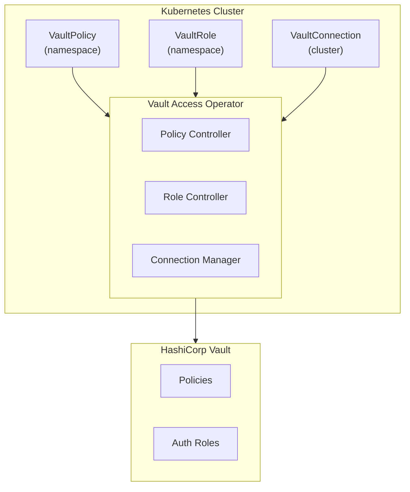

# Vault Access Operator


**Kubernetes-native management of HashiCorp Vault policies and authentication roles**

[](https://github.com/panteparak/vault-access-operator/actions/workflows/ci.yaml)
[](https://github.com/panteparak/vault-access-operator/releases)
[](https://goreportcard.com/report/github.com/panteparak/vault-access-operator)
[](https://pkg.go.dev/github.com/panteparak/vault-access-operator)
[](LICENSE)

[Documentation](https://panteparak.github.io/vault-access-operator/) |
[Getting Started](https://panteparak.github.io/vault-access-operator/getting-started/) |
[Examples](https://panteparak.github.io/vault-access-operator/examples/) |
[Releases](https://github.com/panteparak/vault-access-operator/releases)

---

## Why Vault Access Operator?

Managing Vault policies and Kubernetes authentication roles at scale is challenging. Teams often struggle with:

- **Manual policy management** - Vault policies scattered across CLI commands and scripts
- **No GitOps workflow** - Changes bypass version control and code review
- **Namespace isolation** - Difficult to enforce tenant boundaries in multi-tenant clusters
- **Credential sprawl** - Managing secrets for multiple authentication methods

**Vault Access Operator** solves these problems by bringing Vault access management into Kubernetes as native Custom Resources, enabling GitOps workflows, automated reconciliation, and secure multi-tenancy.

```yaml
# Define Vault policies as Kubernetes resources
apiVersion: vault.platform.io/v1alpha1
kind: VaultPolicy
metadata:
  name: app-secrets
  namespace: production
spec:
  connectionRef: vault-primary
  enforceNamespaceBoundary: true
  rules:
    - path: "secret/data/{{namespace}}/*"
      capabilities: [read, list]
```

## Key Features

| Feature | Description |
|---------|-------------|
| **Declarative Policies** | Define Vault policies as Kubernetes CRDs with full YAML/JSON support |
| **GitOps Ready** | Version control policies alongside application manifests |
| **Namespace Isolation** | Automatic enforcement of tenant boundaries with `{{namespace}}` variables |
| **Multi-Cloud Auth** | Support for Kubernetes, JWT, OIDC, AWS IAM (IRSA), and GCP Workload Identity |
| **Admission Webhooks** | Validate configurations before they reach Vault |
| **Conflict Handling** | Choose between fail-fast or adopt strategies for existing resources |
| **Automatic Reconciliation** | Self-healing with exponential backoff and jitter |
| **Least Privilege** | Operator requires minimal Vault permissions - no access to secrets |

## Architecture



## Quick Start

### Prerequisites

- Kubernetes v1.25+
- HashiCorp Vault v1.12+
- Helm v3+ (recommended) or kubectl

### Installation

**Option 1: Helm (Recommended)**

```bash
helm install vault-access-operator \
  oci://ghcr.io/panteparak/vault-access-operator/charts/vault-access-operator \
  --namespace vault-access-operator-system \
  --create-namespace
```

**Option 2: kubectl**

```bash
kubectl apply -f https://raw.githubusercontent.com/panteparak/vault-access-operator/main/dist/install.yaml
```

### Configure Vault (one-time)

Before the connection can come up, Vault needs an auth method for the operator to
log in with, a least-privilege policy, and a login role bound to the operator's
service account:

```bash
# 1. Enable an auth method. "kubernetes" below is the auth method MOUNT NAME —
#    pick your own with `vault auth enable -path=my-mount kubernetes`
#    and list existing mounts with `vault auth list`.
vault auth enable kubernetes
vault write auth/kubernetes/config \
    kubernetes_host="https://$KUBERNETES_SERVICE_HOST:$KUBERNETES_SERVICE_PORT"

# 2. Least-privilege operator policy: manage policies + auth roles, never read secrets.
vault policy write vault-access-operator - <<'EOF'
path "sys/policies/acl/*" { capabilities = ["create", "read", "update", "delete", "list"] }
path "sys/policies/acl"   { capabilities = ["list"] }
path "sys/health"         { capabilities = ["read"] }
# One block per auth mount your VaultRole/VaultClusterRole resources target.
# "kubernetes" is the mount name — substitute yours (e.g. auth/jwt/role/* for a JWT/OIDC mount).
path "auth/kubernetes/role/*" { capabilities = ["create", "read", "update", "delete"] }
EOF

# 3. Login role for the operator's own service account.
vault write auth/kubernetes/role/vault-access-operator \
    bound_service_account_names=vault-access-operator-controller-manager \
    bound_service_account_namespaces=vault-access-operator-system \
    policies=vault-access-operator \
    ttl=1h
```

<details>
<summary><strong>Using a JWT / OIDC mount instead?</strong></summary>

```bash
# 1. Enable a JWT mount ("jwt" = mount name; pick your own with -path=my-idp)
vault auth enable jwt
vault write auth/jwt/config \
    oidc_discovery_url="https://your-idp.example.com"

# 2. In the operator policy above, swap the role-management grant for:
#    path "auth/jwt/role/*" { capabilities = ["create", "read", "update", "delete"] }

# 3. Login role on the JWT mount
vault write auth/jwt/role/vault-access-operator \
    role_type=jwt \
    bound_audiences=vault \
    bound_subject="system:serviceaccount:vault-access-operator-system:vault-access-operator-controller-manager" \
    user_claim=sub \
    policies=vault-access-operator \
    ttl=1h
```

Then use `auth.jwt` in the `VaultConnection` (see [Authentication Methods](#authentication-methods) below).

</details>

See [Getting Started → Configure Vault](https://panteparak.github.io/vault-access-operator/getting-started/#configure-vault-for-the-operator)
for the full permission table and the [JWT](https://panteparak.github.io/vault-access-operator/auth-methods/jwt/) /
[OIDC](https://panteparak.github.io/vault-access-operator/auth-methods/oidc/) guides for IdP-specific config.

### Create a Vault Connection

```yaml
apiVersion: vault.platform.io/v1alpha1
kind: VaultConnection
metadata:
  name: vault-primary
spec:
  address: https://vault.example.com:8200
  auth:
    kubernetes:
      role: vault-access-operator
```

```bash
kubectl apply -f vault-connection.yaml
kubectl get vaultconnection
# NAME            ADDRESS                          PHASE    VERSION   AGE
# vault-primary   https://vault.example.com:8200   Active   1.15.0    30s
```

### Create a Policy and Role

```yaml
---
apiVersion: vault.platform.io/v1alpha1
kind: VaultPolicy
metadata:
  name: app-secrets
  namespace: my-app
spec:
  connectionRef: vault-primary
  rules:
    - path: "secret/data/{{namespace}}/*"
      capabilities: [read, list]
---
apiVersion: vault.platform.io/v1alpha1
kind: VaultRole
metadata:
  name: app-role
  namespace: my-app
spec:
  connectionRef: vault-primary
  serviceAccounts: [default]
  policies:
    - kind: VaultPolicy
      name: app-secrets
```

```bash
kubectl apply -f policy-and-role.yaml
kubectl get vaultpolicy,vaultrole -n my-app
```

The `spec.policies` list on the VaultRole is the policy↔role binding. In Vault
(names are `<namespace>-<name>`; roles land on the mount their VaultConnection
resolves — `spec.defaults.authPath` when set, otherwise the connection's own
login mount — see [ADR 0009](docs/adr/0009-connection-owned-role-mount.md)):

```bash
vault policy read my-app-app-secrets
vault read auth/kubernetes/role/my-app-app-role   # policies=[my-app-app-secrets]
```

Pods using the bound service account can now log in:

```bash
vault login -method=kubernetes role=my-app-app-role
```

## Custom Resource Definitions

| CRD | Scope | Description |
|-----|-------|-------------|
| **VaultConnection** | Cluster | Establishes authenticated connection to Vault |
| **VaultPolicy** | Namespaced | Namespace-scoped Vault policies with `{{namespace}}` variable |
| **VaultClusterPolicy** | Cluster | Cluster-wide Vault policies |
| **VaultRole** | Namespaced | Kubernetes auth roles for namespace service accounts |
| **VaultClusterRole** | Cluster | Kubernetes auth roles spanning multiple namespaces |
| **VaultKVSecret** | Namespaced | Seeds empty KV v2 secret paths for External Secrets Operator |

## Authentication Methods

The operator supports multiple authentication methods to connect to Vault:

| Method | Best For | Cloud Support |
|--------|----------|---------------|
| **Kubernetes** | Standard K8s clusters | Any |
| **JWT** | External identity providers | Any |
| **OIDC** | Workload identity | EKS, AKS, GKE |
| **AWS IAM** | EKS with IRSA | AWS |
| **GCP IAM** | GKE with Workload Identity | GCP |
| **Token** | Development/testing | Any |
| **AppRole** | CI/CD pipelines | Any |

### JWT Example

```yaml
apiVersion: vault.platform.io/v1alpha1
kind: VaultConnection
metadata:
  name: vault-jwt
spec:
  address: https://vault.example.com:8200
  auth:
    jwt:
      role: vault-access-operator
      authPath: jwt          # your mount name
      audiences: [vault]
      # no jwtSecretRef → the operator's own SA token is used
```

### AWS IAM (IRSA) Example

```yaml
apiVersion: vault.platform.io/v1alpha1
kind: VaultConnection
metadata:
  name: vault-aws
spec:
  address: https://vault.example.com:8200
  auth:
    aws:
      role: eks-workload-role
      authType: iam
      region: us-west-2
```

### GCP Workload Identity Example

```yaml
apiVersion: vault.platform.io/v1alpha1
kind: VaultConnection
metadata:
  name: vault-gcp
spec:
  address: https://vault.example.com:8200
  auth:
    gcp:
      role: gke-workload-role
      authType: iam
      serviceAccountEmail: vault-auth@project.iam.gserviceaccount.com
```

### OIDC (EKS) Example

```yaml
apiVersion: vault.platform.io/v1alpha1
kind: VaultConnection
metadata:
  name: vault-oidc
spec:
  address: https://vault.example.com:8200
  auth:
    oidc:
      role: eks-oidc-role
      providerURL: https://oidc.eks.us-west-2.amazonaws.com/id/CLUSTER_ID
      audiences: ["sts.amazonaws.com"]
```

## Documentation

| Guide | Description |
|-------|-------------|
| [Getting Started](https://panteparak.github.io/vault-access-operator/getting-started/) | Installation and first steps |
| [Configuration](https://panteparak.github.io/vault-access-operator/configuration/) | Helm chart options and operator settings |
| [API Reference](https://panteparak.github.io/vault-access-operator/api-reference/) | Complete CRD field documentation |
| [Examples](https://panteparak.github.io/vault-access-operator/examples/) | Real-world usage patterns |
| [Webhooks](https://panteparak.github.io/vault-access-operator/webhooks/) | Admission webhook validation rules |
| [Troubleshooting](https://panteparak.github.io/vault-access-operator/troubleshooting/) | Common issues and solutions |

## Comparison with Alternatives

| Feature | Vault Access Operator | Vault Secrets Operator | External Secrets | Manual Scripts |
|---------|:---------------------:|:----------------------:|:----------------:|:--------------:|
| Policy Management | Yes | No | No | Manual |
| Auth Role Management | Yes | No | No | Manual |
| Namespace Isolation | Built-in | N/A | N/A | Manual |
| GitOps Workflow | Yes | Yes | Yes | Partial |
| Least Privilege | Yes | No* | No* | Varies |
| Secret Sync | No** | Yes | Yes | Manual |
| Multi-Cloud Auth | Yes | Partial | Partial | Manual |

\* *Requires access to secrets for syncing*
\** *Use alongside Vault Secrets Operator or External Secrets for secret syncing*

## Security

### Principle of Least Privilege

The operator is designed with security in mind:

- **No secret access** - Only manages policies and roles, never reads secrets
- **Minimal permissions** - Core grants are just `sys/policies/acl/*` and `auth/<mount>/role/*` for the auth backend it manages (Kubernetes or JWT) — never any secret-data reads. See the [operator policy](https://panteparak.github.io/vault-access-operator/getting-started/#create-operator-policy)
- **Namespace boundary enforcement** - Prevents cross-namespace access leaks
- **Admission webhooks** - Validates configurations before applying

### Reporting Security Issues

Please report security vulnerabilities via [GitHub Security Advisories](https://github.com/panteparak/vault-access-operator/security/advisories/new) rather than public issues.

## Development

```bash
# Clone the repository
git clone https://github.com/panteparak/vault-access-operator.git
cd vault-access-operator

# Install dependencies
make install

# Run locally against current kubeconfig
make run

# Run tests
make test

# Run linter
make lint

# Install and run local pre-push hooks
make pre-commit-install
make pre-push-run

# Build container image
make docker-build IMG=my-registry/vault-access-operator:dev

# Run end-to-end tests locally (starts k3s + Vault + Dex in Docker)
make e2e-local-up     # One-time setup
make e2e-local-test   # Run tests
make e2e-local-down   # Tear down

# Run E2E tests in CI (requires pre-deployed stack)
make test-e2e
```

### Project Structure

```
.
├── api/v1alpha1/          # CRD type definitions
├── cmd/                   # Entrypoints
├── config/                # Kustomize manifests
├── docs/                  # Documentation source
├── features/              # Feature controllers (Domain-Driven Design)
│   ├── connection/        # VaultConnection feature
│   ├── policy/            # VaultPolicy/VaultClusterPolicy feature
│   └── role/              # VaultRole/VaultClusterRole feature
├── internal/              # Internal packages
├── pkg/                   # Reusable packages
│   └── vault/             # Vault client and auth helpers
└── test/                  # Test fixtures and e2e tests
```

## Contributing

We welcome contributions! Please see our [Contributing Guide](CONTRIBUTING.md) for details.

1. Fork the repository
2. Create a feature branch (`git checkout -b feature/amazing-feature`)
3. Make your changes with tests
4. Run `make pre-push-run && make test && make lint`
5. Commit with [conventional commits](https://www.conventionalcommits.org/)
6. Open a Pull Request

### Code of Conduct

This project follows the [CNCF Code of Conduct](https://github.com/cncf/foundation/blob/main/code-of-conduct.md).

## Roadmap

- [x] Core policy and role management
- [x] Multi-cloud authentication (AWS, GCP, OIDC)
- [x] Admission webhooks
- [x] Comprehensive documentation
- [ ] Metrics and observability
- [ ] Policy validation against Vault
- [ ] Azure Workload Identity support
- [ ] Vault Enterprise namespace support

See the [open issues](https://github.com/panteparak/vault-access-operator/issues) for a full list of proposed features and known issues.

## Community

- [GitHub Discussions](https://github.com/panteparak/vault-access-operator/discussions) - Ask questions and share ideas
- [GitHub Issues](https://github.com/panteparak/vault-access-operator/issues) - Report bugs and request features
- [Releases](https://github.com/panteparak/vault-access-operator/releases) - Download and changelog

## License

Copyright 2024-2026 Vault Access Operator Contributors.

Licensed under the Apache License, Version 2.0. See [LICENSE](LICENSE) for the full license text.

---

Made with love by the community
