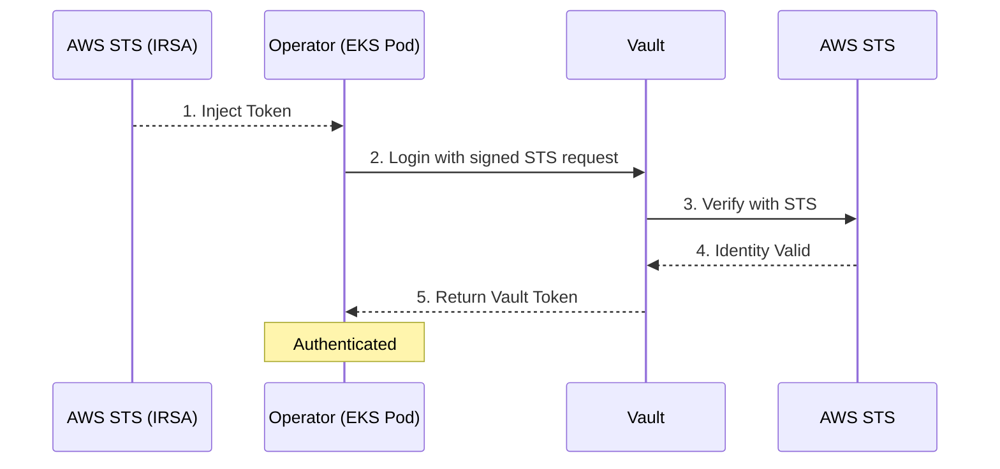

# AWS IAM Authentication

AWS IAM authentication enables EKS workloads to authenticate to Vault using IAM Roles for Service Accounts (IRSA). This is the recommended method for EKS clusters.

## Overview

**Best for:** Amazon EKS clusters with IRSA configured.

**How it works:**

1. EKS injects AWS credentials into pods via IRSA
2. The operator uses these credentials to sign an STS GetCallerIdentity request
3. Vault verifies the signed request with AWS STS
4. Vault returns a token with the configured policies



## Prerequisites

### AWS Requirements

- EKS cluster with OIDC provider enabled
- IAM role with trust policy for the service account
- Permissions for sts:GetCallerIdentity (automatic with IRSA)

### Vault Requirements

- Vault server v1.12 or later
- AWS auth method enabled
- AWS credentials for Vault to verify requests (optional if using IAM role)

### Kubernetes Requirements

- EKS v1.25 or later
- Service account annotated for IRSA

## Assumptions

This guide assumes:

- You have an EKS cluster with OIDC provider enabled
- You have AWS CLI configured with appropriate permissions
- You have `kubectl` access to your EKS cluster
- You have `vault` CLI access

## Step-by-Step Setup

### Step 1: Get EKS OIDC Provider URL

```bash
# Get your cluster's OIDC issuer URL
OIDC_ISSUER=$(aws eks describe-cluster \
    --name my-cluster \
    --query "cluster.identity.oidc.issuer" \
    --output text)

echo $OIDC_ISSUER
# Output: https://oidc.eks.us-west-2.amazonaws.com/id/EXAMPLED539D4633E53DE1B716D3041E

# Extract the OIDC ID
OIDC_ID=$(echo $OIDC_ISSUER | sed 's|https://||' | sed 's|/id/||')
```

### Step 2: Create IAM Role for the Operator

Create a trust policy that allows the operator's service account to assume the role:

```json
{
  "Version": "2012-10-17",
  "Statement": [
    {
      "Effect": "Allow",
      "Principal": {
        "Federated": "arn:aws:iam::ACCOUNT_ID:oidc-provider/oidc.eks.REGION.amazonaws.com/id/CLUSTER_ID"
      },
      "Action": "sts:AssumeRoleWithWebIdentity",
      "Condition": {
        "StringEquals": {
          "oidc.eks.REGION.amazonaws.com/id/CLUSTER_ID:sub": "system:serviceaccount:vault-access-operator-system:vault-access-operator-controller-manager",
          "oidc.eks.REGION.amazonaws.com/id/CLUSTER_ID:aud": "sts.amazonaws.com"
        }
      }
    }
  ]
}
```

Create the IAM role:

```bash
aws iam create-role \
    --role-name vault-access-operator-role \
    --assume-role-policy-document file://trust-policy.json
```

!!! note "No additional IAM permissions needed"
    The role doesn't need any IAM permissions beyond the ability to be assumed. Vault only uses it to verify identity.

### Step 3: Annotate the Operator Service Account

```bash
kubectl annotate serviceaccount \
    vault-access-operator-controller-manager \
    -n vault-access-operator-system \
    eks.amazonaws.com/role-arn=arn:aws:iam::ACCOUNT_ID:role/vault-access-operator-role
```

Or via Helm values:

```yaml
serviceAccount:
  annotations:
    eks.amazonaws.com/role-arn: arn:aws:iam::ACCOUNT_ID:role/vault-access-operator-role
```

### Step 4: Enable AWS Auth in Vault

```bash
# Enable AWS auth method
vault auth enable aws

# Configure with IAM credentials (optional, Vault can use its own IAM role)
vault write auth/aws/config/client \
    access_key=$AWS_ACCESS_KEY_ID \
    secret_key=$AWS_SECRET_ACCESS_KEY
```

!!! tip "Vault with IAM Role"
    If Vault runs with an IAM role (EC2, EKS, or Lambda), you can skip providing credentials:
    ```bash
    vault write auth/aws/config/client iam_server_id_header_value="vault.example.com"
    ```

### Step 5: Create Vault Policy

```bash
vault policy write vault-access-operator - <<EOF
# Manage ACL policies
path "sys/policies/acl/*" {
  capabilities = ["create", "read", "update", "delete", "list"]
}
path "sys/policies/acl" {
  capabilities = ["list"]
}

# Manage Kubernetes auth roles
path "auth/kubernetes/role/*" {
  capabilities = ["create", "read", "update", "delete", "list"]
}
path "auth/kubernetes/role" {
  capabilities = ["list"]
}
EOF
```

### Step 6: Create Vault Role for AWS Auth

```bash
vault write auth/aws/role/vault-access-operator \
    auth_type=iam \
    bound_iam_principal_arn="arn:aws:iam::ACCOUNT_ID:role/vault-access-operator-role" \
    policies=vault-access-operator \
    ttl=1h
```

| Parameter | Description |
|-----------|-------------|
| `auth_type` | Use `iam` for IRSA authentication |
| `bound_iam_principal_arn` | The IAM role ARN allowed to authenticate |
| `policies` | Vault policies to attach |
| `ttl` | Token lifetime |

### Step 7: Create VaultConnection Resource

```yaml
apiVersion: vault.platform.io/v1alpha1
kind: VaultConnection
metadata:
  name: vault-aws
spec:
  address: https://vault.example.com:8200

  tls:
    caCert:
      secretRef:
        name: vault-ca-cert
        namespace: vault-access-operator-system
        key: ca.crt

  auth:
    aws:
      role: vault-access-operator
      authType: iam
      # Optional fields
      # region: us-west-2            # Auto-detected from environment
      # stsEndpoint: https://...     # Custom STS endpoint (VPC endpoints)
      # iamServerIdHeaderValue: ...  # Extra security header
```

Apply the configuration:

```bash
kubectl apply -f vaultconnection.yaml
```

### Step 8: Verify the Connection

```bash
# Check VaultConnection status
kubectl get vaultconnection vault-aws -o yaml

# Expected status
# status:
#   phase: Active
#   healthy: true
```

## Configuration Reference

### Required Fields

| Field | Description |
|-------|-------------|
| `auth.aws.role` | The Vault role name to authenticate as |

### Optional Fields

| Field | Default | Description |
|-------|---------|-------------|
| `authPath` | `aws` | Vault auth mount path |
| `authType` | `iam` | Auth type: `iam` or `ec2` |
| `region` | Auto-detected | AWS region for STS calls |
| `stsEndpoint` | AWS default | Custom STS endpoint URL |
| `iamServerIdHeaderValue` | None | X-Vault-AWS-IAM-Server-ID header value |

### IAM Server ID Header

For additional security, configure an IAM server ID header:

```yaml
auth:
  aws:
    role: vault-access-operator
    iamServerIdHeaderValue: vault.example.com
```

This must match the `iam_server_id_header_value` in Vault's AWS auth config:

```bash
vault write auth/aws/config/client iam_server_id_header_value="vault.example.com"
```

## Troubleshooting

### "no credentials found" error

**Symptoms:**
```
Error: NoCredentialProviders: no valid providers in chain
```

**Solutions:**

1. Verify IRSA is configured correctly:
   ```bash
   kubectl describe sa vault-access-operator-controller-manager -n vault-access-operator-system | grep eks.amazonaws.com/role-arn
   ```

2. Check the pod has the AWS token file:
   ```bash
   kubectl exec -n vault-access-operator-system deploy/vault-access-operator-controller-manager -- ls -la /var/run/secrets/eks.amazonaws.com/serviceaccount/
   ```

3. Verify the trust policy allows the service account

### "access denied" from Vault

**Symptoms:**
```
Error: entry for role vault-access-operator not found
```

**Solutions:**

1. Verify the Vault role exists:
   ```bash
   vault read auth/aws/role/vault-access-operator
   ```

2. Check the bound_iam_principal_arn matches your IAM role ARN exactly

### STS endpoint connectivity issues

**Symptoms:**
```
Error: RequestError: send request failed
```

**Solutions:**

1. For VPC endpoints, specify the STS endpoint:
   ```yaml
   auth:
     aws:
       stsEndpoint: https://sts.us-west-2.amazonaws.com
   ```

2. Ensure the pod has network access to STS

## Example: Complete Setup with Terraform

=== "IAM Role (Terraform)"

    ```hcl
    data "aws_eks_cluster" "cluster" {
      name = "my-cluster"
    }

    resource "aws_iam_role" "vault_operator" {
      name = "vault-access-operator-role"

      assume_role_policy = jsonencode({
        Version = "2012-10-17"
        Statement = [{
          Effect = "Allow"
          Principal = {
            Federated = "arn:aws:iam::${data.aws_caller_identity.current.account_id}:oidc-provider/${replace(data.aws_eks_cluster.cluster.identity[0].oidc[0].issuer, "https://", "")}"
          }
          Action = "sts:AssumeRoleWithWebIdentity"
          Condition = {
            StringEquals = {
              "${replace(data.aws_eks_cluster.cluster.identity[0].oidc[0].issuer, "https://", "")}:sub" = "system:serviceaccount:vault-access-operator-system:vault-access-operator-controller-manager"
            }
          }
        }]
      })
    }
    ```

=== "VaultConnection"

    ```yaml
    apiVersion: vault.platform.io/v1alpha1
    kind: VaultConnection
    metadata:
      name: vault-aws
    spec:
      address: https://vault.example.com:8200
      auth:
        aws:
          role: vault-access-operator
          authType: iam
    ```

## See Also

- [Kubernetes Authentication](kubernetes.md) - Alternative for non-EKS clusters
- [OIDC Authentication](oidc.md) - Alternative using EKS OIDC directly
- [API Reference](../api-reference.md) - Complete field reference
