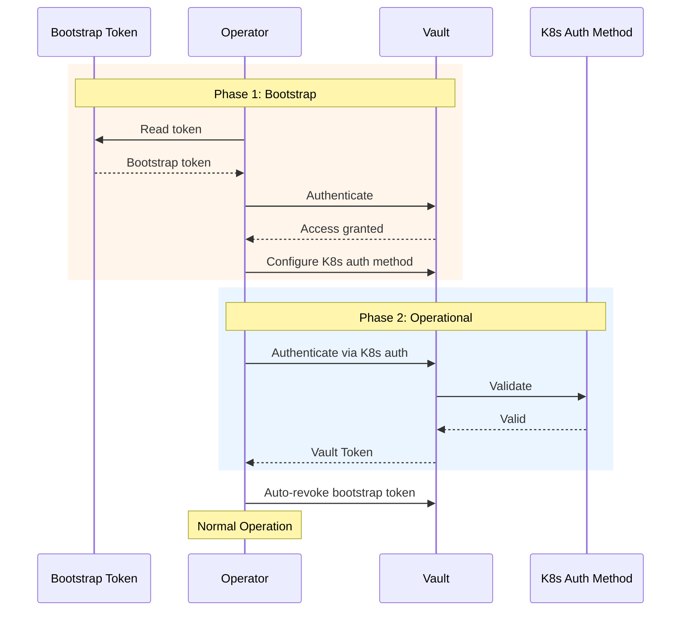

# Bootstrap Authentication

Bootstrap authentication is used for initial Vault setup when the Kubernetes auth method hasn't been configured yet. It uses a one-time token to configure Vault and then transitions to Kubernetes auth.

## Overview

**Best for:** Initial Vault configuration, setting up Kubernetes auth method.

**How it works:**

1. Operator uses a bootstrap token to authenticate to Vault
2. Operator configures Vault's Kubernetes auth method
3. Operator transitions to Kubernetes auth
4. Bootstrap token is optionally revoked



## Prerequisites

### Vault Requirements

- Vault server v1.12 or later
- Bootstrap token with permissions to configure auth methods

### Kubernetes Requirements

- Kubernetes v1.25 or later
- Kubernetes API server accessible from Vault

## Assumptions

This guide assumes:

- You're setting up Vault Access Operator for the first time
- Vault's Kubernetes auth method is NOT yet configured
- You have a Vault token with sufficient permissions
- This is a one-time setup process

## Step-by-Step Setup

### Step 1: Create Bootstrap Token in Vault

The bootstrap token needs permissions to:
- Enable and configure the Kubernetes auth method
- Create policies
- Create auth roles

```bash
# Create a bootstrap policy
vault policy write bootstrap-operator - <<EOF
# Enable auth methods
path "sys/auth/*" {
  capabilities = ["create", "read", "update", "delete", "sudo"]
}

# Configure auth methods
path "auth/*" {
  capabilities = ["create", "read", "update", "delete", "list"]
}

# Manage policies
path "sys/policies/acl/*" {
  capabilities = ["create", "read", "update", "delete", "list"]
}
path "sys/policies/acl" {
  capabilities = ["list"]
}
EOF

# Create a token with the bootstrap policy
vault token create \
    -policy=bootstrap-operator \
    -ttl=1h \
    -use-limit=10 \
    -display-name="vault-access-operator-bootstrap"

# Output:
# token            hvs.CAESI...
# token_accessor   ...
```

!!! warning "Security Considerations"
    - Use a short TTL (1 hour or less)
    - Limit the number of uses
    - Revoke the token immediately after setup

### Step 2: Create Kubernetes Secret for Bootstrap Token

```bash
kubectl create secret generic vault-bootstrap-token \
    -n vault-access-operator-system \
    --from-literal=token=hvs.CAESI...
```

### Step 3: Create VaultConnection with Bootstrap Auth

```yaml
apiVersion: vault.platform.io/v1alpha1
kind: VaultConnection
metadata:
  name: vault-primary
spec:
  address: https://vault.example.com:8200

  tls:
    caCert:
      secretRef:
        name: vault-ca-cert
        namespace: vault-access-operator-system
        key: ca.crt

  auth:
    # Bootstrap phase - will auto-transition to kubernetes auth
    bootstrap:
      secretRef:
        name: vault-bootstrap-token
        namespace: vault-access-operator-system
        key: token
      autoRevoke: true  # Revoke bootstrap token after setup

    # Target configuration - operator will set this up
    kubernetes:
      role: vault-access-operator
      authPath: kubernetes
```

Apply the configuration:

```bash
kubectl apply -f vaultconnection.yaml
```

### Step 4: Monitor the Bootstrap Process

```bash
# Watch the VaultConnection status
kubectl get vaultconnection vault-primary -w

# Check operator logs for bootstrap progress
kubectl logs -n vault-access-operator-system \
    deploy/vault-access-operator-controller-manager -f
```

Expected progression:
1. `Phase: Pending` - Starting bootstrap
2. `Phase: Syncing` - Configuring Vault
3. `Phase: Active` - Bootstrap complete, using Kubernetes auth

### Step 5: Verify Configuration

After bootstrap completes:

```bash
# Verify Kubernetes auth is enabled
vault auth list | grep kubernetes

# Verify the operator role exists
vault read auth/kubernetes/role/vault-access-operator

# Verify the bootstrap token is revoked (if autoRevoke=true)
vault token lookup hvs.CAESI...  # Should fail
```

### Step 6: Clean Up Bootstrap Secret

```bash
# Delete the bootstrap secret (no longer needed)
kubectl delete secret vault-bootstrap-token -n vault-access-operator-system
```

## Configuration Reference

### Required Fields

| Field | Description |
|-------|-------------|
| `auth.bootstrap.secretRef` | Reference to secret containing bootstrap token |

### Optional Fields

| Field | Default | Description |
|-------|---------|-------------|
| `autoRevoke` | `true` | Revoke bootstrap token after successful setup |

### What Gets Configured

During bootstrap, the operator:

1. **Enables Kubernetes auth** (if not already enabled)
   ```bash
   vault auth enable kubernetes
   ```

2. **Configures Kubernetes auth** with cluster details
   ```bash
   vault write auth/kubernetes/config \
       kubernetes_host="https://kubernetes.default.svc" \
       kubernetes_ca_cert="@/var/run/secrets/kubernetes.io/serviceaccount/ca.crt"
   ```

3. **Creates the operator policy**
   ```hcl
   path "sys/policies/acl/*" { capabilities = ["create", "read", "update", "delete", "list"] }
   path "auth/kubernetes/role/*" { capabilities = ["create", "read", "update", "delete", "list"] }
   ```

4. **Creates the operator role**
   ```bash
   vault write auth/kubernetes/role/vault-access-operator \
       bound_service_account_names=vault-access-operator-controller-manager \
       bound_service_account_namespaces=vault-access-operator-system \
       policies=vault-access-operator \
       ttl=1h
   ```

5. **Transitions to Kubernetes auth**
6. **Revokes bootstrap token** (if autoRevoke=true)

## External Vault Setup

When Vault runs outside the Kubernetes cluster, provide the external API server address:

```yaml
apiVersion: vault.platform.io/v1alpha1
kind: VaultConnection
metadata:
  name: vault-primary
spec:
  address: https://vault.example.com:8200
  auth:
    bootstrap:
      secretRef:
        name: vault-bootstrap-token
        namespace: vault-access-operator-system
        key: token
    kubernetes:
      role: vault-access-operator
      kubernetesHost: https://k8s-api.example.com:6443  # External API address
```

## Troubleshooting

### Bootstrap token lacks permissions

**Symptoms:**
```
Error: permission denied
```

**Solutions:**

1. Verify the bootstrap policy has required permissions
2. Check the token has the policy attached:
   ```bash
   vault token lookup hvs.CAESI...
   ```

### Kubernetes auth configuration fails

**Symptoms:**
```
Error: error configuring Kubernetes auth
```

**Solutions:**

1. Verify Vault can reach the Kubernetes API server
2. Check the CA certificate is correct
3. For external Vault, provide the correct `kubernetesHost`

### Bootstrap doesn't transition to Kubernetes auth

**Symptoms:**
VaultConnection stays in bootstrap mode

**Solutions:**

1. Check operator logs for errors:
   ```bash
   kubectl logs -n vault-access-operator-system \
       deploy/vault-access-operator-controller-manager
   ```

2. Verify the Kubernetes auth role was created:
   ```bash
   vault read auth/kubernetes/role/vault-access-operator
   ```

## See Also

- [Kubernetes Authentication](kubernetes.md) - Post-bootstrap authentication
- [Getting Started](../getting-started.md) - Complete setup guide
- [Troubleshooting](../troubleshooting.md) - Common issues
