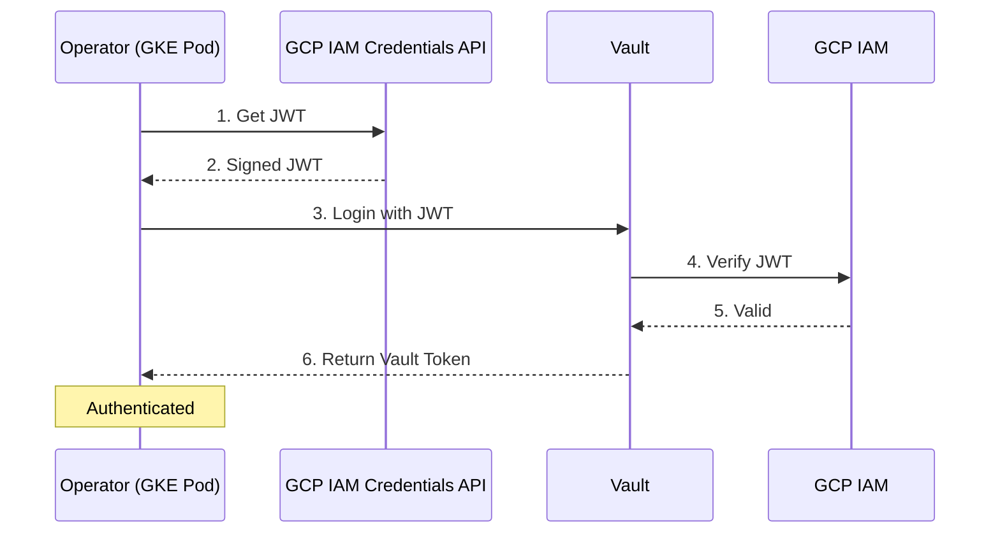

# GCP IAM Authentication

GCP IAM authentication enables GKE workloads to authenticate to Vault using Workload Identity. This is the recommended method for GKE clusters.

## Overview

**Best for:** Google Kubernetes Engine (GKE) clusters with Workload Identity enabled.

**How it works:**

1. GKE Workload Identity maps Kubernetes service accounts to GCP service accounts
2. The operator obtains a signed JWT from the GCP IAM Credentials API
3. Vault verifies the JWT with GCP
4. Vault returns a token with the configured policies



## Prerequisites

### GCP Requirements

- GKE cluster with Workload Identity enabled
- GCP service account
- IAM binding between K8s SA and GCP SA

### Vault Requirements

- Vault server v1.12 or later
- GCP auth method enabled

### Kubernetes Requirements

- GKE v1.25 or later
- Service account annotated for Workload Identity

## Assumptions

This guide assumes:

- You have a GKE cluster with Workload Identity enabled
- You have `gcloud` CLI configured with appropriate permissions
- You have `kubectl` access to your GKE cluster
- You have `vault` CLI access

## Step-by-Step Setup

### Step 1: Create GCP Service Account

```bash
# Set variables
PROJECT_ID=my-project
GCP_SA_NAME=vault-access-operator
K8S_NAMESPACE=vault-access-operator-system
K8S_SA_NAME=vault-access-operator-controller-manager

# Create GCP service account
gcloud iam service-accounts create $GCP_SA_NAME \
    --project=$PROJECT_ID \
    --display-name="Vault Access Operator"
```

### Step 2: Configure Workload Identity

```bash
# Allow the K8s SA to impersonate the GCP SA
gcloud iam service-accounts add-iam-policy-binding \
    $GCP_SA_NAME@$PROJECT_ID.iam.gserviceaccount.com \
    --project=$PROJECT_ID \
    --role=roles/iam.workloadIdentityUser \
    --member="serviceAccount:$PROJECT_ID.svc.id.goog[$K8S_NAMESPACE/$K8S_SA_NAME]"
```

### Step 3: Annotate the Kubernetes Service Account

```bash
kubectl annotate serviceaccount \
    $K8S_SA_NAME \
    -n $K8S_NAMESPACE \
    iam.gke.io/gcp-service-account=$GCP_SA_NAME@$PROJECT_ID.iam.gserviceaccount.com
```

Or via Helm values:

```yaml
serviceAccount:
  annotations:
    iam.gke.io/gcp-service-account: vault-access-operator@my-project.iam.gserviceaccount.com
```

### Step 4: Enable GCP Auth in Vault

```bash
# Enable GCP auth method
vault auth enable gcp
```

### Step 5: Create Vault Policy

```bash
vault policy write vault-access-operator - <<EOF
# Manage ACL policies
path "sys/policies/acl/*" {
  capabilities = ["create", "read", "update", "delete", "list"]
}
path "sys/policies/acl" {
  capabilities = ["list"]
}

# Manage Kubernetes auth roles
path "auth/kubernetes/role/*" {
  capabilities = ["create", "read", "update", "delete", "list"]
}
path "auth/kubernetes/role" {
  capabilities = ["list"]
}
EOF
```

### Step 6: Create Vault Role for GCP Auth

```bash
vault write auth/gcp/role/vault-access-operator \
    type=iam \
    bound_service_accounts="$GCP_SA_NAME@$PROJECT_ID.iam.gserviceaccount.com" \
    policies=vault-access-operator \
    ttl=1h
```

| Parameter | Description |
|-----------|-------------|
| `type` | Use `iam` for Workload Identity |
| `bound_service_accounts` | GCP service account email(s) allowed to authenticate |
| `policies` | Vault policies to attach |
| `ttl` | Token lifetime |

### Step 7: Create VaultConnection Resource

```yaml
apiVersion: vault.platform.io/v1alpha1
kind: VaultConnection
metadata:
  name: vault-gcp
spec:
  address: https://vault.example.com:8200

  tls:
    caCert:
      secretRef:
        name: vault-ca-cert
        namespace: vault-access-operator-system
        key: ca.crt

  auth:
    gcp:
      role: vault-access-operator
      authType: iam
      serviceAccountEmail: vault-access-operator@my-project.iam.gserviceaccount.com
```

Apply the configuration:

```bash
kubectl apply -f vaultconnection.yaml
```

### Step 8: Verify the Connection

```bash
# Check VaultConnection status
kubectl get vaultconnection vault-gcp -o yaml

# Expected status
# status:
#   phase: Active
#   healthy: true
```

## Configuration Reference

### Required Fields

| Field | Description |
|-------|-------------|
| `auth.gcp.role` | The Vault role name to authenticate as |

### Optional Fields

| Field | Default | Description |
|-------|---------|-------------|
| `authPath` | `gcp` | Vault auth mount path |
| `authType` | `iam` | Auth type: `iam` or `gce` |
| `serviceAccountEmail` | Auto-detected | GCP service account email |
| `credentialsSecretRef` | None | Secret with GCP credentials JSON |

### Auth Types

| Type | Description | Use Case |
|------|-------------|----------|
| `iam` | Uses IAM credentials to sign JWTs | GKE with Workload Identity |
| `gce` | Uses GCE instance metadata | Compute Engine VMs |

### Using Explicit Credentials

If Workload Identity is not available, you can provide explicit GCP credentials:

```yaml
auth:
  gcp:
    role: vault-access-operator
    authType: iam
    serviceAccountEmail: vault-access-operator@my-project.iam.gserviceaccount.com
    credentialsSecretRef:
      name: gcp-credentials
      namespace: vault-access-operator-system
      key: credentials.json
```

Create the secret:

```bash
kubectl create secret generic gcp-credentials \
    -n vault-access-operator-system \
    --from-file=credentials.json=/path/to/service-account.json
```

!!! warning "Prefer Workload Identity"
    Using static credentials is less secure than Workload Identity. Only use this approach when Workload Identity is not available.

## Troubleshooting

### "could not find default credentials" error

**Symptoms:**
```
Error: google: could not find default credentials
```

**Solutions:**

1. Verify Workload Identity is configured:
   ```bash
   kubectl describe sa vault-access-operator-controller-manager -n vault-access-operator-system | grep iam.gke.io
   ```

2. Check the GCP SA IAM binding:
   ```bash
   gcloud iam service-accounts get-iam-policy \
       vault-access-operator@my-project.iam.gserviceaccount.com
   ```

3. Verify the node pool has Workload Identity enabled:
   ```bash
   gcloud container node-pools describe default-pool \
       --cluster my-cluster \
       --zone us-central1-a \
       --format="value(config.workloadMetadataConfig)"
   ```

### "permission denied" from Vault

**Symptoms:**
```
Error: permission denied
```

**Solutions:**

1. Verify the Vault role exists:
   ```bash
   vault read auth/gcp/role/vault-access-operator
   ```

2. Check bound_service_accounts matches your GCP SA email exactly

3. Verify the GCP SA has the right IAM permissions:
   ```bash
   # GCP SA needs to be able to sign JWTs (automatic with Workload Identity)
   gcloud iam service-accounts get-iam-policy \
       vault-access-operator@my-project.iam.gserviceaccount.com
   ```

### Metadata server connectivity issues

**Symptoms:**
```
Error: metadata: GCE metadata not available
```

**Solutions:**

1. Ensure Workload Identity is enabled on the cluster
2. Verify the node pool has the correct metadata configuration
3. Check network policies allow metadata server access

## Example: Complete Setup with Terraform

=== "GCP Resources (Terraform)"

    ```hcl
    resource "google_service_account" "vault_operator" {
      project      = var.project_id
      account_id   = "vault-access-operator"
      display_name = "Vault Access Operator"
    }

    resource "google_service_account_iam_binding" "workload_identity" {
      service_account_id = google_service_account.vault_operator.name
      role               = "roles/iam.workloadIdentityUser"
      members = [
        "serviceAccount:${var.project_id}.svc.id.goog[vault-access-operator-system/vault-access-operator-controller-manager]"
      ]
    }
    ```

=== "VaultConnection"

    ```yaml
    apiVersion: vault.platform.io/v1alpha1
    kind: VaultConnection
    metadata:
      name: vault-gcp
    spec:
      address: https://vault.example.com:8200
      auth:
        gcp:
          role: vault-access-operator
          authType: iam
          serviceAccountEmail: vault-access-operator@my-project.iam.gserviceaccount.com
    ```

## See Also

- [Kubernetes Authentication](kubernetes.md) - Alternative for any cluster
- [OIDC Authentication](oidc.md) - Alternative using GKE OIDC
- [API Reference](../api-reference.md) - Complete field reference
