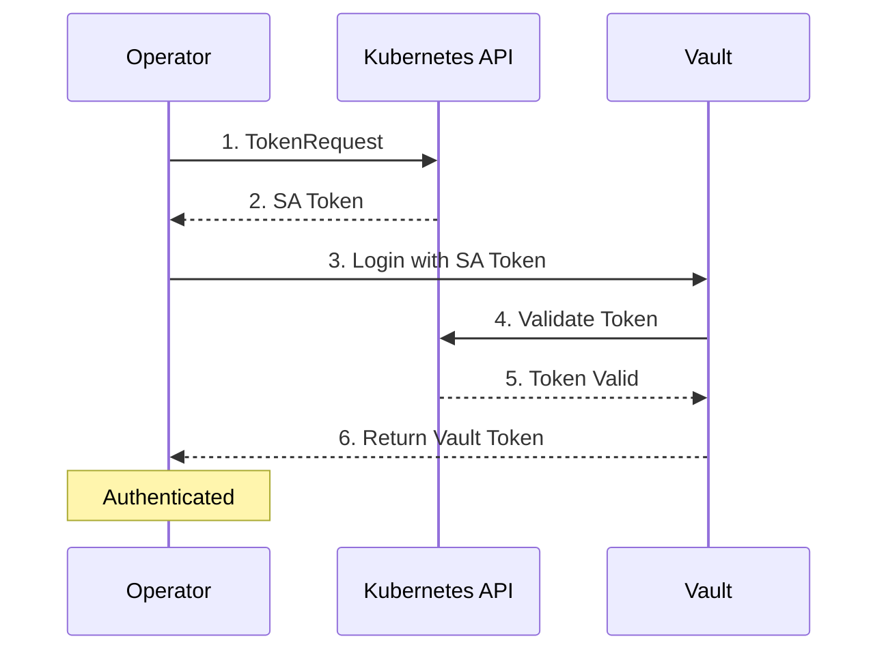

# Kubernetes Authentication

Kubernetes authentication is the standard method for authenticating workloads running in Kubernetes clusters to HashiCorp Vault. It uses Kubernetes service account tokens to verify identity.

## Overview

**Best for:** Standard Kubernetes clusters on any cloud provider or on-premises.

**How it works:**

1. The operator requests a short-lived service account token via the TokenRequest API
2. The token is sent to Vault's Kubernetes auth endpoint
3. Vault validates the token against the Kubernetes API server
4. Vault returns a Vault token with the configured policies



## Prerequisites

### Vault Requirements

- Vault server v1.12 or later
- Kubernetes auth method enabled
- Network access from Vault to Kubernetes API server

### Kubernetes Requirements

- Kubernetes v1.25 or later
- TokenRequest API enabled (enabled by default)
- ServiceAccount for the operator

## Assumptions

This guide assumes:

- You have `kubectl` access to your Kubernetes cluster
- You have `vault` CLI access or Vault UI access
- Vault can reach the Kubernetes API server over the network
- You have permissions to create Vault policies and auth roles

## Step-by-Step Setup

### Step 1: Enable Kubernetes Auth in Vault

```bash
# Enable the Kubernetes auth method
vault auth enable kubernetes

# Configure the auth method with the Kubernetes API server
# If Vault runs in-cluster, it auto-discovers the host
vault write auth/kubernetes/config \
    kubernetes_host="https://$KUBERNETES_SERVICE_HOST:$KUBERNETES_SERVICE_PORT"
```

!!! note "External Vault"
    If Vault runs outside the cluster, you need to provide a CA certificate and explicit host:
    ```bash
    vault write auth/kubernetes/config \
        kubernetes_host="https://k8s-api.example.com:6443" \
        kubernetes_ca_cert=@/path/to/ca.crt
    ```

### Step 2: Create Operator Policy in Vault

The operator needs permissions to manage policies and auth roles:

```bash
vault policy write vault-access-operator - <<EOF
# Manage ACL policies
path "sys/policies/acl/*" {
  capabilities = ["create", "read", "update", "delete", "list"]
}

# List all policies
path "sys/policies/acl" {
  capabilities = ["list"]
}

# Manage Kubernetes auth roles
path "auth/kubernetes/role/*" {
  capabilities = ["create", "read", "update", "delete", "list"]
}

# List auth roles
path "auth/kubernetes/role" {
  capabilities = ["list"]
}

# Read auth configuration (for health checks)
path "auth/kubernetes/config" {
  capabilities = ["read"]
}
EOF
```

### Step 3: Create Vault Role for the Operator

```bash
vault write auth/kubernetes/role/vault-access-operator \
    bound_service_account_names=vault-access-operator-controller-manager \
    bound_service_account_namespaces=vault-access-operator-system \
    policies=vault-access-operator \
    ttl=1h
```

| Parameter | Description |
|-----------|-------------|
| `bound_service_account_names` | The K8s service account name(s) allowed to authenticate |
| `bound_service_account_namespaces` | The K8s namespace(s) where the SA must exist |
| `policies` | Vault policies to attach to authenticated tokens |
| `ttl` | Token lifetime (1 hour is recommended) |

### Step 4: Create VaultConnection Resource

```yaml
apiVersion: vault.platform.io/v1alpha1
kind: VaultConnection
metadata:
  name: vault-primary
spec:
  address: https://vault.example.com:8200

  # TLS configuration (if using HTTPS)
  tls:
    caCert:
      secretRef:
        name: vault-ca-cert
        namespace: vault-access-operator-system
        key: ca.crt

  # Kubernetes authentication
  auth:
    kubernetes:
      role: vault-access-operator
      # Optional: defaults shown below
      authPath: kubernetes           # Vault auth mount path
      tokenDuration: 1h              # SA token lifetime
      tokenReviewerRotation: true    # Auto-rotate token_reviewer_jwt
      renewalStrategy: renew         # renew or reauth
```

Apply the configuration:

```bash
kubectl apply -f vaultconnection.yaml
```

### Step 5: Verify the Connection

```bash
# Check VaultConnection status
kubectl get vaultconnection vault-primary -o yaml

# Expected status
# status:
#   phase: Active
#   healthy: true
#   vaultVersion: "1.15.0"
```

## Configuration Reference

### Required Fields

| Field | Description |
|-------|-------------|
| `auth.kubernetes.role` | The Vault role name to authenticate as |

### Optional Fields

| Field | Default | Description |
|-------|---------|-------------|
| `authPath` | `kubernetes` | Vault auth mount path |
| `tokenDuration` | `1h` | Requested SA token lifetime |
| `kubernetesHost` | Auto-detected | K8s API server URL for Vault config |
| `tokenReviewerRotation` | `true` | Enable automatic token_reviewer_jwt rotation |
| `renewalStrategy` | `renew` | How to refresh Vault tokens: `renew` or `reauth` |

### Token Reviewer Rotation

The `tokenReviewerRotation` field is critical for security:

- **When enabled (default):** The operator automatically rotates the `token_reviewer_jwt` used by Vault to validate service account tokens
- **When disabled:** You must manually manage token rotation, or authentication will fail when the JWT expires

!!! warning "Do not disable token reviewer rotation"
    Disabling `tokenReviewerRotation` can cause authentication failures when the token_reviewer_jwt expires. Only disable this if you have an external system managing token rotation.

### Renewal Strategy

The `renewalStrategy` field controls how the operator refreshes Vault tokens:

| Strategy | Behavior | Use Case |
|----------|----------|----------|
| `renew` (default) | Proactively renew tokens via Vault API, fallback to re-auth on failure | Most workloads |
| `reauth` | Always re-authenticate with fresh K8s credentials | Security-critical workloads |

## Troubleshooting

### Connection stays in "Pending" phase

**Symptoms:**
```
status:
  phase: Pending
  conditions:
  - type: Ready
    status: "False"
    reason: AuthenticationFailed
```

**Possible causes:**

1. **Wrong role name:** Verify the role exists in Vault
   ```bash
   vault read auth/kubernetes/role/vault-access-operator
   ```

2. **Service account mismatch:** Check SA name and namespace match the Vault role
   ```bash
   vault read auth/kubernetes/role/vault-access-operator | grep bound
   ```

3. **Network connectivity:** Verify Vault can reach the K8s API
   ```bash
   # From Vault server
   curl -k https://<k8s-api-server>:6443/healthz
   ```

### "permission denied" errors

**Symptoms:**
```
Error: permission denied
```

**Solutions:**

1. Check the Vault policy is attached to the role:
   ```bash
   vault read auth/kubernetes/role/vault-access-operator
   ```

2. Verify the policy has required permissions:
   ```bash
   vault policy read vault-access-operator
   ```

### Token expiration errors

**Symptoms:**
```
Error: token is expired
```

**Solutions:**

1. Ensure `tokenReviewerRotation` is enabled (default)
2. Check operator logs for rotation errors:
   ```bash
   kubectl logs -n vault-access-operator-system deploy/vault-access-operator-controller-manager
   ```

## Example: Complete Setup

Here's a complete example for a standard setup:

=== "VaultConnection"

    ```yaml
    apiVersion: vault.platform.io/v1alpha1
    kind: VaultConnection
    metadata:
      name: vault-primary
    spec:
      address: https://vault.example.com:8200
      tls:
        caCert:
          secretRef:
            name: vault-ca-cert
            namespace: vault-access-operator-system
            key: ca.crt
      auth:
        kubernetes:
          role: vault-access-operator
      healthCheckInterval: 30s
    ```

=== "Vault Policy"

    ```hcl
    # vault-access-operator policy
    path "sys/policies/acl/*" {
      capabilities = ["create", "read", "update", "delete", "list"]
    }
    path "sys/policies/acl" {
      capabilities = ["list"]
    }
    path "auth/kubernetes/role/*" {
      capabilities = ["create", "read", "update", "delete", "list"]
    }
    path "auth/kubernetes/role" {
      capabilities = ["list"]
    }
    path "auth/kubernetes/config" {
      capabilities = ["read"]
    }
    ```

=== "Vault Role"

    ```bash
    vault write auth/kubernetes/role/vault-access-operator \
        bound_service_account_names=vault-access-operator-controller-manager \
        bound_service_account_namespaces=vault-access-operator-system \
        policies=vault-access-operator \
        ttl=1h
    ```

## See Also

- [Getting Started](../getting-started.md) - Quick start guide
- [API Reference](../api-reference.md) - Complete field reference
- [Troubleshooting](../troubleshooting.md) - Common issues and solutions
