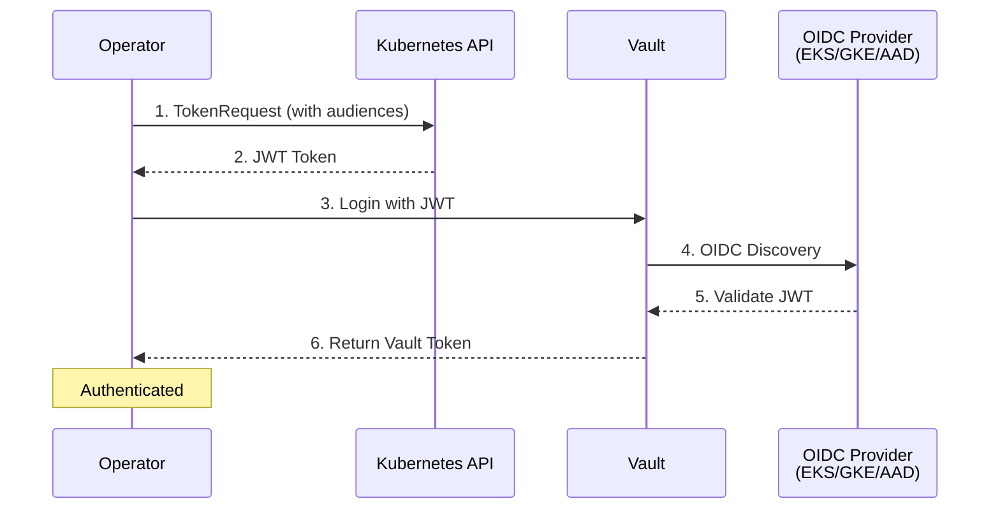

# OIDC Authentication

OIDC (OpenID Connect) authentication enables workloads to authenticate to Vault using identity tokens from OIDC providers. This is useful for workload identity federation across EKS, GKE, Azure AKS, and other platforms.

## Overview

**Best for:** Workload identity federation with cloud providers (EKS OIDC, GKE, Azure AD).

**How it works:**

1. The operator requests a service account token with OIDC claims
2. The token is sent to Vault's OIDC auth endpoint
3. Vault validates the token against the configured OIDC provider
4. Vault returns a token with the configured policies



## Prerequisites

### OIDC Provider Requirements

=== "EKS"
    - EKS cluster with OIDC provider enabled
    - OIDC issuer URL from cluster configuration

=== "GKE"
    - GKE cluster (OIDC provider automatic)
    - Workload Identity enabled (recommended)

=== "Azure AKS"
    - AKS cluster with OIDC issuer enabled
    - Azure AD Workload Identity configured

### Vault Requirements

- Vault server v1.12 or later
- OIDC or JWT auth method enabled
- Network access to OIDC discovery endpoint

### Kubernetes Requirements

- Kubernetes v1.25 or later
- ServiceAccount for the operator

## Assumptions

This guide assumes:

- You have access to your cluster's OIDC issuer URL
- Vault can reach the OIDC discovery endpoint (may require internet access)
- You have `kubectl` and `vault` CLI access

## Step-by-Step Setup

### Step 1: Get OIDC Issuer URL

=== "EKS"
    ```bash
    aws eks describe-cluster \
        --name my-cluster \
        --query "cluster.identity.oidc.issuer" \
        --output text
    # Output: https://oidc.eks.us-west-2.amazonaws.com/id/EXAMPLED539D4633E53DE1B716D3041E
    ```

=== "GKE"
    ```bash
    gcloud container clusters describe my-cluster \
        --zone us-central1-a \
        --format="value(selfLink)"
    # Use: https://container.googleapis.com/v1/projects/PROJECT/locations/ZONE/clusters/CLUSTER
    ```

=== "Azure AKS"
    ```bash
    az aks show \
        --resource-group my-rg \
        --name my-cluster \
        --query "oidcIssuerProfile.issuerUrl" \
        --output tsv
    # Output: https://eastus.oic.prod-aks.azure.com/TENANT_ID/GUID/
    ```

### Step 2: Enable OIDC Auth in Vault

```bash
# Enable OIDC auth (or JWT auth for more flexibility)
vault auth enable oidc

# Configure OIDC discovery
vault write auth/oidc/config \
    oidc_discovery_url="$OIDC_ISSUER_URL" \
    default_role="vault-access-operator"
```

!!! note "JWT vs OIDC Auth"
    Vault has two similar auth methods:

    - **OIDC auth**: Full OIDC flow with browser redirect (also supports JWT)
    - **JWT auth**: Pure JWT validation without browser flow

    For Kubernetes workloads, either works. JWT auth is simpler for server-to-server auth.

### Step 3: Create Vault Policy

```bash
vault policy write vault-access-operator - <<EOF
# Manage ACL policies
path "sys/policies/acl/*" {
  capabilities = ["create", "read", "update", "delete", "list"]
}
path "sys/policies/acl" {
  capabilities = ["list"]
}

# Manage Kubernetes auth roles
path "auth/kubernetes/role/*" {
  capabilities = ["create", "read", "update", "delete", "list"]
}
path "auth/kubernetes/role" {
  capabilities = ["list"]
}
EOF
```

### Step 4: Create Vault Role

```bash
vault write auth/oidc/role/vault-access-operator \
    role_type="jwt" \
    bound_audiences="vault" \
    user_claim="sub" \
    policies="vault-access-operator" \
    ttl="1h"
```

| Parameter | Description |
|-----------|-------------|
| `role_type` | Use `jwt` for service account tokens |
| `bound_audiences` | Audience claim(s) required in the JWT |
| `user_claim` | JWT claim to use as identity (usually `sub`) |
| `policies` | Vault policies to attach |
| `ttl` | Token lifetime |

### Step 5: Create VaultConnection Resource

```yaml
apiVersion: vault.platform.io/v1alpha1
kind: VaultConnection
metadata:
  name: vault-oidc
spec:
  address: https://vault.example.com:8200

  tls:
    caCert:
      secretRef:
        name: vault-ca-cert
        namespace: vault-access-operator-system
        key: ca.crt

  auth:
    oidc:
      role: vault-access-operator
      authPath: oidc
      providerURL: https://oidc.eks.us-west-2.amazonaws.com/id/CLUSTER_ID
      audiences:
        - vault
      useServiceAccountToken: true
      tokenDuration: 1h
```

Apply the configuration:

```bash
kubectl apply -f vaultconnection.yaml
```

### Step 6: Verify the Connection

```bash
kubectl get vaultconnection vault-oidc -o yaml

# Expected status
# status:
#   phase: Active
#   healthy: true
```

## Configuration Reference

### Required Fields

| Field | Description |
|-------|-------------|
| `auth.oidc.role` | The Vault role name to authenticate as |

### Optional Fields

| Field | Default | Description |
|-------|---------|-------------|
| `authPath` | `oidc` | Vault auth mount path |
| `providerURL` | None | OIDC provider URL for documentation |
| `audiences` | `["vault"]` | Audience claim(s) in the JWT |
| `tokenDuration` | `1h` | SA token lifetime |
| `useServiceAccountToken` | `true` | Use K8s SA token for auth |
| `jwtSecretRef` | None | Use external JWT instead of SA token |
| `userClaim` | `sub` | JWT claim for entity alias |
| `groupsClaim` | None | JWT claim for group membership |
| `scopes` | None | OIDC scopes (for browser flow) |

## Platform-Specific Examples

=== "EKS"
    ```yaml
    apiVersion: vault.platform.io/v1alpha1
    kind: VaultConnection
    metadata:
      name: vault-eks-oidc
    spec:
      address: https://vault.example.com:8200
      auth:
        oidc:
          role: vault-access-operator
          providerURL: https://oidc.eks.us-west-2.amazonaws.com/id/CLUSTER_ID
          audiences:
            - sts.amazonaws.com    # EKS default audience
          useServiceAccountToken: true
    ```

=== "GKE"
    ```yaml
    apiVersion: vault.platform.io/v1alpha1
    kind: VaultConnection
    metadata:
      name: vault-gke-oidc
    spec:
      address: https://vault.example.com:8200
      auth:
        oidc:
          role: vault-access-operator
          providerURL: https://container.googleapis.com/v1/projects/PROJECT/locations/ZONE/clusters/CLUSTER
          audiences:
            - vault
          useServiceAccountToken: true
    ```

=== "Azure AKS"
    ```yaml
    apiVersion: vault.platform.io/v1alpha1
    kind: VaultConnection
    metadata:
      name: vault-aks-oidc
    spec:
      address: https://vault.example.com:8200
      auth:
        oidc:
          role: vault-access-operator
          providerURL: https://eastus.oic.prod-aks.azure.com/TENANT_ID/GUID/
          audiences:
            - api://AzureADTokenExchange
          useServiceAccountToken: true
    ```

## Troubleshooting

### "OIDC discovery failed" error

**Symptoms:**
```
Error: error fetching OIDC discovery document
```

**Solutions:**

1. Verify Vault can reach the OIDC discovery endpoint:
   ```bash
   # From Vault server
   curl -s "$OIDC_ISSUER_URL/.well-known/openid-configuration"
   ```

2. For private clusters, ensure network connectivity or use JWT auth with manual JWKS

### "audience claim mismatch" error

**Symptoms:**
```
Error: audience claim does not match
```

**Solutions:**

1. Check the audience in your VaultConnection matches the Vault role:
   ```bash
   vault read auth/oidc/role/vault-access-operator
   ```

2. Verify the SA token has the expected audience:
   ```bash
   # Get a token and decode it
   kubectl create token vault-access-operator-controller-manager \
       -n vault-access-operator-system \
       --audience=vault | jwt decode -
   ```

### "invalid issuer" error

**Symptoms:**
```
Error: issuer claim does not match
```

**Solutions:**

1. Verify the OIDC issuer URL is exactly correct (no trailing slash)
2. Check the Vault OIDC config matches:
   ```bash
   vault read auth/oidc/config
   ```

## See Also

- [JWT Authentication](jwt.md) - Alternative for generic JWT
- [Kubernetes Authentication](kubernetes.md) - Simpler for standard setups
- [AWS IAM Authentication](aws-iam.md) - Better for EKS with IRSA
- [GCP IAM Authentication](gcp-iam.md) - Better for GKE with Workload Identity
