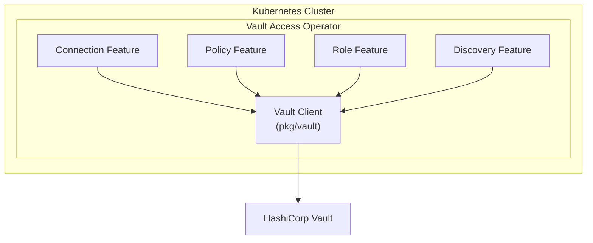
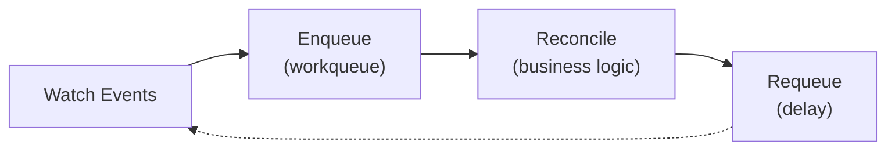
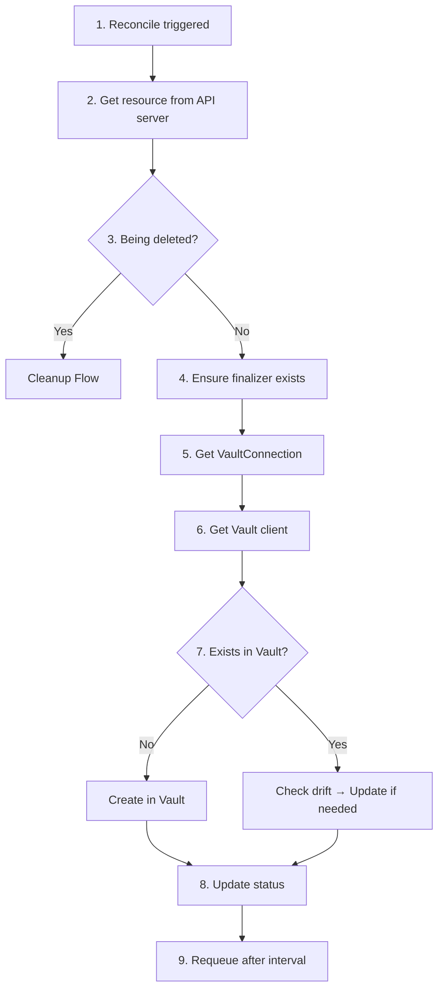
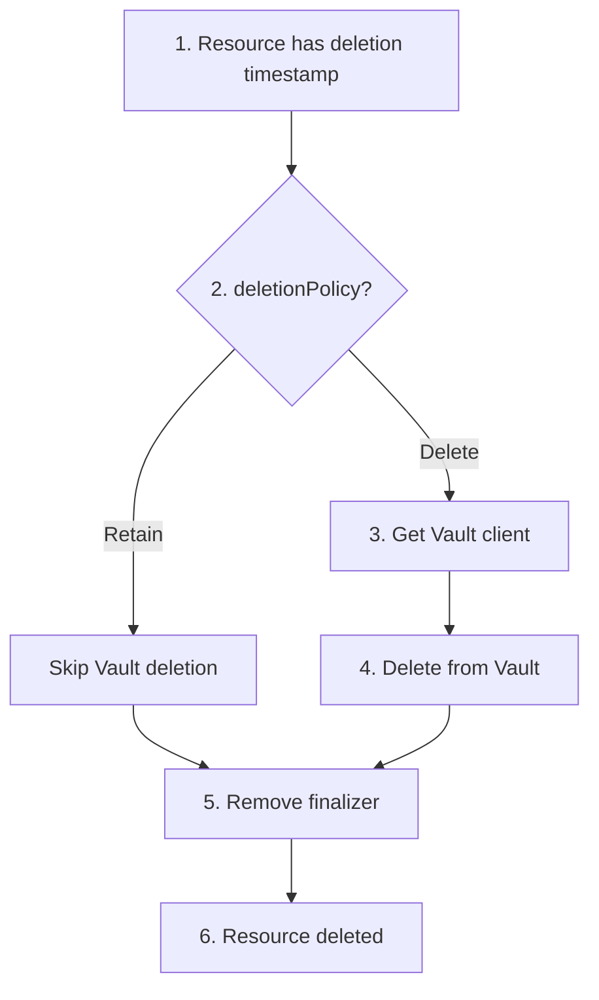
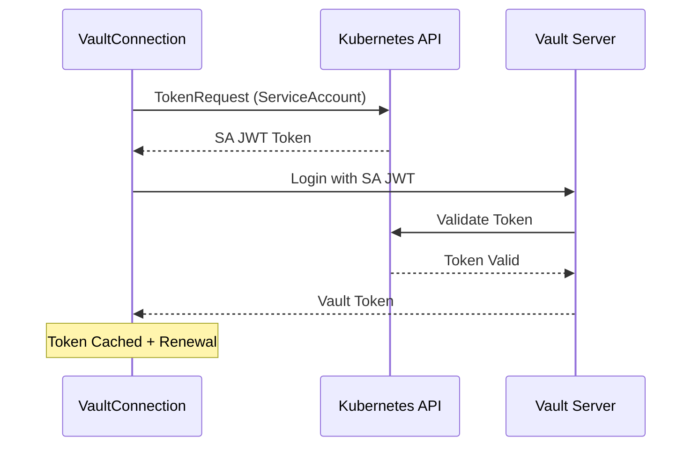
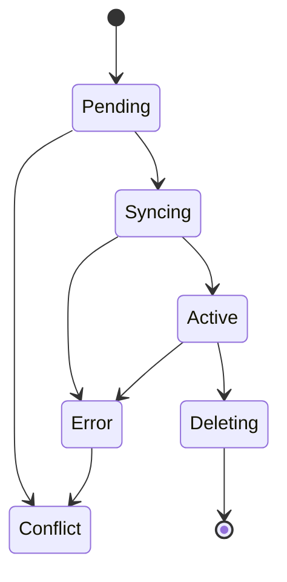

# Architecture

This document explains the internal architecture of the Vault Access Operator.

## High-Level Overview



## Feature-Driven Design

The operator follows a feature-driven architecture where each domain (connection, policy, role, discovery) is self-contained:

```
features/
├── connection/
│   ├── feature.go        # Feature registration
│   └── controller/       # Reconciler, handler
├── policy/
│   ├── feature.go
│   ├── controller/       # Policy + ClusterPolicy reconcilers
│   └── domain/           # Business logic adapters
├── role/
│   ├── feature.go
│   ├── controller/
│   └── domain/
└── discovery/
    ├── feature.go
    └── controller/       # Scanner implementation
```

### Benefits

1. **Isolation**: Each feature can be developed and tested independently
2. **Pluggability**: Features can be enabled/disabled at startup
3. **Maintainability**: Clear ownership and separation of concerns
4. **Testability**: Domain logic separated from K8s/Vault infrastructure

## Controller Pattern

Each resource type has a dedicated controller following the standard Kubernetes controller pattern:



### BaseReconciler

All controllers use a shared `BaseReconciler` that provides:

- Finalizer management
- Status updates
- Error handling
- Requeue logic
- ReconcileID tracking

```go
// BaseReconciler provides common reconciliation patterns
type BaseReconciler[T client.Object] struct {
    client   client.Client
    scheme   *runtime.Scheme
    log      logr.Logger
    finalizer string
    recorder record.EventRecorder
}

// Reconcile handles the common reconciliation flow
func (r *BaseReconciler[T]) Reconcile(
    ctx context.Context,
    req ctrl.Request,
    handler FeatureHandler[T],
    newObj func() T,
) (ctrl.Result, error)
```

### FeatureHandler Interface

Each feature implements the `FeatureHandler` interface:

```go
type FeatureHandler[T client.Object] interface {
    // Sync creates or updates the resource in Vault
    Sync(ctx context.Context, obj T) error

    // Cleanup removes the resource from Vault
    Cleanup(ctx context.Context, obj T) error
}
```

## Reconciliation Flow

### Sync Flow (Create/Update)



### Cleanup Flow (Delete)



## Domain Adapters

Domain adapters abstract the differences between namespaced and cluster-scoped resources:

```go
// PolicyAdapter provides a unified interface for VaultPolicy and VaultClusterPolicy
type PolicyAdapter interface {
    GetName() string
    GetNamespace() string
    GetVaultPolicyName() string
    GetConnectionRef() vaultv1alpha1.ConnectionReference
    GetRules() []vaultv1alpha1.PolicyRule
    GetDriftMode() vaultv1alpha1.DriftMode
    // ... status setters
}
```

This allows the same business logic to handle both:
- `VaultPolicy` (namespaced) → policy name: `namespace-name`
- `VaultClusterPolicy` (cluster-scoped) → policy name: `name`

## Vault Client Layer

The `pkg/vault` package provides a client abstraction:

```go
type Client struct {
    client     *api.Client
    authConfig AuthConfig
    log        logr.Logger
}

// Policy operations
func (c *Client) ReadPolicy(ctx context.Context, name string) (string, error)
func (c *Client) WritePolicy(ctx context.Context, name, rules string) error
func (c *Client) DeletePolicy(ctx context.Context, name string) error

// Role operations
func (c *Client) ReadKubernetesAuthRole(ctx context.Context, authPath, roleName string) (*RoleConfig, error)
func (c *Client) WriteKubernetesAuthRole(ctx context.Context, authPath, roleName string, config *RoleConfig) error
func (c *Client) DeleteKubernetesAuthRole(ctx context.Context, authPath, roleName string) error

// Authentication
func (c *Client) Authenticate(ctx context.Context) error
func (c *Client) RenewToken(ctx context.Context) error
```

## Authentication Flow



### Renewal Strategy

The operator supports two token renewal strategies:

| Strategy | Behavior |
|----------|----------|
| `renew` (default) | Renew existing token before expiration |
| `reauth` | Re-authenticate with fresh credentials |

## Status Management

### Phase Transitions



### Conditions

Resources track detailed conditions:

| Condition | Description |
|-----------|-------------|
| `Ready` | Resource is ready for use |
| `Synced` | Resource is synced to Vault |
| `ConnectionReady` | VaultConnection is available |
| `PoliciesResolved` | Referenced policies exist |

## Metrics and Observability

### Prometheus Metrics

```
vault_access_operator_reconcile_total{resource, status}
vault_access_operator_reconcile_duration_seconds{resource}
vault_access_operator_vault_operations_total{operation, status}
vault_access_operator_drift_detected{resource}
vault_access_operator_discovery_scans_total{connection, status}
vault_access_operator_discovered_resources{connection, type}
```

### Structured Logging

All log entries include:

```json
{
  "level": "info",
  "ts": "2026-01-15T10:30:00Z",
  "logger": "vaultpolicy",
  "msg": "reconciling resource",
  "reconcileID": "abc123",
  "namespace": "production",
  "name": "my-policy"
}
```

Filter logs by reconcileID:
```bash
kubectl logs deploy/vault-access-operator-controller-manager | \
  jq 'select(.reconcileID == "abc123")'
```

## Error Handling

### Retry with Backoff

Failed operations are automatically retried with exponential backoff:

```
Attempt 1: immediate
Attempt 2: 30s delay
Attempt 3: 1m delay
Attempt 4: 2m delay
...
Max delay: 5m
```

### Error Categories

| Category | Behavior |
|----------|----------|
| Transient (network, timeout) | Requeue with backoff |
| Conflict | Set status, wait for resolution |
| Validation | Set error status, no requeue |
| Permanent (auth failed) | Set error status, alert |

## See Also

- [Drift Detection](drift-detection.md) - How drift is detected and corrected
- [Discovery](discovery.md) - Finding unmanaged resources
- [API Reference](../api-reference.md) - Complete CRD reference
