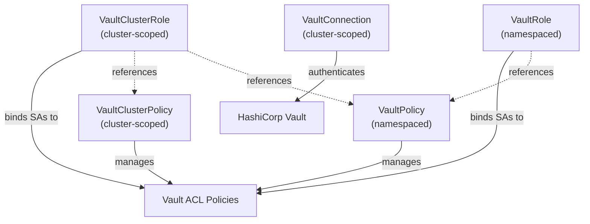
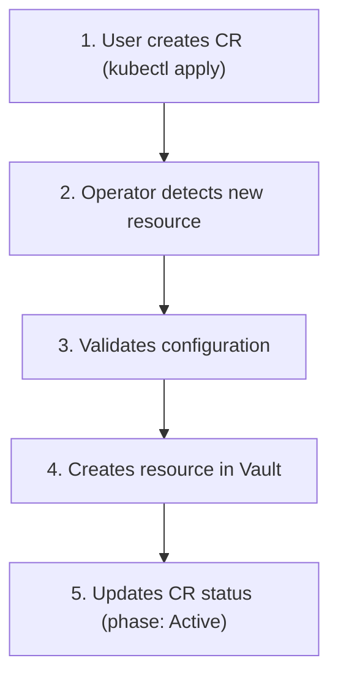
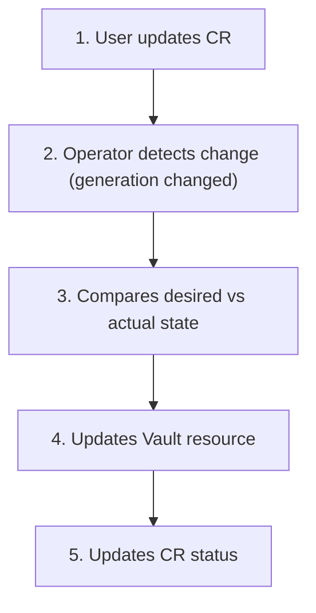
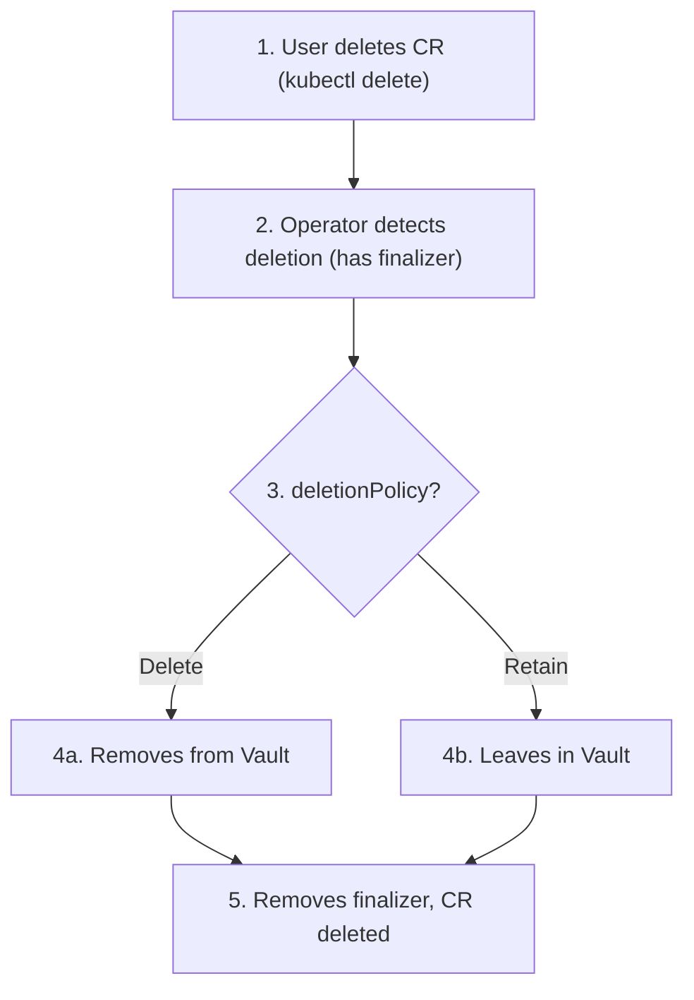

# Concepts Overview

This section explains the core concepts and design principles behind the Vault Access Operator.

## What is Vault Access Operator?

Vault Access Operator is a Kubernetes operator that manages HashiCorp Vault resources using native Kubernetes workflows. It follows the declarative approach of Kubernetes: you define the desired state, and the operator ensures Vault matches that state.

## Core Design Principles

### 1. Declarative Configuration

Instead of running imperative `vault` CLI commands, you define Vault resources as Kubernetes Custom Resources (CRs):

```yaml
apiVersion: vault.platform.io/v1alpha1
kind: VaultPolicy
metadata:
  name: my-app-read
  namespace: production
spec:
  vaultConnectionRef:
    name: vault-primary
  rules:
    - path: "secret/data/production/*"
      capabilities: ["read", "list"]
```

The operator continuously reconciles this desired state with Vault.

### 2. Kubernetes-Native Experience

- **Familiar tooling**: Use `kubectl`, Helm, Kustomize, ArgoCD
- **RBAC integration**: Kubernetes RBAC controls who can create Vault resources
- **Namespace isolation**: VaultPolicy and VaultRole are namespaced; VaultClusterPolicy and VaultClusterRole are cluster-scoped
- **GitOps compatible**: Store Vault configuration in Git

### 3. Feature-Driven Architecture

The operator is organized as independent features that can be enabled/disabled:

| Feature | Resources | Purpose |
|---------|-----------|---------|
| Connection | VaultConnection | Authenticate and connect to Vault |
| Policy | VaultPolicy, VaultClusterPolicy | Manage Vault ACL policies |
| Role | VaultRole, VaultClusterRole | Manage Kubernetes auth roles |
| Discovery | (built into VaultConnection) | Find unmanaged Vault resources |

## Custom Resource Definitions

### Resource Hierarchy



### Naming Convention

Resources in Vault are named with a prefix derived from their Kubernetes context:

| K8s Resource | Vault Name Pattern |
|--------------|-------------------|
| VaultPolicy `foo` in namespace `bar` | `bar-foo` |
| VaultClusterPolicy `foo` | `foo` |
| VaultRole `foo` in namespace `bar` | `bar-foo` |
| VaultClusterRole `foo` | `foo` |

## Key Concepts

### [Architecture](architecture.md)

Learn about the operator's internal structure, controller patterns, and reconciliation flow.

### [Drift Detection](drift-detection.md)

Understand how the operator detects and optionally corrects configuration drift between Kubernetes and Vault.

### [Discovery](discovery.md)

Discover how to find existing Vault resources that aren't yet managed by Kubernetes CRs.

## Resource Lifecycle

### Creation Flow



### Update Flow



### Deletion Flow



## Status Fields

All managed resources share common status patterns:

| Field | Description |
|-------|-------------|
| `phase` | Current state: Pending, Syncing, Active, Error, Conflict |
| `conditions` | Detailed conditions (Ready, Synced, etc.) |
| `lastSyncedAt` | When the resource was last synced to Vault |
| `driftDetected` | Whether configuration drift exists |
| `lastReconcileID` | Correlation ID for log filtering |

## Next Steps

- [Architecture](architecture.md) - Deep dive into operator internals
- [Drift Detection](drift-detection.md) - Understand drift modes
- [Discovery](discovery.md) - Find unmanaged Vault resources
- [Authentication Methods](../auth-methods/index.md) - Choose your auth method
