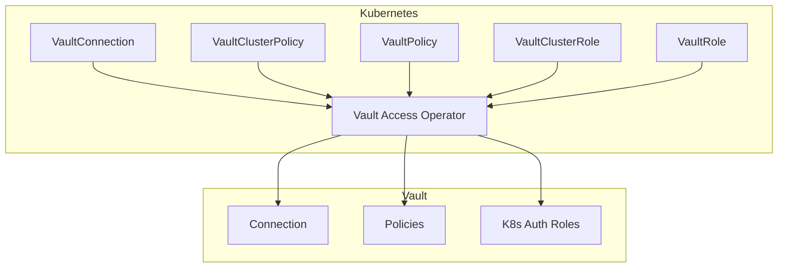

# Vault Access Operator

A Kubernetes operator for managing HashiCorp Vault access policies and Kubernetes authentication roles declaratively through Custom Resource Definitions (CRDs).

<div class="grid cards" markdown>

-   :material-rocket-launch:{ .lg .middle } __Get Started in 5 Minutes__

    ---

    Install the operator and create your first VaultConnection, VaultPolicy, and VaultRole.

    [:octicons-arrow-right-24: Quick Start](quickstart.md)

-   :material-cog:{ .lg .middle } __Configuration Reference__

    ---

    Complete Helm chart configuration options and example values files.

    [:octicons-arrow-right-24: Configuration](configuration/helm-values.md)

-   :material-book-open-variant:{ .lg .middle } __API Reference__

    ---

    Detailed documentation for all Custom Resource Definitions.

    [:octicons-arrow-right-24: API Reference](api-reference/index.md)

-   :material-lifebuoy:{ .lg .middle } __Troubleshooting__

    ---

    Common issues, debugging techniques, and solutions.

    [:octicons-arrow-right-24: Troubleshooting](troubleshooting.md)

</div>

## Overview

The Vault Access Operator enables platform teams to manage Vault policies and Kubernetes authentication roles using native Kubernetes resources. It provides a GitOps-friendly approach to Vault access management, allowing teams to version control their Vault configurations alongside their application deployments.

## Features

- **Declarative Vault Policy Management** - Define Vault policies as Kubernetes resources
- **Kubernetes Auth Role Management** - Configure Vault Kubernetes authentication roles through CRDs
- **Namespace Boundary Enforcement** - Automatically restrict namespaced policies to their namespace scope
- **Multiple Authentication Methods** - Support for Kubernetes, Token, and AppRole authentication
- **Conflict Detection and Handling** - Choose between fail-fast or adopt strategies for existing resources
- **Automatic Policy Generation** - Generate Vault HCL policies from structured rule definitions
- **Variable Substitution** - Use `{{namespace}}` and `{{name}}` variables in policy paths
- **Exponential Backoff Retry** - Intelligent retry with jitter for transient failures
- **Deletion Policies** - Control whether Vault resources are retained or deleted when K8s resources are removed
- **Admission Webhooks** - Validate resources before creation with detailed error messages

## Quick Installation

=== "Helm (Recommended)"

    ```bash
    # Add the Helm repository
    helm repo add vault-access-operator https://panteparak.github.io/vault-access-operator/charts

    # Install the operator
    helm install vault-access-operator vault-access-operator/vault-access-operator \
      --namespace vault-access-operator-system \
      --create-namespace
    ```

=== "kubectl"

    ```bash
    kubectl apply -f https://raw.githubusercontent.com/panteparak/vault-access-operator/main/dist/install.yaml
    ```

=== "From Source"

    ```bash
    git clone https://github.com/panteparak/vault-access-operator.git
    cd vault-access-operator
    make install
    make deploy IMG=ghcr.io/panteparak/vault-access-operator:latest
    ```

For detailed installation instructions, see the [Installation Guide](installation.md).

## Custom Resource Definitions

The operator provides five CRDs for managing Vault access:

| CRD | Scope | Description |
|-----|-------|-------------|
| [VaultConnection](api-reference/vaultconnection.md) | Cluster | Establishes connection to Vault server |
| [VaultClusterPolicy](api-reference/vaultclusterpolicy.md) | Cluster | Manages cluster-wide Vault policies |
| [VaultPolicy](api-reference/vaultpolicy.md) | Namespaced | Manages namespace-scoped Vault policies |
| [VaultClusterRole](api-reference/vaultclusterrole.md) | Cluster | Manages cluster-wide Kubernetes auth roles |
| [VaultRole](api-reference/vaultrole.md) | Namespaced | Manages namespace-scoped Kubernetes auth roles |

## Architecture



## Prerequisites

- Kubernetes cluster (v1.25+)
- HashiCorp Vault server
- cert-manager (for webhook certificates, optional)
- kubectl configured to access your cluster

## Community

- [GitHub Repository](https://github.com/panteparak/vault-access-operator)
- [Issue Tracker](https://github.com/panteparak/vault-access-operator/issues)
- [Contributing Guide](https://github.com/panteparak/vault-access-operator/blob/main/CONTRIBUTING.md)

## License

Copyright 2024-2026 Vault Access Operator Contributors.

Licensed under the Apache License, Version 2.0.
