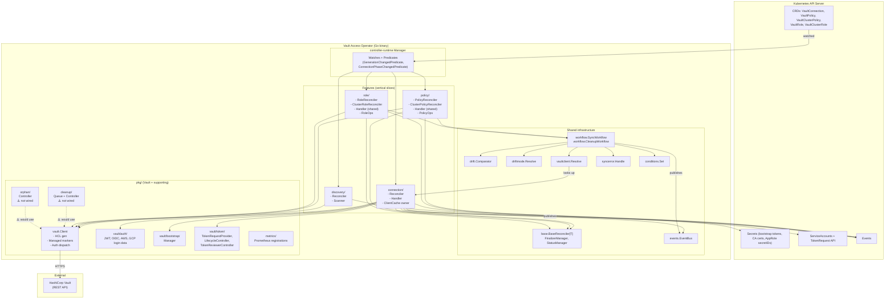
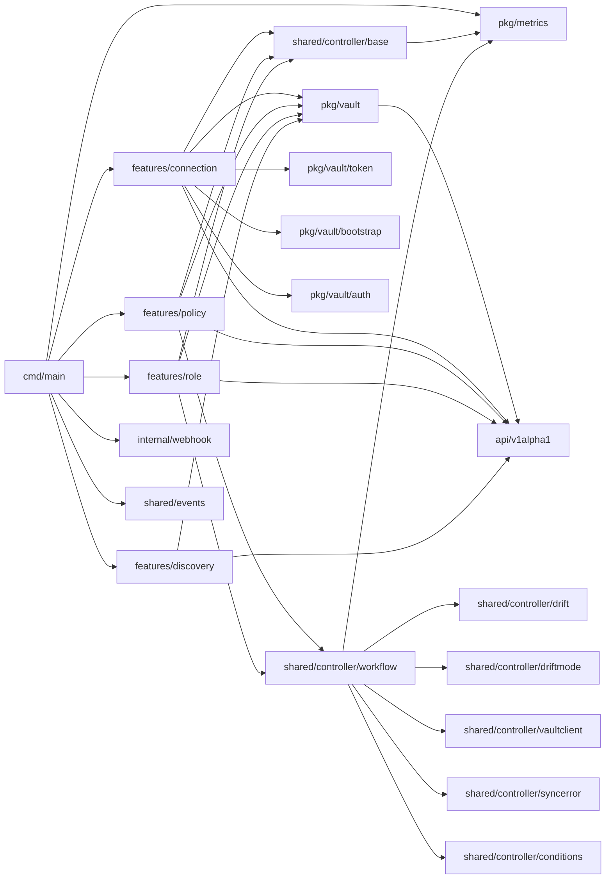
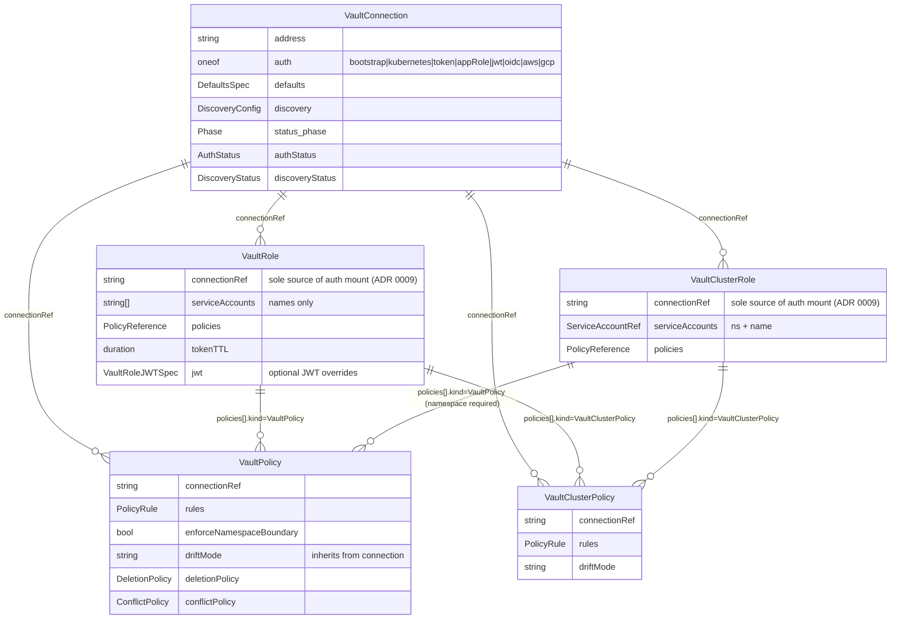
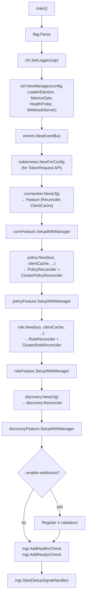
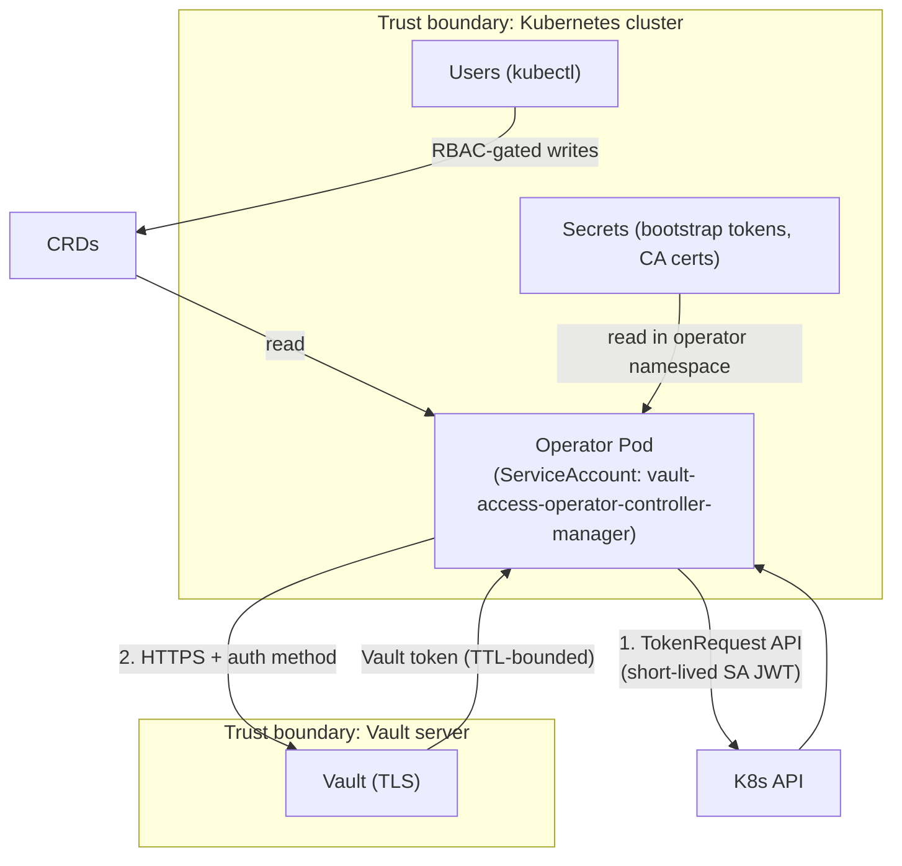
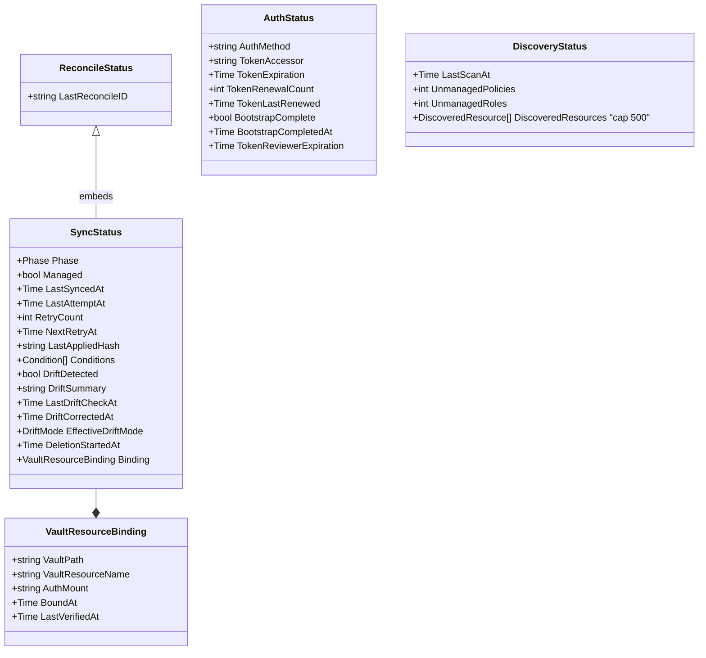
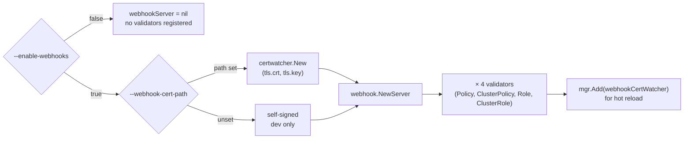

# Vault Access Operator — Architecture

> Static structure, layering, and dependency view. Dynamic flows live in the `FLOW_*.md` siblings.

## Architecture Style

**Feature-Driven Design (FDD)** layered over a **Template Method** reconciler skeleton. Each CRD family (connection, policy, role, discovery) is a vertical slice with its own feature package. A shared `workflow` package deduplicates the 9-step sync orchestration between policy and role.

Why FDD instead of flat `controllers/` packages:
- A CRD family's controller, handler, domain adapter, and tests all live in one folder — changes are localized.
- Features expose a narrow constructor (`feature.New(cfg)`) and a `SetupWithManager(mgr)` entrypoint — `cmd/main.go` wires them without knowing internals.
- The connection feature publishes a shared resource (`*vault.ClientCache`) that other features consume read-only, keeping inter-feature coupling explicit and unidirectional.

## Layer Diagram

## Module Dependency Graph

## Key Patterns

| Pattern | Where | Why |
|---------|-------|-----|
| **Template Method** | [base.BaseReconciler[T]](../../shared/controller/base/reconciler.go:97) | Every CRD reconciler shares the fetch → handle-deletion → ensure-finalizer → Sync → status-update skeleton. Feature supplies `FeatureHandler.Sync`/`Cleanup`. |
| **Workflow / Orchestrator** | [workflow.SyncWorkflow](../../shared/controller/workflow/sync.go:47) | Policy and role share 9 orchestration steps (validate, check conflict, prepare content, detect drift, handle mode, write, verify, finalize, publish). Resource-specific steps live in `ResourceOps`. |
| **Adapter** | [PolicyAdapter](../../features/policy/domain/adapter.go), [RoleAdapter](../../features/role/domain/adapter.go) | Unifies namespaced + cluster-scoped variants behind one interface. One `Handler` serves both. |
| **Strategy** | `auth.Kubernetes / Token / AppRole / JWT / OIDC / AWS / GCP` branches in [handler.authenticate](../../features/connection/controller/handler.go:704) | Auth backend selected at runtime by which sub-struct is non-nil. |
| **Strategy** | `token.TokenRequestProvider` vs `token.MountedTokenProvider` | How the operator fetches its own SA token. |
| **Repository** | [`vault.ClientCache`](../../pkg/vault/client_cache.go) | In-memory map owned by the connection feature; other features read via `.Get(name)`. |
| **Pub/Sub** | [events.EventBus](../../shared/events/bus.go) | Type-erased in-process bus. `Subscribe[T]` captures the type assertion in a closure; `Publish*` invokes all handlers for matching type. |
| **Finalizer** | [base.FinalizerManager](../../shared/controller/base/finalizer.go) | Ensures `Cleanup()` runs before K8s allows object deletion. Finalizer name `vault.platform.io/finalizer`. |
| **Validator (admission)** | [internal/webhook/](../../internal/webhook/) | Pre-persist CR validation (path formatting, policy refs, namespace boundary). Opt-in via `--enable-webhooks`. |
| **Predicate filter** | [GenerationChangedPredicate](../../features/policy/controller/policy_reconciler.go:89), [ConnectionPhaseChangedPredicate](../../shared/controller/watches/predicates.go) | Policy/role reconcilers ignore status-only updates from health checks; policy reconciler also watches VaultConnection phase changes to requeue when auth comes online. |
| **Retry on conflict** | [retry.RetryOnConflict in discovery](../../features/discovery/controller/controller.go:286) | Discovery + connection write to the same `VaultConnection.Status`; the discovery controller explicitly retries on 409 conflicts. |

## CRD Relationships

## Runtime Wiring (cmd/main.go)

**Dependency injection order matters:** connection feature is constructed first so its `ClientCache` exists before policy/role/discovery features receive it. This is enforced by sequential construction in `main.go` and is the main reason the features aren't fully decoupled.

## External Dependencies

| Dependency | Type | Purpose | Failure Impact |
|-----------|------|---------|----------------|
| Kubernetes API server | Control plane | CRD storage, Secrets, Events, TokenRequest | operator cannot reconcile |
| HashiCorp Vault | External service | target state for policies + auth roles | `Phase: Error`, metrics flip, reconciles retry with backoff |
| `sigs.k8s.io/controller-runtime` | library | manager, cache, predicates, leader election | compile-time |
| `github.com/hashicorp/vault/api` v1.22 | library | Vault REST (note: uses `sys/policies/acl?list=true` semantics) | auth/policy/role ops fail |
| `k8s.io/client-go` | library | TokenRequest API, kubernetes.Interface | K8s-auth + JWT auth break |
| `github.com/go-logr/logr` + `zap` | library | structured logs | logging degraded |
| `testcontainers-go` | test-only | spin up Vault Docker image for integration | dev only |

## Security Boundaries

- **Operator authenticates per connection**, not globally — each `VaultConnection` selects its own auth method.
- **Bootstrap tokens are read-only from Secrets** and never written to status or logs (enforced by `handleSyncError`).
- **Token accessor** (but not the token itself) may appear in status for audit correlation.
- **Webhook TLS** certs are hot-reloaded via `certwatcher` — no restart needed for cert rotation.
- **HTTP/2 is disabled** by default for both metrics and webhook servers (CVE-2023-44487 mitigation).
- **Metrics endpoint** is authn/authz-protected when `--metrics-secure=true` (via `filters.WithAuthenticationAndAuthorization`).

## Data Model (status payloads)

`VaultConnection.Status` embeds `ReconcileStatus` directly (no sync status) and adds `AuthStatus` + `DiscoveryStatus` + health fields. Policy/role statuses embed both `ReconcileStatus` and `SyncStatus`.

## Metrics

All registered from `pkg/metrics/metrics.go`. Prefix: `vault_access_operator_*`.

| Metric | Type | Labels | Meaning |
|--------|------|--------|---------|
| `connection_healthy` | Gauge | `connection` | 1 = healthy, 0 = not |
| `connection_health_checks_total` | Counter | `connection, result` | every 30s per connection |
| `connection_consecutive_fails` | Gauge | `connection` | resets on success |
| `policy_reconcile_total` | Counter | `kind, namespace, result` | per-reconcile outcome |
| `role_reconcile_total` | Counter | `kind, namespace, result` | per-reconcile outcome |
| `vault_drift_detected` | Gauge | `kind, namespace, name` | 1 during drift, 0 after; cleared on resource delete |
| `vault_drift_corrected_total` | Counter | `kind, namespace` | increments on correct-mode writes |
| `safety_destructive_blocked_total` | Counter | `kind, namespace` | drift-correct blocked by missing annotation |
| `vault_orphaned_resources` | Gauge | `connection, type` | from `pkg/orphan` (⚠️ not wired) |
| `cleanup_queue_size` | Gauge | — | from `pkg/cleanup` (⚠️ not wired) |
| `cleanup_retries_total` | Counter | `resource_type, result` | from `pkg/cleanup` (⚠️ not wired) |
| `discovery_unmanaged_resources` | Gauge | `connection, type` | from scanner |
| `discovery_scans_total` | Counter | `connection, result` | from scanner |
| `discovery_adoptions_total` | Counter | `kind, namespace, result` | **registered but never emitted** — see [IMPROVEMENTS.md §31](IMPROVEMENTS.md#31-dead-metrics) |
| `policy_reconcile_total` | Counter | `kind, namespace, result` | **registered but never emitted** (§31) |
| `role_reconcile_total` | Counter | `kind, namespace, result` | **registered but never emitted** (§31) |

See [FLOW_METRICS.md](FLOW_METRICS.md) for per-metric emission sites and wiring recommendations.

## RBAC Surface

RBAC is authored via `+kubebuilder:rbac:` markers on the feature reconcilers and webhook validators; `make manifests` aggregates them into [config/rbac/role.yaml](../../config/rbac/role.yaml). The aggregated ClusterRole is what the operator's ServiceAccount is bound to.

| Resource group | Verbs | Granted to (conceptually) | Notes |
|----------------|-------|---------------------------|-------|
| `vault.platform.io/vaultconnections` (+status, +finalizers) | full | connection feature | lifecycle ownership |
| `vault.platform.io/vaultpolicies`, `vaultclusterpolicies` (+status, +finalizers) | full | policy feature | |
| `vault.platform.io/vaultroles`, `vaultclusterroles` (+status, +finalizers) | full | role feature | |
| `core/secrets` | get, list, watch | connection feature | auth creds: bootstrap token, AppRole secretID, JWT, GCP SA key, CA cert |
| `core/serviceaccounts/token` | create | connection feature | TokenRequest API for k8s/jwt/oidc auth flows |
| `core/events` | create, patch | all features | reconcile events to `kubectl describe` |
| `coordination.k8s.io/leases` | get, list, watch, create, update, patch, delete | manager | leader election |
| `authentication.k8s.io/tokenreviews`, `authorization.k8s.io/subjectaccessreviews` | create | metrics server | `--metrics-secure=true` authn/authz |
| `core/configmaps` | get, list, watch, create, update, patch, delete | **unwired cleanup controller** | ConfigMap-backed retry queue — granted but unused today (see [IMPROVEMENTS.md §34](IMPROVEMENTS.md#34-rbac-aggregates-unwired-controller-needs)) |

See [INSTRUCTIONS.md §2](INSTRUCTIONS.md#2-add-a-new-crd-family) for the contributor workflow when adding new markers.

## Webhook Wiring

The webhook server is **opt-in** — nothing is constructed unless `--enable-webhooks=true`:

Helm chart ([validatingwebhookconfiguration.yaml](../../charts/vault-access-operator/templates/validatingwebhookconfiguration.yaml)) renders the `ValidatingWebhookConfiguration` only when `webhooks.enabled=true`. TLS comes from cert-manager when `webhooks.certManager.enabled=true`.

See [FLOW_WEBHOOK.md](FLOW_WEBHOOK.md) for request-flow detail and per-validator rules.

## Cross-References

- [PROJECT_OVERVIEW.md](PROJECT_OVERVIEW.md) — identity, glossary, config
- [FLOW_OVERVIEW.md](FLOW_OVERVIEW.md) — shared runtime foundations
- [FLOW_LIFECYCLE.md](FLOW_LIFECYCLE.md) — manager startup and shutdown
- [FLOW_WEBHOOK.md](FLOW_WEBHOOK.md) — webhook request-path detail
- [FLOW_METRICS.md](FLOW_METRICS.md) — metric-by-metric emission sites
- [INSTRUCTIONS.md](INSTRUCTIONS.md) — contributor procedures
- [IMPROVEMENTS.md](IMPROVEMENTS.md) — disconnects & duplicates called out above
