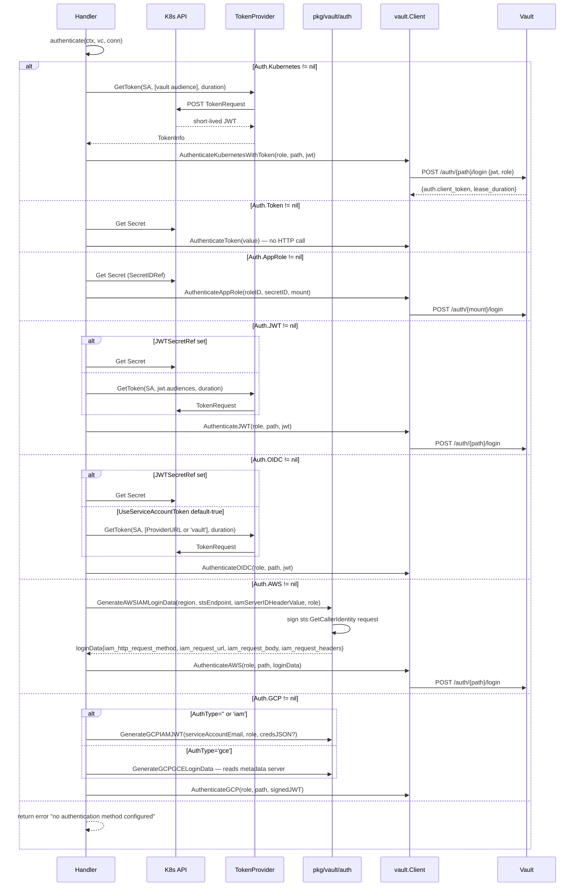
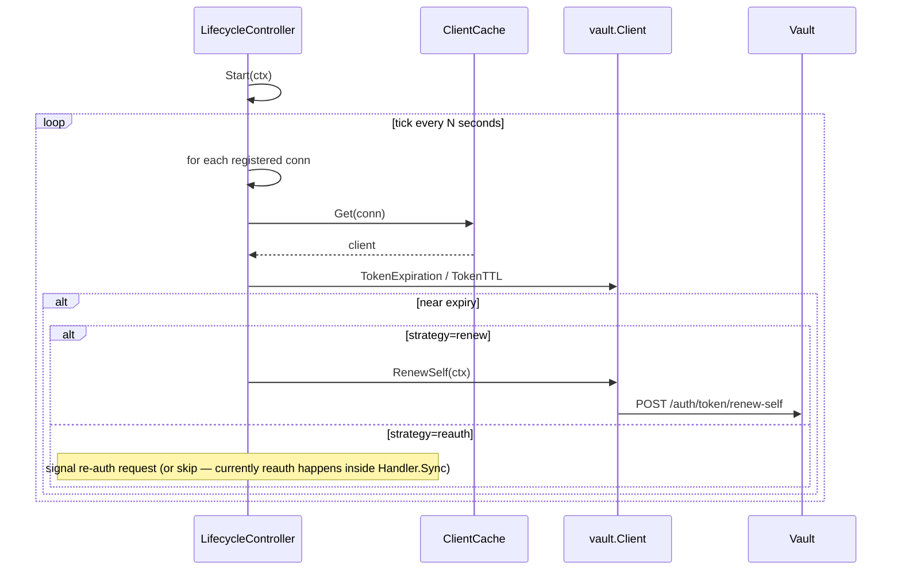
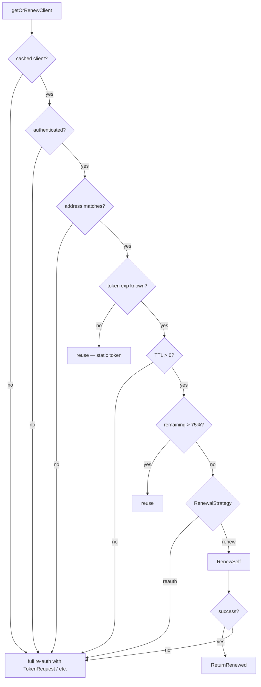

# FLOW: Authentication Backends & Token Lifecycle

## Summary

The operator authenticates to Vault **per VaultConnection** using one of 8 possible auth methods. Backend selection is **exclusive**: only the first non-nil `Spec.Auth.*` sub-struct is used ([handler.go:704](../../features/connection/controller/handler.go:704)). After authentication, the resulting Vault token is cached along with its expiration; subsequent reconciles renew or re-authenticate based on a 75% TTL threshold and the configured `RenewalStrategy`.

There are **two separate lifecycle controllers** (in `pkg/vault/token/`) whose purpose is to proactively renew tokens and rotate the `token_reviewer_jwt` for k8s-auth — but they are only used in the connection handler's cleanup path via `Unregister`. Their `Start(ctx)` methods exist but are not called. See [IMPROVEMENTS.md §1](IMPROVEMENTS.md#1-unwired-controllers).

## Auth Method Matrix

| Method | Use case | Token source | Secret input | Status published |
|--------|---------|--------------|--------------|------------------|
| `bootstrap` | first-time Vault setup | Secret with root/admin token | `Auth.Bootstrap.SecretRef` | `BootstrapComplete`, `BootstrapCompletedAt`, `TokenReviewerExpiration` |
| `kubernetes` | pod running in cluster | TokenRequest API (short-lived SA JWT) → Vault login | none (uses operator SA) | `AuthMethod=kubernetes`, `TokenExpiration`, `TokenAccessor`, renewal count |
| `token` | dev, CI | static Vault token in Secret | `Auth.Token.SecretRef` | `AuthMethod` only (no expiration tracking for static tokens) |
| `appRole` | CI pipelines, external agents | RoleID + Secret-wrapped SecretID → Vault login | `Auth.AppRole.SecretIDRef` | token tracking |
| `jwt` | external identity providers | JWT from Secret OR TokenRequest API | `Auth.JWT.JWTSecretRef` OR none | token tracking |
| `oidc` | EKS/GKE/Azure AD OIDC federation | TokenRequest API with audiences = provider URL (or Secret) | `Auth.OIDC.JWTSecretRef` OR none | token tracking |
| `aws` | EKS with IRSA, EC2 | STS GetCallerIdentity signed request | `Auth.AWS.*` (Role, Region, STSEndpoint, IAMServerIDHeaderValue) | token tracking |
| `gcp` | GKE Workload Identity, GCE | GCP-signed JWT (IAM) or identity token (GCE) | `Auth.GCP.CredentialsSecretRef` OR metadata server | token tracking |

## Backend Selection Sequence



## Token Providers

Two implementations in [pkg/vault/token/provider.go](../../pkg/vault/token/provider.go):

### TokenRequestProvider (recommended)

Uses the K8s [TokenRequest API](https://kubernetes.io/docs/reference/access-authn-authz/authentication/#token-request) to mint a **short-lived, audience-scoped** JWT for the operator's own service account.

```mermaid
sequenceDiagram
    participant TP as TokenRequestProvider
    participant CS as kubernetes.Interface
    participant K8s as K8s API

    TP->>CS: CoreV1().ServiceAccounts(ns).CreateToken(name, TokenRequest{
        Spec: {
            Audiences: [audience],
            ExpirationSeconds: duration
        }
    })
    CS->>K8s: POST /api/v1/namespaces/{ns}/serviceaccounts/{name}/token
    K8s-->>CS: TokenRequestStatus{token, expirationTimestamp}
    CS-->>TP: TokenInfo{token, expiration, audiences}
```

Properties:
- Stateless — each call produces a fresh token
- Minimum K8s 1.22, widely supported
- Automatically rotates: no operator side-effect

### MountedTokenProvider

Reads the SA token from the mounted projected volume (typically `/var/run/secrets/kubernetes.io/serviceaccount/token`). Legacy — use only if TokenRequest API is unavailable.

## Lifecycle Controller (intended behavior)

[`pkg/vault/token/lifecycle.go`](../../pkg/vault/token/lifecycle.go): periodically iterates registered clients, calls `RenewSelf` on those nearing expiration. The connection handler calls `lifecycleCtrl.Unregister(conn.Name)` on cleanup, implying it is supposed to register somewhere — but `Register` calls are absent from the current main binary.

Expected behavior once wired:



Today the connection reconciler's 30s requeue implicitly covers this — the next `Sync` runs `getOrRenewClient` which handles the same logic inline. So **the missing wire-up has no immediate correctness cost**, just potentially more Vault load (each reconcile calls `GetVersion` + `IsHealthy` regardless).

## Token Reviewer Rotation (K8s auth only)

When Vault's k8s auth mount is configured, it needs a `token_reviewer_jwt` to call the K8s `TokenReview` API. This JWT expires; if it does, Vault can no longer validate pod tokens.

[`pkg/vault/token/rotator.go`](../../pkg/vault/token/rotator.go) (TokenReviewerController) is designed to:

1. Periodically mint a fresh reviewer JWT via TokenRequest API
2. Write it back to Vault's auth config (`auth/{mount}/config`)

Like the lifecycle controller, it has a `Start(ctx)` but nothing calls it. The connection handler emits a warning condition if the user explicitly disabled rotation:

```go
// handler.go:357
if k8sAuth.TokenReviewerRotation != nil && !*k8sAuth.TokenReviewerRotation {
    setCondition("TokenReviewerRotationDisabled", True, "ManualManagement",
        "Warning: TokenReviewerRotation is disabled. You must manually update token_reviewer_jwt in Vault before it expires.")
}
```

— but if the flag is **default** (unset or true), the warning is skipped even though rotation **is still not running**. This is a silent failure mode: the user thinks rotation is enabled, but nothing is rotating. See [IMPROVEMENTS.md §1](IMPROVEMENTS.md#1-unwired-controllers).

## Renewal Strategy

Spec field: `VaultConnection.Spec.Auth.Kubernetes.RenewalStrategy`:
- `renew` (default) — attempt `token/renew-self` first; fallback to re-auth on failure
- `reauth` — always re-authenticate when nearing expiration (no renew attempt)

Used by [`getOrRenewClient`](../../features/connection/controller/handler.go:591). Rationale for `reauth`:
- security-critical workloads that prefer fresh identity assertions over renewed tokens
- environments where renewal privileges are revoked but login is allowed

## Cache Reuse Logic



## Cloud Identity Variants (detail)

### AWS IAM

[pkg/vault/auth/aws.go](../../pkg/vault/auth/aws.go): signs a `sts:GetCallerIdentity` request using the Go AWS SDK v2, then packages method/url/body/headers for Vault's `/auth/aws/login` endpoint. Vault re-executes the signed request against STS to verify the caller.

Spec fields:
- `Region` — e.g. `us-east-1`
- `STSEndpoint` — override for non-default regions or VPC endpoints
- `IAMServerIDHeaderValue` — adds `X-Vault-AWS-IAM-Server-ID`, required when Vault is configured with server ID
- `Role` — Vault role name (the K8s-auth `role`, not the AWS IAM role)

### GCP IAM / GCE

[pkg/vault/auth/gcp.go](../../pkg/vault/auth/gcp.go):
- **IAM** (default): uses Application Default Credentials or explicit `CredentialsSecretRef` JSON to call `iam:signJwt` for a given service account email. The resulting JWT is the login payload.
- **GCE**: calls the metadata server (`metadata.google.internal`) for an identity token. Works only inside GCE VMs / GKE nodes.

### OIDC

Tied closely to JWT auth. The difference:
- JWT can use any signer (Dex, Keycloak, custom issuer)
- OIDC requires `ProviderURL` (which becomes the default audience when none specified)

## Interface Boundary Summary

| Crossing | Port | Method | Payload |
|----------|------|--------|---------|
| Handler → `TokenProvider` | concrete | `GetToken(opts)` | `TokenInfo{token, expiration, audiences}` |
| Handler → `bootstrap.Manager` | concrete | `Bootstrap(vc, cfg)` | `*Result` |
| Handler → `auth.GenerateAWSIAMLoginData` | package function | `opts` | `map[string]interface{}` |
| Handler → `auth.GenerateGCPIAMJWT` | package function | `opts` | signed JWT string |
| Handler → `vault.Client` | concrete | `Authenticate{Kubernetes|Token|AppRole|JWT|OIDC|AWS|GCP}` | HTTPS bodies |

## Error Scenarios

| Error | Origin | Likely cause |
|-------|--------|-------------|
| `no authentication method configured` | `authenticate` end of chain | all `Auth.*` sub-structs nil |
| `TokenRequest API unauthorized` | `TokenProvider.GetToken` | operator SA lacks `create serviceaccounts/token` RBAC |
| `AWS signing failed` | `GenerateAWSIAMLoginData` | no AWS credentials in env / IRSA misconfigured |
| `GCP IAM signJwt denied` | `GenerateGCPIAMJWT` | workload identity SA lacks `roles/iam.serviceAccountTokenCreator` |
| `Vault 400 bad role` | `AuthenticateKubernetesWithToken` | role name mismatch between spec and Vault |
| `Vault 403 permission denied` | any auth method | bootstrap didn't create operator role, or role has no policies |
| `OIDC auth requires either jwtSecretRef or useServiceAccountToken=true` | `getOIDCToken` | user set `UseServiceAccountToken=false` without `JWTSecretRef` |

## Cross-References

- [FLOW_CONNECTION.md](FLOW_CONNECTION.md) — where auth is invoked
- [FLOW_ROLE.md](FLOW_ROLE.md) — the role's `authPath` determines which auth backend a role binds into (separate from how the operator itself authenticates)
- [IMPROVEMENTS.md §1](IMPROVEMENTS.md#1-unwired-controllers) — lifecycle + reviewer controllers not running
- [IMPROVEMENTS.md §6](IMPROVEMENTS.md#6-auth-dispatch-chain-vs-strategy-map) — dispatch refactor
- [IMPROVEMENTS.md §7](IMPROVEMENTS.md#7-role-backend-coverage-gap) — role flow only supports kubernetes + jwt, despite 8 auth methods
- [IMPROVEMENTS.md §8](IMPROVEMENTS.md#8-connection-webhook-missing)
