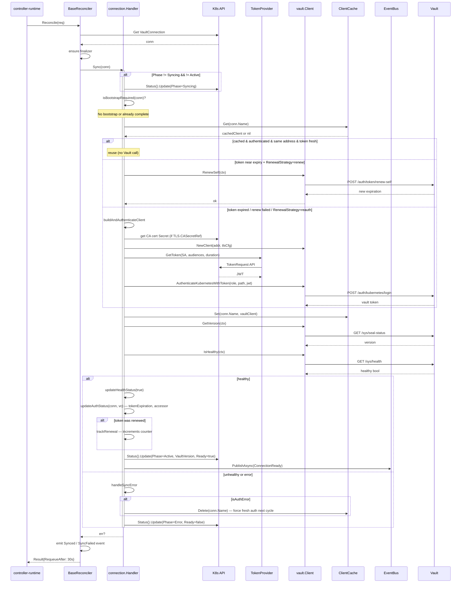
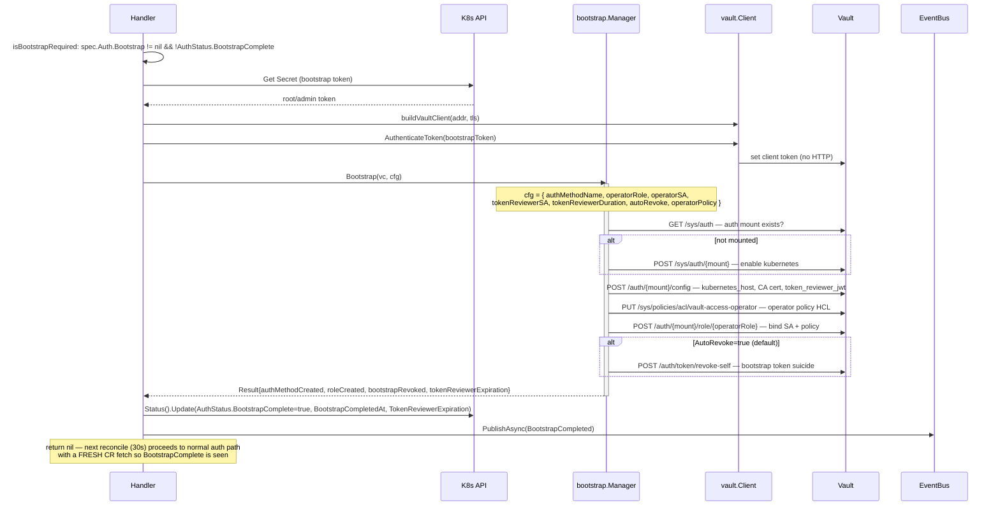
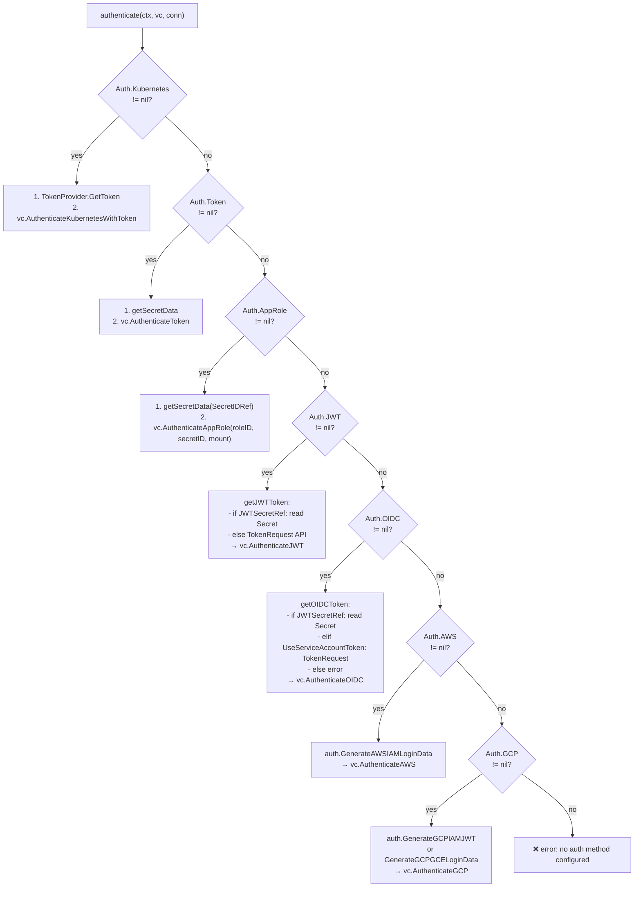
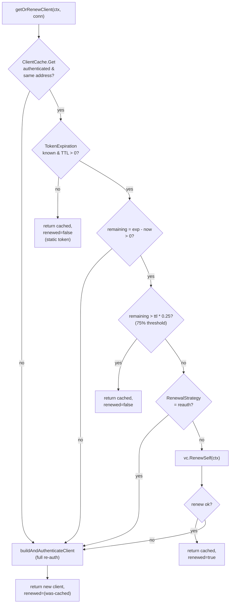
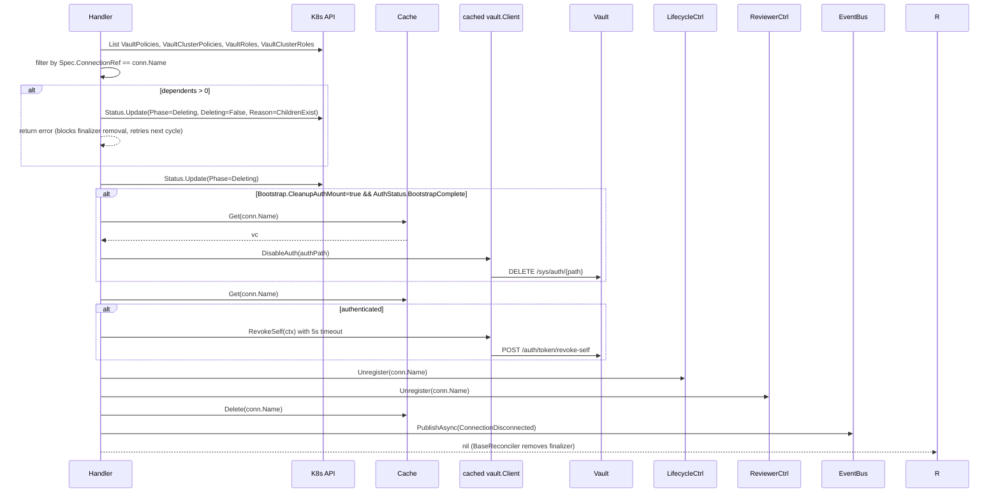

# FLOW: VaultConnection Reconciliation

## Summary

The VaultConnection reconciler is the entry point for every conversation the operator has with Vault. It establishes an authenticated `*vault.Client`, caches it in `ClientCache`, performs a health check, and publishes a `ConnectionReady` event so dependent policies/roles know they can proceed. It also owns the **bootstrap** path — a one-time setup where a high-privilege token is used to enable the kubernetes auth mount, create the operator's own role + policy, then (optionally) self-revoke.

**Unlike policy/role, this reconciler does NOT use the shared `SyncWorkflow`**: connection state (bootstrap state, token state, health state) doesn't fit the generic "write content, verify, detect drift" model. Its logic lives entirely in [`features/connection/controller/handler.go`](../../features/connection/controller/handler.go).

## Participants

| # | Component | Layer | Source | Role |
|---|-----------|-------|--------|------|
| 1 | `connection.Reconciler` | transport | [features/connection/controller/reconciler.go](../../features/connection/controller/reconciler.go) | wraps `BaseReconciler[*VaultConnection]` |
| 2 | `connection.Handler` | feature | [features/connection/controller/handler.go:56](../../features/connection/controller/handler.go:56) | `Sync` + `Cleanup` |
| 3 | `bootstrap.Manager` | pkg | [pkg/vault/bootstrap/](../../pkg/vault/bootstrap/) | `Bootstrap(vaultClient, cfg)` — creates k8s mount, role, policy |
| 4 | `token.TokenProvider` | pkg | [pkg/vault/token/provider.go](../../pkg/vault/token/provider.go) | TokenRequest API wrapper |
| 5 | `auth.*` | pkg | [pkg/vault/auth/](../../pkg/vault/auth/) | cloud-identity login-data generators |
| 6 | `vault.Client` | pkg | [pkg/vault/client.go](../../pkg/vault/client.go) | Vault REST facade |
| 7 | `vault.ClientCache` | pkg | [pkg/vault/client_cache.go](../../pkg/vault/client_cache.go) | map[name]Client, owned by connection feature |
| 8 | `events.EventBus` | shared | [shared/events/bus.go](../../shared/events/bus.go) | publishes `ConnectionReady`, `BootstrapCompleted`, `ConnectionDisconnected` |
| 9 | K8s API | external | — | CR fetch/update, Secret reads, TokenRequest |
| 10 | Vault | external | — | health, auth, version |

## Full Interaction (Sync, happy path, post-bootstrap)

## Bootstrap Path (first-time setup)

**Why return immediately after bootstrap instead of proceeding to auth?**
The handler just persisted `BootstrapComplete=true` to status. If it continued in the same function call, `conn` in memory and `conn` in K8s are in sync, but the next reconciler invocation needs a fresh `Get` (the object version has changed). Returning yields to the requeue interval, which triggers a new reconcile with the updated object. This prevents a subtle race where `Sync` accidentally re-runs bootstrap.

## Auth Backend Selection (Handler.authenticate)

Only the first non-nil branch is taken. The connection webhook (`validateAuthExactlyOne`) enforces exactly-one at admission (bootstrap+kubernetes is the only legal pair).

## Role Mount Resolution (RoleMount)

The connection is the **sole source** of the auth mount + backend family for dependent `VaultRole`/`VaultClusterRole` resources — role CRDs carry no mount fields ([ADR 0009](../adr/0009-connection-owned-role-mount.md)). This is pure spec resolution, not a reconcile step: [`VaultConnection.RoleMount()`](../../api/v1alpha1/vaultconnection_rolemount.go) is called by the role handler, the role/connection webhooks, discovery, and orphan scanning.

Resolution order:

1. `spec.defaults.authPath` if set — family from the optional `spec.defaults.authType`, else the `kubernetes*`/`jwt*` mount-name heuristic (exact or `-`/`_`-separated); unclassifiable names are an admission error (set `defaults.authType`).
2. Otherwise the connection's own login mount: `auth.kubernetes` → kubernetes family; `auth.jwt`/`auth.oidc` → jwt family (Vault's OIDC method IS the jwt backend).
3. Token/appRole/aws/gcp/bootstrap-only logins without `defaults.authPath` have **no role-capable mount** — the webhook denies dependent roles at admission; the role reconciler parks them at `Reason=ValidationFailed` as backstop.

The `defaults` block is now `{authPath, authType, driftMode}`: `authPath` carries **no baked `auth/kubernetes` default** (absent = follow the login mount); the dead `secretEnginePath`/`transitPath` fields are gone. The connection webhook validates unclassifiable `defaults.authPath` names at apply time, and `ValidateUpdate` **warns** (with the dependent-role count) when an update changes the resolved role mount under existing roles — their next sync re-targets the new mount while their recorded status bindings still pin deletion to the old one.

## Token Lifecycle (getOrRenewClient detail)

[handler.go:591-669](../../features/connection/controller/handler.go:591)

The 75% threshold is a constant (`renewalThreshold = 0.75`) at [handler.go:587](../../features/connection/controller/handler.go:587). The reason: Vault's default token renewal behavior is generous early in the TTL — waiting until ≥75% elapsed reduces Vault API load without risking expiration during a typical reconcile interval.

## Step-by-Step Narrative

### Step 1: Fetch + finalizer
`BaseReconciler.Reconcile` fetches the CR and ensures the finalizer is present. Delegated to `base`.

### Step 2: Bootstrap check
[isBootstrapRequired](../../features/connection/controller/handler.go:184): `spec.Auth.Bootstrap != nil && !AuthStatus.BootstrapComplete`. If true, run `runBootstrap` and return.

### Step 3: Cached-client reuse / renewal / re-auth
[getOrRenewClient](../../features/connection/controller/handler.go:591) — see flowchart above. Returns `(*vault.Client, renewed bool, error)`.

### Step 4: Cache store
Always overwrite: `ClientCache.Set(conn.Name, vaultClient)`. The cache value is a `*vault.Client` with TTL-aware state. Other features `Get` this by name.

### Step 5: Version + health
`GetVersion` (GET `/sys/seal-status`) and `IsHealthy` (GET `/sys/health`). Both are required to reach `Phase: Active`. Failures go through `handleSyncError`.

### Step 6: Status + event publication
- `updateHealthStatus` — `Healthy=true`, resets `ConsecutiveFails`, records heartbeat.
- `updateAuthStatus` — sets `TokenExpiration`, `TokenAccessor`, emits `TokenReviewerRotationDisabled` condition if the user opted out.
- `trackRenewal` — increments `TokenRenewalCount` if a renewal occurred.
- `Phase=Active`, `Ready=True`.
- `Status().Update`.
- Publish `ConnectionReady(name, address, version)` async.

### Step 7: Retry on error
If any step errors, `handleSyncError`:
- evicts the cached client if the error is an auth error (forces fresh auth next cycle)
- sets `Phase=Error`, `Ready=False`, writes `Message=err.Error()`
- updates `LastHealthCheck` if not already set (for errors before explicit health check)
- returns the error to `BaseReconciler.Status.Error` which requeues after the error interval

## Cleanup (conn deletion)

[handler.Cleanup](../../features/connection/controller/handler.go:423)

**Deletion is blocked by dependents** — this is a "soft" block: the finalizer stays, `Phase=Deleting`, `Deleting` condition = False with reason `ChildrenExist`. User must delete all dependent CRs first.

## Interface Boundary Summary

| # | Crossing | Port | Method | Payload |
|---|----------|------|--------|---------|
| 1 | Reconciler → Handler | `FeatureHandler[*VaultConnection]` | `Sync(ctx, conn)` | `*VaultConnection` |
| 2 | Handler → K8s | `client.Client` | `Get`, `Status().Update` | CR |
| 3 | Handler → Secret | `client.Client.Get` | — | `*corev1.Secret` |
| 4 | Handler → TokenProvider | `TokenProvider` | `GetToken(opts)` | `*TokenInfo` |
| 5 | Handler → Vault | `vault.Client` | `AuthenticateKubernetesWithToken`, `AuthenticateJWT`, `AuthenticateAppRole`, `AuthenticateAWS`, `AuthenticateGCP`, `AuthenticateOIDC`, `AuthenticateToken`, `GetVersion`, `IsHealthy`, `RenewSelf` | HTTPS bodies |
| 6 | Handler → BootstrapManager | `bootstrap.Manager` | `Bootstrap(vc, cfg)` | `*Result` |
| 7 | Handler → ClientCache | `vault.ClientCache` | `Get`, `Set`, `Delete` | `*vault.Client` |
| 8 | Handler → EventBus | `events.EventBus` | `PublishAsync` | `ConnectionReady`, `BootstrapCompleted`, `ConnectionDisconnected` |

## Error Scenarios

| Error | Origin step | Trigger | Phase → | Recovery |
|-------|------------|---------|---------|----------|
| Secret not found | step 3 or bootstrap | bootstrap Secret, CA cert Secret, token Secret missing | Error | user creates Secret |
| Vault unreachable | step 3 (auth) | network / DNS / TLS | Error | retry every 30s |
| 403 / invalid token | any Vault call | token revoked / role permissions changed | Error + cache evict | next reconcile re-auths with fresh TokenRequest |
| Vault sealed | step 5 (`IsHealthy`) | seal operation | Error | user unseals Vault |
| `BootstrapFailed` | runBootstrap | bootstrap token lacks permissions | Error | user provides higher-privilege token |
| `kubernetes auth config required for bootstrap` | runBootstrap | `Spec.Auth.Kubernetes` missing | Error | user adds `Auth.Kubernetes` spec |
| Dependents exist | Cleanup | policies/roles reference this connection | Deleting + ChildrenExist cond | user deletes dependents |
| Status conflict (409) | Status().Update | discovery also updating status | (retried implicitly by controller-runtime, or explicitly in discovery) | — |

## Files Read / Written

| File | Op | When |
|------|-----|------|
| `VaultConnection` CR | R + status W | every reconcile |
| `Secret` (bootstrap, token, appRole, jwt, gcp, tls.ca) | R | per-auth-method branches |
| `ServiceAccount` TokenRequest | R (synthetic) | k8s + JWT + OIDC auth flows |
| Vault `/sys/auth` | R + W | bootstrap only |
| Vault `/auth/{mount}/config` | W | bootstrap only |
| Vault `/auth/{mount}/role/{operatorRole}` | W | bootstrap only |
| Vault `/sys/policies/acl/vault-access-operator` | W | bootstrap only |
| Vault `/auth/{method}/login` | W | every full auth |
| Vault `/auth/token/renew-self` | W | renewal path |
| Vault `/auth/token/revoke-self` | W | cleanup + autoRevoke |
| Vault `/sys/health`, `/sys/seal-status` | R | every successful sync |
| K8s Event | W | via `BaseReconciler.recordEvent` |

## Events Published

| Event | Where | Payload |
|-------|-------|---------|
| `ConnectionReady` | Sync success | `{name, address, vaultVersion}` |
| `BootstrapCompleted` | runBootstrap success | `{name, authPath, revoked, transitionedToK8sAuth}` |
| `ConnectionDisconnected` | Cleanup | `{name, reason}` |

## Divergence from Other Flows

1. **No shared workflow** — connection doesn't fit the policy/role mold (no content to write, different state machine). Its own handler is bespoke.
2. **No drift detection** — conceptually, "drift" would mean someone changed the auth mount behind the operator's back. Not implemented.
3. **No conflict detection** — the reconciler doesn't check if another operator owns the same auth mount.
4. **Manual status update vs workflow** — policy/role statuses are updated by `workflow.finalizeSuccessfulSync`; connection updates its own status inline.
5. **Heavy branching** — 7 auth methods via chained `if != nil` checks. Could be refactored to a strategy map (see [IMPROVEMENTS.md §6](IMPROVEMENTS.md#6-auth-dispatch-chain-vs-strategy-map)).

## Cross-References

- Overview: [FLOW_OVERVIEW.md](FLOW_OVERVIEW.md)
- Architecture: [ARCHITECTURE.md](ARCHITECTURE.md)
- Auth detail: [FLOW_AUTH.md](FLOW_AUTH.md)
- Policy/role flows depend on a **ConnectionReady** event or cache entry: [FLOW_POLICY.md](FLOW_POLICY.md), [FLOW_ROLE.md](FLOW_ROLE.md)
- Cleanup: [FLOW_DELETION.md](FLOW_DELETION.md)
