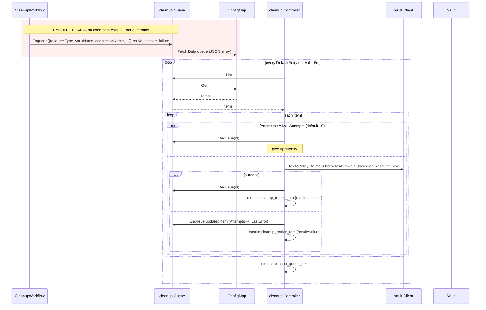
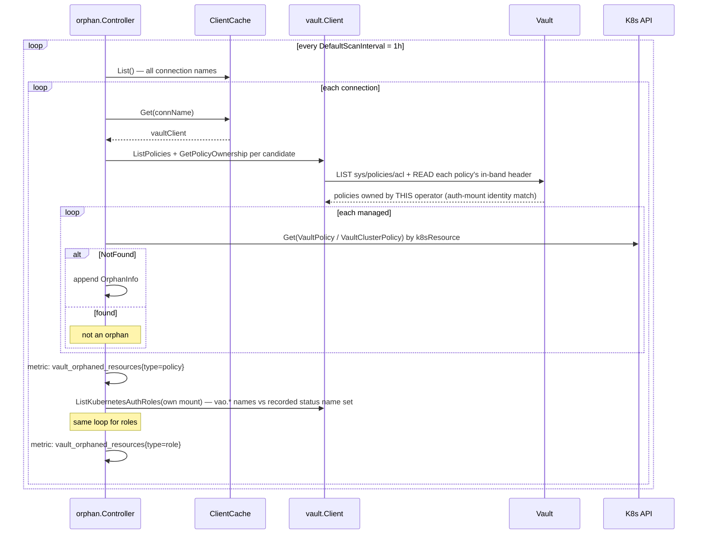

# FLOW: Deletion, Cleanup Queue & Orphan Detection

## Summary

Deletion of a CR goes through three mechanisms:

1. **Finalizer-guarded cleanup** (every CRD) — standard K8s pattern: a finalizer blocks deletion until `Cleanup()` runs successfully.
2. **Persistent cleanup queue** (`pkg/cleanup`) — ConfigMap-backed retry queue for failed deletions, meant to survive operator restarts. **⚠️ Not wired into main.go.**
3. **Orphan detection** (`pkg/orphan`) — periodic scan for Vault resources this operator owns whose K8s owner has vanished. Policies are scanned by their in-band ownership header (ADR 0008); roles by comparing `vao.`-prefixed names on the operator's own mount against the CRs' RECORDED `status.vaultRoleName` set (ADR 0010 — hand-created roles are never candidates). Gated behind `--managed-markers=true` (default OFF).

Only (1) is active today. (2) and (3) are complete implementations with tests. Orphan detection (3) is additionally gated on `--managed-markers` being enabled.

## Finalizer-Guarded Cleanup (active)

Finalizer name: `vault.platform.io/finalizer` (see [api/v1alpha1/common_types.go](../../api/v1alpha1/common_types.go)).

Added by [FinalizerManager.Ensure](../../shared/controller/base/finalizer.go) on first reconcile; removed by `BaseReconciler.handleDeletion` after `Cleanup` succeeds.

### Sequence (policy/role)

```mermaid
sequenceDiagram
    participant User
    participant K8s as K8s API
    participant Base as BaseReconciler
    participant H as Handler (policy/role)
    participant CW as CleanupWorkflow
    participant Ops as PolicyOps/RoleOps
    participant Cache
    participant VC as vault.Client
    participant V as Vault
    participant Bus as EventBus

    User->>K8s: kubectl delete vaultpolicy/myapp
    K8s->>K8s: set DeletionTimestamp (object not removed yet — finalizer present)
    K8s-->>Base: watch event
    Base->>K8s: Get(resource)
    Base->>Base: DeletionTimestamp != 0 → handleDeletion
    Base->>H: Cleanup(resource)
    H->>CW: Execute(adapter, ops)

    activate CW
    CW->>CW: if DeletionStartedAt nil → set now
    CW->>K8s: Status.Update(Phase=Deleting, Deleting cond = True)

    alt DeletionPolicy = Delete (default)
        CW->>Cache: Get (lightweight — no validation)
        alt client authenticated
            CW->>Ops: DeleteFromVault(recordedName)
            Note over CW: name = status.vaultName/.vaultRoleName<br/>(ADR 0010 — never re-derived)
            Ops->>VC: DeletePolicy/DeleteKubernetesAuthRole
            VC->>V: DELETE
            alt V returns error
                Note over CW: logged, but cleanup continues
            end
            Note over CW: no marker removal — ownership is in-band<br/>(header dies with the policy; roles have no record)
        else unauthenticated / cache miss
            Note over CW: log "failed to get Vault client, continuing with finalizer removal"<br/>⚠️ Vault resource LEAKED
        end
    else DeletionPolicy = Retain
        Note over CW: skip Vault deletion entirely
    end

    CW->>Ops: PublishDeleteEvent
    Ops->>Bus: PublishAsync(PolicyDeleted/RoleDeleted)
    deactivate CW

    CW-->>H: nil
    H-->>Base: nil
    Base->>Base: FinalizerManager.Remove
    Base->>K8s: Patch (remove finalizer)
    K8s->>K8s: actually delete object
    Base->>Recorder: Event(Normal, "Deleted")
```

### Stuck deletion

If `Cleanup` repeatedly errors and `time.Since(DeletionTimestamp) > 5m`, `BaseReconciler.handleDeletion` emits a `Warning / DeletionStuck` event with elapsed time. The finalizer remains; the user needs to:

- Fix the underlying issue (usually Vault unreachable), or
- Manually patch the object to remove the finalizer (forces orphan in Vault).

### VaultConnection deletion

Different: blocked by dependent CRs **before** proceeding. [connection.Handler.Cleanup](../../features/connection/controller/handler.go:423) lists all `VaultPolicy`/`VaultClusterPolicy`/`VaultRole`/`VaultClusterRole` objects, filters by `spec.connectionRef == conn.Name`. If any exist:

```
Phase: Deleting
Deleting condition: False, Reason: ChildrenExist, Message: "deletion blocked: N dependent resource(s) still reference..."
return error (finalizer NOT removed)
```

User must delete dependents first. Once clear:
1. `Phase=Deleting` (no dependents condition)
2. Disable auth mount if `Bootstrap.CleanupAuthMount=true` and bootstrap was completed
3. Revoke operator's self token (5s timeout, best-effort)
4. Unregister from `LifecycleController` + `TokenReviewerController`
5. Evict from `ClientCache`
6. Publish `ConnectionDisconnected`
7. Allow finalizer removal

## Cleanup Queue (⚠️ not wired)

Persistent retry queue backed by a ConfigMap named `vault-cleanup-queue` in the operator's namespace.

### Intended Flow



### Why this matters

Without wiring, the current cleanup path has a silent-leak failure mode: **if Vault is unreachable during CR deletion, the finalizer is still removed** ([cleanup.go:91-92](../../shared/controller/workflow/cleanup.go:91)):

```go
vaultClient, err := w.getVaultClient(resource.GetConnectionRef())
if err != nil {
    log.Info("failed to get Vault client during deletion, continuing with finalizer removal")
}
```

The K8s object is gone, the Vault resource is not — and no mechanism re-attempts it. `pkg/cleanup` was designed to fix this but isn't invoked.

See [IMPROVEMENTS.md §1](IMPROVEMENTS.md#1-unwired-controllers) and [§2](IMPROVEMENTS.md#2-silent-cleanup-failures-leak-vault-policies).

## Orphan Detection (⚠️ not wired)

Symmetric to the cleanup queue: finds Vault resources that still claim this operator as owner (or, for roles, live on its mount) but whose K8s CR is gone.

### Intended Flow



### Current behavior

Controller can be constructed and even started (`NewController(cfg).Start(ctx)`) but nothing calls that in `main.go`. The `NeedsLeaderElection() bool` method means it **would** run on the leader only when wired.

The orphan controller **does not delete** — it only logs and publishes metrics. This is the right default (cleanup is destructive) but there's no delete-on-orphan strategy documented.

## Resource Type Matrix

Ownership records are in-band (ADR 0008), so deletion needs no marker step: the policy header dies with the policy, KV custom_metadata dies with the secret, and roles have no record. Before a policy delete, cleanup re-reads the live header and **skips the delete when it names a foreign owner** (`ForeignPolicyNotDeleted` warning) — names can collide across clusters on a shared Vault.

| CR kind | Cleanup calls | Vault path deleted | Ownership record |
|---------|--------------|--------------------|-------------------------------------------------------|
| `VaultPolicy` | `DeletePolicy` (ownership-gated) | `sys/policies/acl/{namespace}-{name}` | in-band header — dies with the policy |
| `VaultClusterPolicy` | `DeletePolicy` (ownership-gated) | `sys/policies/acl/{name}` | in-band header — dies with the policy |
| `VaultRole` | `DeleteKubernetesAuthRole` | `auth/{mount}/role/{namespace}-{name}` | none (CR status was the memory) |
| `VaultClusterRole` | same | `auth/{mount}/role/{name}` | none (CR status was the memory) |
| `VaultConnection` | dependent-check → DisableAuth (opt-in) → RevokeSelf → Unregister × 2 → Cache.Delete → event | auth mount (opt-in), token revoke | — |

## Error Scenarios

| Error | Origin | Current outcome | Ideal outcome |
|-------|--------|-----------------|---------------|
| Vault unreachable during cleanup | `getVaultClient` | finalizer removed, resource leaked in Vault | enqueue → cleanup controller retries later |
| Vault 403 during delete | `DeleteFromVault` | logged, finalizer still removed | enqueue → retry; alert on 403 (permissions issue) |
| Delete returns 404 | `DeleteFromVault` | logged as error (Vault returns 404 when policy doesn't exist) | treat 404 as success |
| Connection deletion while dependents exist | `listDependents` | blocked, `ChildrenExist` condition, user intervention | add CR-level webhook to reject deletion earlier |
| Finalizer manually removed before cleanup completes | user action | Vault resource leaked | orphan scanner should catch it — but it's not running |

## Events Emitted

| Event Type | Reason | When |
|-----------|--------|------|
| Normal | `Deleting` | cleanup start |
| Normal | `Deleted` | cleanup success + finalizer removed |
| Warning | `DeleteFailed` | `Cleanup` returns error |
| Warning | `DeletionStuck` | `time.Since(DeletionTimestamp) > 5m` and still failing |
| Warning | `DeletionBlocked` | (defined but apparently not emitted; see [base/reconciler.go:87](../../shared/controller/base/reconciler.go:87)) |

Connection cleanup emits: `ConnectionDisconnected`, plus the generic base events.

## Cross-References

- [FLOW_OVERVIEW.md](FLOW_OVERVIEW.md)
- [FLOW_CONNECTION.md](FLOW_CONNECTION.md) — blocking-on-dependents logic
- [FLOW_POLICY.md](FLOW_POLICY.md) / [FLOW_ROLE.md](FLOW_ROLE.md) — per-kind cleanup ops
- [IMPROVEMENTS.md](IMPROVEMENTS.md) — cleanup queue wiring, orphan wiring, delete-on-orphan policy
