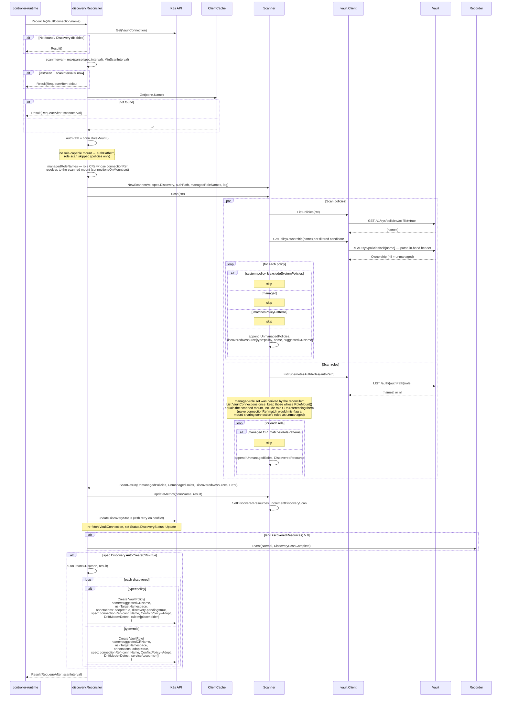
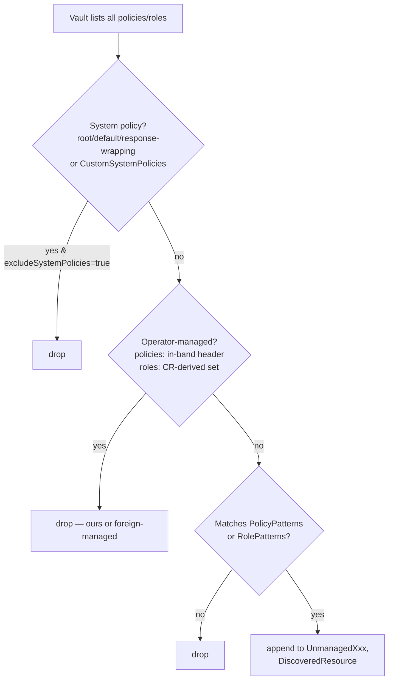
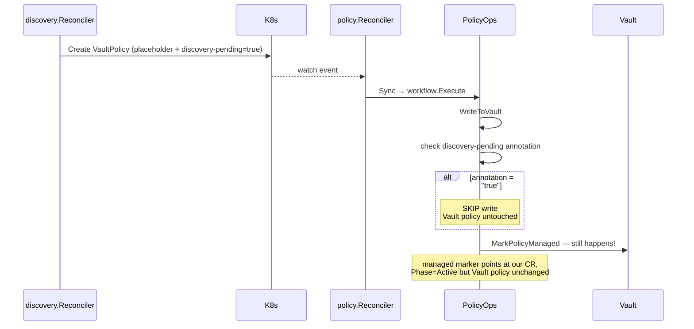

# FLOW: Discovery Scan

## Summary

Discovery is an **inverse reconciliation**: instead of pushing K8s state to Vault, it pulls Vault state and identifies unmanaged resources so operators can adopt them into CRs (either manually or via auto-creation). It's driven by `VaultConnection.Spec.Discovery`, runs on a configurable interval (default 1h), and has its own reconciler that watches `VaultConnection` — separately from the connection-management reconciler.

!!! note "Discovery requires `--managed-markers=true` (default OFF)"
    Discovery separates unmanaged Vault resources from ones an operator already owns, so it runs **only when `--managed-markers=true`**. Ownership is read **in-band** (ADR 0008): each candidate policy (after system + pattern filters) is READ and its ownership comment header parsed — any operator-managed policy is skipped, whether owned by THIS operator or a **foreign** one (a foreign owner's policy must never become an adoption candidate on a shared Vault). Roles carry no in-band record (and no mount fields — [ADR 0009](../adr/0009-connection-owned-role-mount.md)): the scanned mount is the connection's resolved role mount (`VaultConnection.RoleMount()`), and the managed set is this cluster's `VaultRole`/`VaultClusterRole` CRs whose `connectionRef` resolves to that mount — two connections sharing one mount both count. A connection with no role-capable mount scans policies only (role scan skipped). See [ADR 0008](../adr/0008-in-band-ownership-markers.md).

Two reconcilers watch the same CRD. This is intentional (separation of concerns: connection auth vs discovery scanning) but creates a **status-write contention** handled with `retry.RetryOnConflict`. See [controller.go:286](../../features/discovery/controller/controller.go:286).

`Reconcile` takes its logger from the context (controller-runtime's per-reconcile `reconcileID`) and enriches it with `vaultConnection` and, once the client is resolved, `authPath` — so scan log lines are traceable like the sync workflows. See `.claude/skills/logging-context/SKILL.md`.

## Participants

| # | Component | Source | Role |
|---|-----------|--------|------|
| 1 | `discovery.Reconciler` | [controller.go:61](../../features/discovery/controller/controller.go:61) | watches `VaultConnection` with `GenerationChangedPredicate` |
| 2 | `Scanner` | [scanner.go:60](../../features/discovery/controller/scanner.go:60) | `Scan(ctx)` — pulls all policies + roles, filters, produces `ScanResult` |
| 3 | `vault.Client` | pkg | `ListPolicies`, `ListKubernetesAuthRoles`, `GetPolicyOwnership`, `AuthMount` |
| 4 | `ClientCache` | shared | borrow `*vault.Client` by connection name |
| 5 | K8s API | external | `VaultConnection` CR read + status update (with retry), `VaultPolicy`/`VaultRole` CR create |
| 6 | `Recorder` | — | emits `DiscoveryScanComplete`, `AutoCreateFailed` |

## Triggers

- `VaultConnection` with `Spec.Discovery.Enabled=true` — scheduled every `Spec.Discovery.Interval` (default 1h, floor `MinScanInterval` = 5m).
- Override floor via `OPERATOR_MIN_SCAN_INTERVAL` env var.
- Changes to `VaultConnection` **spec** (not status) — reconciler uses `GenerationChangedPredicate` to ignore health-check status updates from the connection feature.

## Full Flow



## Filtering Pipeline



Patterns use `filepath.Match` glob syntax (`*`, `?`, `[abc]`). Empty pattern list = match all.

## Suggested CR Name

From [suggestCRName](../../features/discovery/controller/scanner.go:270):

1. lowercase
2. replace non-`[a-z0-9-]` with `-`
3. collapse `--` to `-`
4. trim leading/trailing `-`
5. truncate to 253 chars (K8s name limit), then re-trim trailing `-`
6. if empty after sanitization → `"vault-resource"` (fallback)

Example: `prod/secret-reader` → `prod-secret-reader`.

## Auto-Create Payload

### Policy (with placeholder + discovery-pending)

```yaml
metadata:
  name: <suggestedCRName>
  namespace: <spec.discovery.targetNamespace>
  annotations:
    vault.platform.io/adopt: "true"
    vault.platform.io/discovered-at: <RFC3339>
    vault.platform.io/discovered-from: <connectionName>
    vault.platform.io/discovery-pending: "true"   # prevents placeholder write
spec:
  connectionRef: <connectionName>
  conflictPolicy: Adopt
  driftMode: detect
  rules:
    - path: "secret/data/placeholder"
      capabilities: [read]
      description: "Placeholder rule - replace with actual policy rules from Vault"
```

The `discovery-pending=true` annotation is honored by `PolicyOps.WriteToVault` ([ops.go:107](../../features/policy/controller/ops.go:107)) — it **skips the write** until the user removes the annotation. This prevents the operator from overwriting the adopted Vault policy with the meaningless placeholder.

### Role (no placeholder, adopt-only)

```yaml
metadata:
  name: <suggestedCRName>
  namespace: <spec.discovery.targetNamespace>
  annotations:
    vault.platform.io/adopt: "true"
    vault.platform.io/discovered-at: <RFC3339>
    vault.platform.io/discovered-from: <connectionName>
spec:
  connectionRef: <connectionName>
  conflictPolicy: Adopt
  driftMode: detect
  serviceAccounts: []   # user must fill in
```

**Inconsistency:** Role auto-create has no `discovery-pending` annotation, so the first reconcile will overwrite the Vault role with `serviceAccounts: []` (effectively unbinding all SAs). See [IMPROVEMENTS.md §4](IMPROVEMENTS.md#4-discovery-pending-annotation-inconsistency).

## Error Scenarios

| Error | Origin | Handling |
|-------|--------|----------|
| `ClientCache.Get` miss | pre-scan | requeue after `scanInterval`, no error returned |
| `ListPolicies` fails | scanPolicies | recorded in `ScanResult.Error`, role scan still runs |
| `ListKubernetesAuthRoles` fails | scanRoles | same — partial results still published |
| Policy ownership read fails | scanner helpers | candidate skipped conservatively (never offered for adoption); CR list failure for roles yields an empty managed set — everything looks unmanaged (discovery never mutates Vault) |
| `Status.Update` 409 | `updateDiscoveryStatus` | retries via `retry.RetryOnConflict` (re-fetch + re-apply) |
| `autoCreateCRs` without `TargetNamespace` | autoCreateCRs | returns error; emits `AutoCreateFailed` event |
| Create CR fails (e.g., duplicate) | createPolicyCR/createRoleCR | logged, loop continues for remaining items |

## Metrics Emitted

| Metric | Where |
|--------|-------|
| `vault_access_operator_discovered_resources{connection, type}` | `Scanner.UpdateMetrics` |
| `vault_access_operator_discovery_scan_total{connection, result}` | `IncrementDiscoveryScan` |

## Status Written

```go
VaultConnection.Status.DiscoveryStatus = {
  LastScanAt: now,
  UnmanagedPolicies: count,
  UnmanagedRoles: count,
  DiscoveredResources: [
    { Type, Name, DiscoveredAt, SuggestedCRName, AdoptionStatus: "discovered" },
    ...
  ],
}
```

**Cap not enforced here** — the `DiscoveredResource` slice can grow until etcd rejects the write. The memory note mentions 500 as a suggested cap; see [IMPROVEMENTS.md §5](IMPROVEMENTS.md#5-discoveredresources-unbounded-growth).

## Interaction with Policy/Role Controllers



**Key insight:** After auto-create, the operator "owns" the Vault policy (via managed marker) but won't modify it until the user removes the `discovery-pending` annotation. This is subtle and deserves prominent user docs (see [IMPROVEMENTS.md §4](IMPROVEMENTS.md#4-discovery-pending-annotation-inconsistency)).

## Cross-References

- [FLOW_POLICY.md](FLOW_POLICY.md) — how discovery-pending interacts with policy sync
- [FLOW_OVERVIEW.md](FLOW_OVERVIEW.md)
- [IMPROVEMENTS.md](IMPROVEMENTS.md) — role annotation gap, unbounded `DiscoveredResources`, dual-reconciler status race
