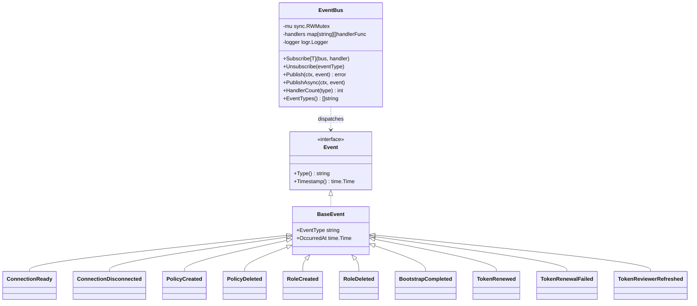
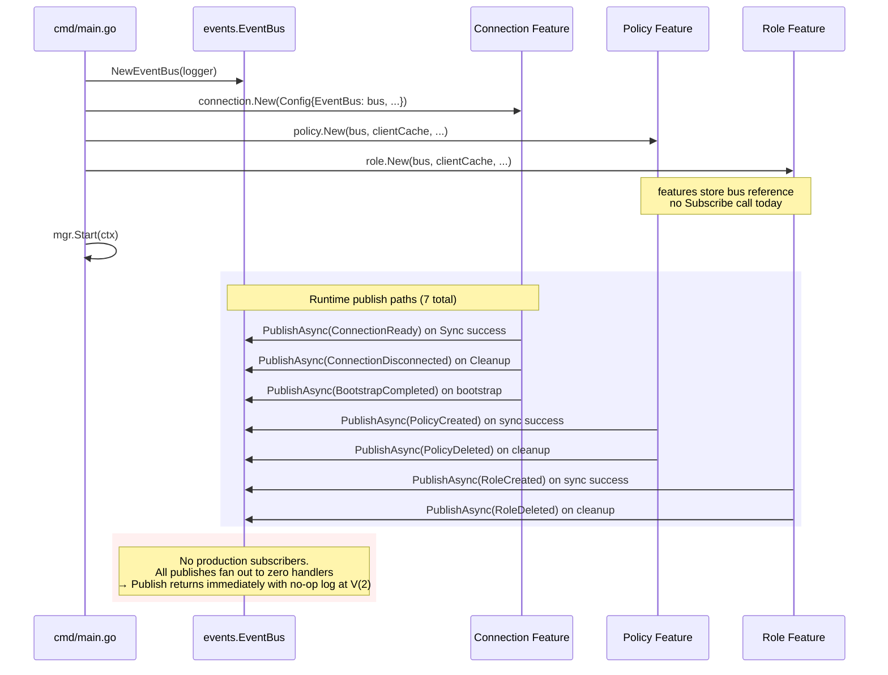

# FLOW: Event Bus (Inter-Feature Communication)

## Summary

`shared/events.EventBus` is an in-process, typed publish/subscribe bus meant for inter-feature communication in the Feature-Driven Design (FDD) architecture. The intent (captured in the package doc) is: the **connection** feature publishes `ConnectionReady` when it finishes authenticating, and **policy**/**role** features subscribe to react — e.g., trigger immediate re-sync of resources that were blocked on a dependency.

**In reality, there are zero production subscribers today.** Every feature's `PublishAsync` call writes into a bus that nobody reads, and re-sync on connection recovery is handled by the `ConnectionPhaseChangedPredicate` ([shared/controller/watches/predicates.go](../../shared/controller/watches/predicates.go)) instead. See [IMPROVEMENTS.md §27](IMPROVEMENTS.md#27-event-bus-has-no-production-subscribers).

The bus is still exercised in test code (handler tests subscribe to confirm events are emitted), so it's not dead — it's scaffold that was built for a future use case.

## Participants

| # | Component | Layer | Source | Role |
|---|-----------|-------|--------|------|
| 1 | `events.EventBus` | shared | [shared/events/bus.go:38](../../shared/events/bus.go:38) | stateful registry; `map[string][]handlerFunc` |
| 2 | `Subscribe[T]` | shared | [bus.go:59](../../shared/events/bus.go:59) | generic registration; captures `T` in a closure |
| 3 | `Publish` | shared | [bus.go:91](../../shared/events/bus.go:91) | synchronous fan-out |
| 4 | `PublishAsync` | shared | [bus.go:142](../../shared/events/bus.go:142) | `go Publish(...)`; fire-and-forget |
| 5 | Connection feature | publisher | [features/connection/controller/handler.go](../../features/connection/controller/handler.go) | emits 4 event types |
| 6 | Policy feature | publisher | [features/policy/controller/ops.go](../../features/policy/controller/ops.go) | emits `PolicyCreated`, `PolicyDeleted` |
| 7 | Role feature | publisher | [features/role/controller/ops.go](../../features/role/controller/ops.go) | emits `RoleCreated`, `RoleDeleted` |
| 8 | Test handlers | consumer | `*_test.go` | only place `Subscribe` is called today |

## Event Type Catalog

All events embed `BaseEvent` ([shared/events/types.go:36](../../shared/events/types.go:36)) providing `Type() string` and `Timestamp() time.Time`. Most include a `ResourceInfo{Name, Namespace, ClusterScoped, ConnectionName}` sub-struct for K8s-resource attribution.

### Connection events ([shared/events/connection.go](../../shared/events/connection.go))

| Type | Payload | Published By | Meaning |
|------|---------|--------------|---------|
| `connection.ready` | `{ConnectionName, VaultAddress, VaultVersion}` | `connection.Handler.Sync` success path | Vault authenticated + healthy |
| `connection.disconnected` | `{ConnectionName, Reason}` | `connection.Handler.Cleanup` | CR deleted; don't reuse cached client |
| `connection.health_changed` | `{ConnectionName, Healthy, Reason}` | — | **declared but NEVER published** (see §27) |

### Policy events ([shared/events/policy.go](../../shared/events/policy.go))

| Type | Payload | Published By | Meaning |
|------|---------|--------------|---------|
| `policy.created` | `{PolicyName, Resource}` | `PolicyOps.PublishSyncEvent` | wrote new/updated policy to Vault |
| `policy.updated` | `{PolicyName, Resource, RulesChanged}` | — | **declared but NEVER published** — policy sync always fires `PolicyCreated`, even on updates |
| `policy.deleted` | `{PolicyName, Resource}` | `PolicyOps.PublishDeleteEvent` | deleted policy from Vault |

### Role events ([shared/events/role.go](../../shared/events/role.go))

| Type | Payload | Published By | Meaning |
|------|---------|--------------|---------|
| `role.created` | `{RoleName, AuthPath, Resource, Policies, BoundServiceAccounts}` | `RoleOps.PublishSyncEvent` | wrote role to Vault |
| `role.updated` | `{RoleName, AuthPath, Resource, Policies, BoundServiceAccounts, PoliciesChanged, BindingsChanged}` | — | **declared but NEVER published** |
| `role.deleted` | `{RoleName, AuthPath, Resource}` | `RoleOps.PublishDeleteEvent` | deleted role |

### Token events ([shared/events/token.go](../../shared/events/token.go))

| Type | Payload | Published By | Meaning |
|------|---------|--------------|---------|
| `token.renewed` | `{ConnectionName, NewExpiration, RenewalCount, Method}` | — | **declared but NEVER published** — intended for `LifecycleController`, which is unwired ([IMPROVEMENTS.md §1](IMPROVEMENTS.md#1-unwired-controllers)) |
| `token.renewal_failed` | `{ConnectionName, Error, RetryCount, WillRetry}` | — | **not published** |
| `token.reviewer_refreshed` | `{ConnectionName, NextRefresh, Expiration}` | — | **not published** — intended for `TokenReviewerController`, also unwired |
| `bootstrap.completed` | `{ConnectionName, AuthPath, BootstrapRevoked, TransitionedToK8s}` | `connection.Handler.runBootstrap` | bootstrap succeeded |

### Summary: publishers vs types

13 event types declared; 5 actually published in production code (`connection.ready`, `connection.disconnected`, `policy.created`, `policy.deleted`, `role.created`, `role.deleted`, `bootstrap.completed` — 7 when you count `bootstrap.completed`). The `*.updated` and `connection.health_changed` types and all `token.*` types exist as scaffolding.

## Bus Mechanics



### Subscribe semantics

```go
Subscribe[ConnectionReady](bus, func(ctx, e ConnectionReady) error { ... })
```

- Subscription is **typed**: `T` must implement `Event`.
- The type assertion is baked into the stored closure ([bus.go:66](../../shared/events/bus.go:66)), so dispatch is O(1) — no type switch.
- Multiple handlers per type: they run **sequentially** in registration order.
- `Unsubscribe(eventType)` clears **all** handlers for that type; there's no way to deregister a single closure.

### Publish semantics

```mermaid
sequenceDiagram
    participant P as Publisher
    participant B as EventBus
    participant H1 as Handler 1
    participant H2 as Handler 2

    P->>B: Publish(ctx, event)
    B->>B: RLock; copy handlers slice
    B->>H1: safeInvoke(handler, event)
    activate H1
    alt handler returns err
        H1-->>B: err (logged, lastErr = err)
    else handler panics
        Note over B,H1: recover() → err = "handler panicked"
    else handler ok
        H1-->>B: nil
    end
    deactivate H1
    B->>H2: safeInvoke
    H2-->>B: ok
    B-->>P: lastErr (or nil)
```

Key properties:
- **Synchronous** — `Publish` blocks until every handler completes.
- **Error isolation** — one handler's error (or panic, via `safeInvoke`'s `recover()`) doesn't prevent others from firing. The bus returns the **last** error observed.
- **No buffering** — if handlers are slow, `Publish` is slow.
- **No backpressure** — `PublishAsync` spawns a goroutine unconditionally. Under high publish rates, goroutines pile up.
- **Panic-safe** — handler panics are recovered at the bus level.

### PublishAsync

```go
func (b *EventBus) PublishAsync(ctx, event) {
    go func() { _ = b.Publish(ctx, event) }()
}
```

- Returns immediately.
- Errors are swallowed (`_ =`).
- Features use this for fire-and-forget notifications that aren't on the reconcile critical path.

## Lifecycle Within the Operator



## Publisher → Subscriber Matrix (production code)

| Event Type | Publishers | Subscribers | Actual Dispatch |
|-----------|-----------|-------------|-----------------|
| `connection.ready` | `connection.Handler` | — | no-op |
| `connection.disconnected` | `connection.Handler` | — | no-op |
| `bootstrap.completed` | `connection.Handler` (bootstrap path) | — | no-op |
| `connection.health_changed` | **none** | — | — |
| `policy.created` | `PolicyOps.PublishSyncEvent` | — | no-op |
| `policy.updated` | **none** | — | — |
| `policy.deleted` | `PolicyOps.PublishDeleteEvent` | — | no-op |
| `role.created` | `RoleOps.PublishSyncEvent` | — | no-op |
| `role.updated` | **none** | — | — |
| `role.deleted` | `RoleOps.PublishDeleteEvent` | — | no-op |
| `token.renewed` | **none** | — | — |
| `token.renewal_failed` | **none** | — | — |
| `token.reviewer_refreshed` | **none** | — | — |

Test subscribers exist in `features/{policy,role,connection}/controller/*_test.go` — they confirm publishers emit the right shape, not that anyone downstream consumes them.

## Why "publish into the void" isn't (yet) a bug

Feature synchronization that would logically use the bus is handled through controller-runtime primitives instead:

- **Re-sync when a connection recovers**: `ConnectionPhaseChangedPredicate` ([shared/controller/watches/predicates.go](../../shared/controller/watches/predicates.go)) watches `VaultConnection` phase transitions and the policy/role reconcilers install `watches.PolicyRequestsForConnection` / `RoleRequestsForConnection` map functions that enqueue every dependent resource. No bus involved.
- **Propagate role-policy dependency updates**: the role reconciler re-checks `PolicyExists` in Vault on every sync, so a missing-policy warning naturally flips when the policy appears. No bus involved.
- **React to bootstrap completion**: the connection handler returns early after persisting `BootstrapComplete=true` — the next reconcile (30s later, or sooner if generation bumps) re-fetches and proceeds on the K8s auth path. No bus involved.

The bus is a scaffold for use cases that haven't materialized:
- Updating `status.PolicyBindings[].Resolved=true` on a role when its referenced policy is created (today it's a warning condition; a `PolicyCreated` subscriber could flip the condition immediately instead of waiting for the next 30s requeue).
- Metric emission from `TokenRenewed` / `TokenRenewalFailed` (today there are no such metrics).
- Audit trail publication (ship events to a SIEM).

## Concurrency Notes

- `handlers` map is guarded by `sync.RWMutex`.
- `Subscribe` takes the write lock.
- `Publish` takes the read lock *briefly* to snapshot the handler slice, then releases before invoking handlers — so a handler that calls `Subscribe` doesn't deadlock, but the new subscription won't see the currently-in-flight publish.
- `PublishAsync` spawns one goroutine per publish. Under sustained high load this could leak goroutines if handlers block indefinitely.

## Gotchas

| Issue | Why | Mitigation |
|-------|-----|------------|
| Goroutine leak under slow handlers | `PublishAsync` has no timeout or cancellation propagation beyond `ctx` | enforce handler timeouts via `context.WithTimeout` inside handlers |
| Lost updates on `Unsubscribe` | clears **all** handlers for a type | add an `Unsubscribe[T](id)` API if needed (not a problem today) |
| Silent swallowing | `PublishAsync` discards error return | if you care, use sync `Publish` |
| No cross-operator delivery | in-process only; doesn't survive restart | K8s events or persistent queue for cross-restart delivery |

## Files Read / Written

Nothing. The bus is pure in-memory state; no persistence.

## Error Scenarios

| Error | Origin | Handling |
|-------|--------|----------|
| Handler returns error | handler body | logged; last error returned from `Publish`; other handlers continue |
| Handler panics | handler body | `recover()` in `safeInvoke` converts to error; same treatment as returned error |
| No handlers for type | normal | `Publish` logs at V(2) and returns nil |

## Cross-References

- [ARCHITECTURE.md](ARCHITECTURE.md) — pub/sub pattern row
- [FLOW_CONNECTION.md](FLOW_CONNECTION.md) — where `ConnectionReady` / `BootstrapCompleted` / `ConnectionDisconnected` are emitted
- [FLOW_POLICY.md](FLOW_POLICY.md) — `PolicyCreated` / `PolicyDeleted` emission
- [FLOW_ROLE.md](FLOW_ROLE.md) — `RoleCreated` / `RoleDeleted` emission
- [FLOW_AUTH.md](FLOW_AUTH.md) — token events that are declared but unused
- [IMPROVEMENTS.md §27](IMPROVEMENTS.md#27-event-bus-has-no-production-subscribers)
