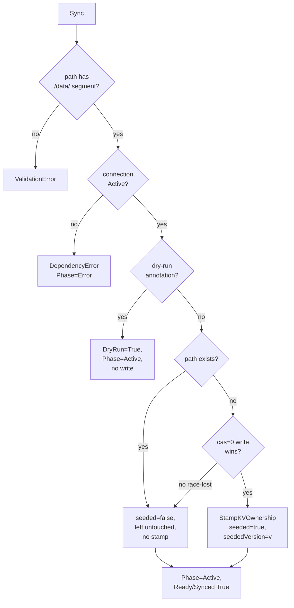
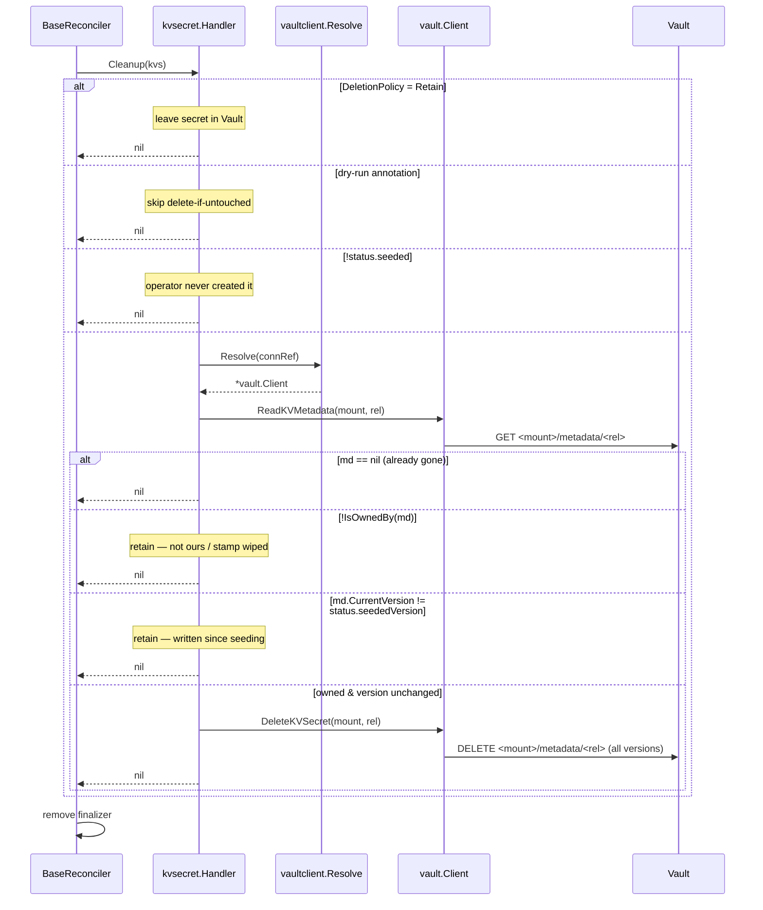

# FLOW: VaultKVSecret Seeding

## Summary

A `VaultKVSecret` pre-creates ("seeds") a Vault KV v2 secret path so consumers such as External Secrets Operator (ESO) don't fail when the source path is missing on a fresh deployment. The model is **create-only-if-absent**: on every reconcile, if the path already exists the operator skips it and never overwrites; only an absent path is seeded. When it seeds, the operator stamps the secret's KV v2 `custom_metadata` with an ownership marker. On CR deletion the operator runs a **delete-if-untouched** check — it removes the secret only if it is still operator-owned and unmodified since seeding, otherwise it retains it. The operator never reads or overwrites the real values stored at the path, so data written later by ESO or a human is never clobbered.

**Unlike policy and role, this feature does NOT route through `workflow.SyncWorkflow`.** Seeding deliberately abandons ownership of the secret's *data* after creation, so the workflow's drift-detect-and-correct machinery (built around "operator owns and reconciles the artifact to spec") does not apply. Instead a thin `Handler` implements `Sync`/`Cleanup` directly on top of [`base.BaseReconciler`](../../shared/controller/base/reconciler.go) — a **trimmed reconcile**. See [Divergences from the Policy/Role SyncWorkflow](#divergences-from-the-policyrole-syncworkflow).

## Participants

| # | Component | Layer | Source | Role |
|---|-----------|-------|--------|------|
| 1 | `KVSecretReconciler` | transport | [kvsecret_reconciler.go](../../features/kvsecret/controller/kvsecret_reconciler.go) | watches VaultKVSecret + VaultConnection phase |
| 2 | `kvsecret.Handler` | feature | [handler.go](../../features/kvsecret/controller/handler.go) | `Sync`, `Cleanup`, `updateStatus` — implements `FeatureHandler[*VaultKVSecret]` directly |
| 3 | `base.BaseReconciler` | shared | [base/reconciler.go](../../shared/controller/base/reconciler.go) | fetch, finalizer, status, events, reconcileID, requeue |
| 4 | `vaultclient.Resolve` | shared | [vaultclient/resolver.go](../../shared/controller/vaultclient/resolver.go) | connRef → `*vault.Client` via cache (gates on connection Active) |
| 5 | `dryrun.IsActive` | shared | [dryrun/](../../shared/controller/dryrun/) | reads the `vault.platform.io/dry-run=true` annotation |
| 6 | `vault.Client` (KV surface) | pkg | [pkg/vault/kvsecret.go](../../pkg/vault/kvsecret.go) | `SplitKVv2Path`, `CreateKVSecretIfAbsent`, `ReadKVMetadata`, `StampKVOwnership`, `IsOwnedBy`, `DeleteKVSecret` |
| 7 | `watches.KVSecretRequestsForConnection` | shared | [shared/controller/watches/](../../shared/controller/watches/) | fans connection-phase changes out to dependent seeds |

There is **no** `ResourceOps`, no adapter, and no `PolicyOps`/`RoleOps` analog — the Handler talks to the concrete `*vault.Client` directly.

## Watches / Triggers

From [kvsecret_reconciler.go](../../features/kvsecret/controller/kvsecret_reconciler.go):

```go
For(&VaultKVSecret{}, WithPredicates(Or(
    GenerationChangedPredicate{},
    ReconcileNowAnnotationPredicate{})))
Watches(&VaultConnection{},
    EnqueueRequestsFromMapFunc(KVSecretRequestsForConnection(client)),
    ConnectionPhaseChangedPredicate{})
```

- **Spec changes** trigger reconciliation (`GenerationChangedPredicate`); the `vault.platform.io/reconcile-now` annotation forces an out-of-band requeue.
- **Connection phase changes** fan out to every `VaultKVSecret` that references that connection — so a seed blocked on a not-yet-Active `VaultConnection` requeues the moment the connection flips to `Active`.

## Full Sync Interaction

```mermaid
sequenceDiagram
    participant RT as controller-runtime
    participant Base as BaseReconciler
    participant H as kvsecret.Handler
    participant VCR as vaultclient.Resolve
    participant DR as dryrun.IsActive
    participant VC as vault.Client
    participant K8s as K8s API
    participant V as Vault

    RT->>Base: Reconcile(req)
    Base->>K8s: Get(VaultKVSecret)
    K8s-->>Base: kvs
    Base->>Base: ensure finalizer
    Base->>H: Sync(kvs)

    H->>VC: SplitKVv2Path(spec.path)
    alt no /data/ segment
        VC-->>H: ok=false
        H-->>Base: ValidationError (spec.path)
    end
    H->>H: status.vaultPath = spec.path

    H->>VCR: Resolve(connRef, resourceID)
    VCR->>K8s: Get(VaultConnection)
    alt connection not Active
        VCR-->>H: DependencyError
        H-->>Base: err (Phase=Error, ConnectionNotReady)
    else active
        VCR-->>H: *vault.Client
    end

    H->>DR: IsActive(kvs)
    alt dry-run annotation present
        Note over H: set DryRun=True, Phase=Active,<br/>message "would seed <path>"
        H-->>Base: nil (no Vault write)
    else not dry-run
        H->>H: set DryRun=False
    end

    H->>VC: CreateKVSecretIfAbsent(mount, rel, spec.data)
    VC->>V: GET <mount>/metadata/<rel> (existence)
    alt path present
        V-->>VC: metadata (currentVersion)
        VC-->>H: (created=false, version, nil)
        Note over H: status.seeded=false,<br/>seededVersion=0,<br/>"already exists; left untouched"
    else path absent
        VC->>V: PUT <mount>/data/<rel> (cas=0)
        alt cas mismatch (lost create race)
            V-->>VC: 400 check-and-set
            VC-->>H: (created=false, 0, nil)
        else created
            V-->>VC: versionMetadata
            VC-->>H: (created=true, version, nil)
            H->>VC: StampKVOwnership(mount, rel, {k8s-resource})
            VC->>V: PATCH <mount>/metadata/<rel> (custom_metadata)
            Note over H: status.seeded=true,<br/>seededVersion=version
        end
    end

    H->>H: Phase=Active, Managed=true, set Binding
    H-->>Base: nil
    Base->>H: updateStatus(kvs, nil)
    H->>H: Ready=True, Synced=True, lastSyncedAt
    H->>K8s: Status.Update
    Base-->>RT: Result{RequeueAfter: success}
```

## Step-by-Step Narrative

### Step 1: Split the path
[`SplitKVv2Path`](../../pkg/vault/kvsecret.go) splits the full `<mount>/data/<rel>` form (`secret/data/apps/foo`) into mount (`secret`) and relative path (`apps/foo`) on the **first** `/data/` segment, so non-default mounts (`kv/data/x`) work. A path with no `/data/` segment returns a `ValidationError` (CEL already rejects this at admission, but the handler re-validates defensively). `status.vaultPath` is set to the full path.

### Step 2: Resolve Vault client
[`vaultclient.Resolve`](../../shared/controller/vaultclient/resolver.go) fetches the `VaultConnection` by `connRef` and returns a `DependencyError` if it is not found or `Phase != Active`. That maps to `Phase=Error`, reason `ConnectionNotReady`; the **connection-phase predicate** re-requeues the seed the moment the connection flips to Active.

### Step 3: Dry-run branch
If the `vault.platform.io/dry-run=true` annotation is present ([`dryrun.IsActive`](../../shared/controller/dryrun/)): set `Phase=Active`, `Managed=true`, a `DryRun=True` condition (reason `DryRunSkipped`), a "dry-run: would seed `<path>` if absent" message, and **return without writing to Vault**. If the annotation is absent, an explicit `DryRun=False` condition is set so removing the annotation after a prior dry-run reflects that it is off now.

### Step 4: Create-only-if-absent
[`CreateKVSecretIfAbsent`](../../pkg/vault/kvsecret.go) first reads `<mount>/metadata/<rel>`:
- **Path present** → returns `(created=false, currentVersion, nil)`. The handler sets `status.seeded=false`, `status.seededVersion=0`, message "already exists; left untouched (create-only)" — **no write, no stamp**.
- **Path absent** → writes `<mount>/data/<rel>` with check-and-set `cas=0` (succeeds only if the secret was never created). On success returns `(created=true, version, nil)`. If the write loses a concurrent create race, `cas=0` fails with a 400 check-and-set error, which is treated as "already present" `(created=false, 0, nil)` rather than surfaced — the race winner is never clobbered.

### Step 5: Stamp ownership (only when seeded)
When `created==true`, [`StampKVOwnership`](../../pkg/vault/kvsecret.go) writes the secret's KV v2 `custom_metadata` via a non-destructive merge patch: `{managed-by: vault-access-operator, k8s-resource: <namespace/name>}`. This is the basis of the delete-if-untouched check. `status.seeded=true`, `status.seededVersion=version` (the baseline for the untouched check).

### Step 6: Finalize status + binding
`Phase=Active`, `Managed=true`, and a `Binding` is set (`vaultPath=spec.path`, `vaultResourceName=<rel>`, `boundAt`/`lastVerifiedAt=now`, `bindingVerified=true`). The base then calls `updateStatus`, which sets `Ready=True` / `Synced=True` and `lastSyncedAt`, and persists status. The operator does NOT publish an event (no event bus integration for this feature) and does NOT write a managed-marker under `secret/metadata/vault-access-operator/managed/*` (the marker mechanism used by policies/roles, itself gated by `--managed-markers`) — ownership lives in the seeded secret's own `custom_metadata` instead.

## Branching Points



## Cleanup Flow

The handler owns `Cleanup` directly — there is no `workflow.CleanupWorkflow`. The base sets the deletion phase and removes the finalizer once `Cleanup` returns nil.



### Delete-if-untouched, step by step

[`Cleanup`](../../features/kvsecret/controller/handler.go) retains (returns early, deletes nothing) in four cases, then deletes only when all guards pass:

1. **`DeletionPolicy: Retain`** → never delete; the base removes the finalizer and nothing happens in Vault.
2. **Dry-run** → skip the untouched check entirely.
3. **`!status.seeded`** → the operator never created this path, so it is not ours to delete.
4. Resolve the client and `ReadKVMetadata`:
   - `md == nil` → already gone; nothing to do.
   - `!IsOwnedBy(md)` (`custom_metadata.managed-by != vault-access-operator`) → **retain** (not ours, or the stamp was wiped).
   - `md.CurrentVersion != status.seededVersion` → **retain** (the secret has been written to since seeding — real data lives there now).
   - **Owned AND version unchanged** → [`DeleteKVSecret`](../../pkg/vault/kvsecret.go), which calls `DeleteMetadata` to remove the secret and ALL its versions.

This is the core safety property: **the operator never destroys data it didn't seed or that has been modified since seeding.**

## The create-only model

Two layers enforce never-clobber:

1. **Code (`cas=0`).** `CreateKVSecretIfAbsent` checks existence via metadata first, then writes with check-and-set `cas=0` as a race backstop. A create that loses a concurrent race is reported as "already present", never an overwrite.
2. **Vault policy (`create`-only).** The operator's Vault policy grants `create`-only on `secret/data/*` — no `update`, `read`, or `delete`. Even if the code had a bug, Vault itself rejects any overwrite or read of secret data. All lifecycle/ownership (existence, stamp, untouched-check, deletion) runs through `secret/metadata/*`. See [the PRD's Security considerations](prd/vaultkvsecret.md#security-considerations) and the policy fixtures [`operator-bootstrap.hcl`](../../test/e2e/fixtures/policies/operator-bootstrap.hcl) / [`e2e-operator-bootstrap.hcl`](../../test/e2e/fixtures/policies/e2e-operator-bootstrap.hcl).

Because the operator never reads secret data values (existence is determined from metadata), it needs **no `read` on `secret/data/*`** — an early assumption that `read` would be needed "to see" the secret was dropped by this metadata-driven design.

## Divergences from the Policy/Role SyncWorkflow

| # | Aspect | Policy / Role (`SyncWorkflow`) | VaultKVSecret (trimmed reconcile) |
|---|--------|--------------------------------|-----------------------------------|
| 1 | Orchestration | 9-step `workflow.SyncWorkflow` via `ResourceOps` | Handler implements `Sync`/`Cleanup` on `base.BaseReconciler` directly; no `ResourceOps` |
| 2 | Ownership model | Operator owns the artifact and reconciles it to spec on every pass | Operator owns only *creation*; the secret's data is abandoned after seeding |
| 3 | Drift | Detect + (optionally) correct, gated by drift mode | **None** — create-only-if-absent deliberately has no drift management |
| 4 | Write semantics | Always (re)writes to match spec | Writes **only** when the path is absent; never overwrites |
| 5 | Managed marker | Separate KV v2 `custom_metadata` path `secret/metadata/vault-access-operator/managed/{cluster}/{policies\|roles}/…` (gated by `--managed-markers`, default off) | Native KV v2 `custom_metadata` on the seeded secret itself |
| 6 | Conflict policy / adopt | `Fail` / `Adopt` + `vault.platform.io/adopt` annotation | N/A — a pre-existing path is simply skipped, never adopted or conflicted |
| 7 | Cleanup | `workflow.CleanupWorkflow`, deletes unconditionally on `Delete` | Handler-owned **delete-if-untouched** (owned + unmodified-since-seed guard) |
| 8 | Validation | Admission webhook | CEL `x-kubernetes-validations` (path immutability + `/data/` segment); no webhook |
| 9 | Events | Publishes `PolicyCreated`/`RoleCreated` etc. | No event bus integration |
| 10 | Adapter | `PolicyAdapter` / `RoleAdapter` unify namespaced + cluster | Single concrete type (namespaced only); no adapter |

## Interface Boundary Summary

| # | Crossing | Port | Method | Data |
|---|----------|------|--------|------|
| 1 | Reconciler → Handler | `FeatureHandler[*VaultKVSecret]` | `Sync`, `Cleanup` | CR |
| 2 | Handler → vaultclient | func | `Resolve(ctx, client, cache, connRef, resID)` | `*vault.Client` |
| 3 | Handler → dryrun | func | `IsActive(obj)` | bool |
| 4 | Handler → vault.Client | concrete | `SplitKVv2Path`, `CreateKVSecretIfAbsent`, `ReadKVMetadata`, `StampKVOwnership`, `IsOwnedBy`, `DeleteKVSecret` | mount/rel, `map[string]string`, `*api.KVMetadata` |

## Error Scenarios

| Error | Step | Trigger | Recovery |
|-------|------|---------|----------|
| `ValidationError` (spec.path) | SplitKVv2Path | path has no `/data/` segment | user fixes spec (CEL normally blocks this at admission) |
| `DependencyError` (connection not Active) | resolve client | connection absent / bootstrap failing / auth failed | connection recovery → phase predicate requeues |
| `TransientError` (seed KV secret) | CreateKVSecretIfAbsent | Vault API error on metadata read / write (not a cas mismatch) | retry after requeue |
| `TransientError` (stamp KV ownership) | StampKVOwnership | Vault API error patching `custom_metadata` | retry after requeue |
| `TransientError` (read KV metadata for cleanup) | Cleanup → ReadKVMetadata | Vault API error during delete-if-untouched | retry; finalizer stays until it succeeds |
| `TransientError` (delete KV secret) | Cleanup → DeleteKVSecret | Vault API error on `DeleteMetadata` | retry; finalizer stays until it succeeds |

## Files Read / Written

| Resource | Op | Step |
|----------|-----|------|
| VaultKVSecret CR | R + status W | every reconcile |
| VaultConnection CR | R | dependency resolution |
| Vault `<mount>/metadata/<rel>` | R (existence + untouched-check) + W (`custom_metadata` stamp) + DELETE (cleanup) | CreateKVSecretIfAbsent, StampKVOwnership, Cleanup |
| Vault `<mount>/data/<rel>` | W only (`cas=0` create, never read/overwrite) | CreateKVSecretIfAbsent |

## Cross-References

- [FLOW_OVERVIEW.md](FLOW_OVERVIEW.md) — shared reconcile foundations
- [FLOW_POLICY.md](FLOW_POLICY.md) — the canonical `SyncWorkflow` this feature deliberately diverges from
- [FLOW_DELETION.md](FLOW_DELETION.md) — finalizer + cleanup foundations
- [prd/vaultkvsecret.md](prd/vaultkvsecret.md) — requirements, acceptance criteria, security considerations
- [CONTEXT.md](CONTEXT.md) — *Secret seeding*, *VaultKVSecret*, *Managed marker*, *KV v2*
- [docs/api-reference.md](../api-reference.md#vaultkvsecret) — user-facing field docs
