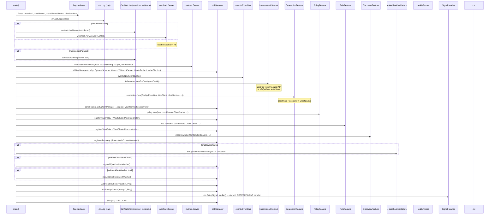
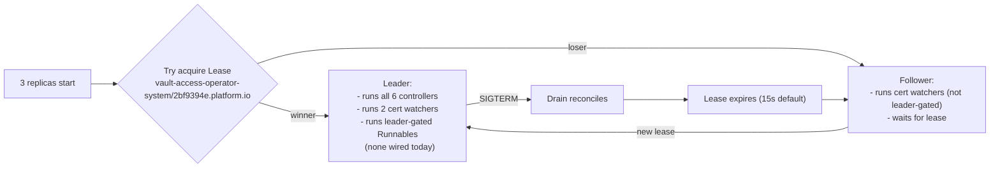
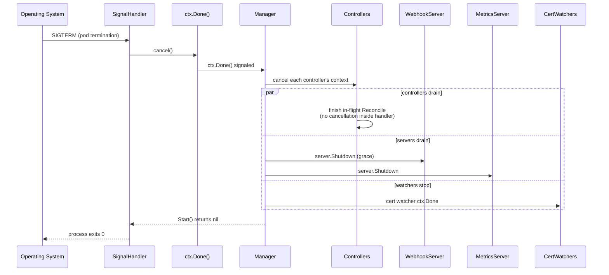
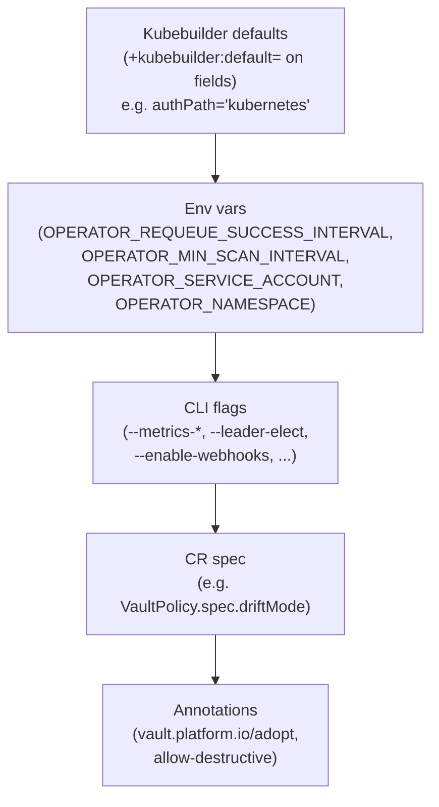
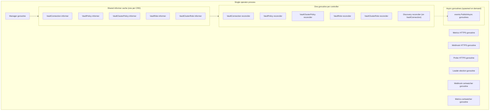

# FLOW: Manager Lifecycle (Startup, Leader Election, Shutdown)

## Summary

The operator binary is driven entirely by `controller-runtime`'s `Manager`: a single process that hosts controllers, webhooks, metrics, health probes, and leader election, sharing one informer cache and one K8s client. [cmd/main.go](../../cmd/main.go) parses flags, constructs the manager, wires four features, optionally enables webhooks, and calls `mgr.Start(ctx)`. Everything the operator does at runtime happens inside that one blocking call.

This doc walks through the lifecycle phases: **parse → construct → wire features → add aux components → start → run → drain → exit**. It also calls out the aspects where the operator relies entirely on controller-runtime defaults with no explicit configuration (graceful shutdown timeout, health probe depth, leader lease tuning).

## Startup Order



Key lines in [cmd/main.go](../../cmd/main.go):
- Flag parse: 64-97
- Manager construction: 197-215
- EventBus: 222
- Clientset: 226-232
- Connection feature: 238-250
- Policy feature: 253-265
- Role feature: 268-280
- Discovery feature: 283-294
- Webhooks: 297-314
- Cert watchers added: 317-331
- Health probes: 333-340
- Start: 343

**Dependency order is not accidental.** The Connection feature constructs `ClientCache` and hands it to Policy/Role/Discovery features. If their construction order were reversed, they'd get a nil cache. The code relies on sequential `:=` declarations to enforce this; it's not checked at compile time.

## Feature Registration — what `SetupWithManager` does

Each feature's `SetupWithManager(mgr)` call internally:
1. Calls `ctrl.NewControllerManagedBy(mgr).For(&CRD{}).Complete(r)` for every CRD it owns.
2. Adds Watches for dependency CRDs with a MapFunc + Predicate (e.g., policy watches VaultConnection).
3. Registers field indexes (for future list-by-field queries) — currently none.
4. Does NOT start anything. All controllers are started by `mgr.Start`.

Total controllers registered today: 6.
- 1 × VaultConnection (connection feature)
- 2 × VaultPolicy, VaultClusterPolicy (policy feature)
- 2 × VaultRole, VaultClusterRole (role feature)
- 1 × VaultConnection (discovery feature — second watch on same kind)

The **two controllers on VaultConnection** is the source of the status-write contention mitigated in [features/discovery/controller/controller.go:286](../../features/discovery/controller/controller.go:286) via `retry.RetryOnConflict`. See [IMPROVEMENTS.md §9](IMPROVEMENTS.md#9-dual-reconcilers-on-vaultconnection--status-race).

## What `mgr.Start(ctx)` does

`mgr.Start` is a blocking call that returns only when the context is canceled (typically by the signal handler) or a fatal error occurs. Internally it:

1. **Leader election** (if enabled): acquires a Lease via the K8s coordination API. `LeaderElectionID = "2bf9394e.platform.io"` ([main.go:203](../../cmd/main.go:203)).
2. **Starts the metrics server** on `--metrics-bind-address`.
3. **Starts the webhook server** if set (separate HTTPS port, default `:9443`).
4. **Starts the health/ready probe server** on `--health-probe-bind-address`.
5. **Starts informers** for every watched CRD. First informer sync blocks the controller from processing queued events.
6. **Starts all controllers** (one goroutine per controller, each pulling from a rate-limited queue). Default `MaxConcurrentReconciles = 1` per controller — reconciles run serially per CRD kind.
7. **Starts each `Runnable` added via `mgr.Add()`**. For this operator, that's the two cert watchers.

### Leader election behaviour

| Flag | Default | Effect |
|------|---------|--------|
| `--leader-elect` | `false` | Multiple replicas can all run reconcilers in parallel → bad |
| (set to true) | — | Only the leader runs reconcilers + `Runnable`s that return `NeedsLeaderElection()=true` |
| `LeaderElectionReleaseOnCancel` | `false` (commented out) | On shutdown, lease expires passively (15s default). A hot takeover would need this to `true`. |

**All controllers today run on the leader** (default for controller-runtime). `Runnable`s currently added (two cert watchers) don't implement `NeedsLeaderElection` — they run on every replica, which is correct because cert reload is per-pod.

**Planned leader-gated components** — `pkg/cleanup.Controller` and `pkg/orphan.Controller` both implement `NeedsLeaderElection() bool { return true }` but are **never passed to `mgr.Add`**. See [IMPROVEMENTS.md §1](IMPROVEMENTS.md#1-unwired-controllers).



## Health Probes

```go
// cmd/main.go:333
mgr.AddHealthzCheck("healthz", healthz.Ping)
mgr.AddReadyzCheck("readyz", healthz.Ping)
```

`healthz.Ping` is the trivial check: it always returns `nil` as long as the HTTP handler is reachable. **It does not check:**
- Whether informers have synced.
- Whether Vault is reachable.
- Whether the event bus is stuck.
- Whether the `ClientCache` is populated.

This is explicitly called out as a gap — see [IMPROVEMENTS.md §33](IMPROVEMENTS.md#33-health-probes-are-trivial-pings).

Probe endpoints:
- `:8081/healthz` — liveness (pod-restart trigger)
- `:8081/readyz` — readiness (service-routing gate)

If you need meaningful health, add a custom `healthz.Checker`:

```go
mgr.AddReadyzCheck("informers", func(_ *http.Request) error {
    if !mgr.GetCache().WaitForCacheSync(r.Context()) {
        return errors.New("cache not synced")
    }
    return nil
})
```

## Shutdown Flow



### Default drain behavior

Controller-runtime's default is:
- **Pre-Start**: `RunnableGroup.Start(ctx)` — all starts happen within `Start`.
- **During Shutdown**: each controller's queue stops accepting new items, current in-flight reconcile(s) finish to completion (not canceled mid-function; the context passed to Reconcile is the **reconcile-scoped** context, not the shutdown context, in current controller-runtime).
- **No explicit timeout** — there is no `manager.Options.GracefulShutdownTimeout` set in this codebase. Controller-runtime's default is `30s` — if a reconcile exceeds that, the manager forcibly returns.

**This is a latent bug surface**: a long-running Vault operation (bootstrap under a slow STS endpoint, say) could still be in-flight when SIGTERM arrives. With no explicit timeout, the default 30s may or may not be enough. See [IMPROVEMENTS.md §32](IMPROVEMENTS.md#32-undocumented-shutdown-drain-timeout).

### K8s pod termination grace period

K8s gives pods `terminationGracePeriodSeconds` (default 30s) between SIGTERM and SIGKILL. If:
- operator drain > `terminationGracePeriodSeconds` → K8s sends SIGKILL, losing in-flight state.
- In-flight Reconcile doesn't respect its scoped context → could block indefinitely until SIGKILL.

Helm chart default `terminationGracePeriodSeconds`: not explicitly set in [deployment.yaml](../../charts/vault-access-operator/templates/deployment.yaml). Falls back to K8s default 30s.

## Pre-flight Failure Modes

Every `os.Exit(1)` path in `main.go` represents a non-recoverable startup failure:

| Line | Failure | Typical cause |
|------|---------|---------------|
| [134](../../cmd/main.go:134) | webhook cert watcher init | bad path; file perms |
| [189](../../cmd/main.go:189) | metrics cert watcher init | same |
| [218](../../cmd/main.go:218) | `ctrl.NewManager` | invalid REST config; scheme registration failed |
| [230](../../cmd/main.go:230) | `kubernetes.NewForConfig` | can't build clientset from config |
| [248](../../cmd/main.go:248) | connection feature setup | controller already registered; cache init failure |
| [263](../../cmd/main.go:263) | policy feature setup | same class |
| [278](../../cmd/main.go:278) | role feature setup | same class |
| [292](../../cmd/main.go:292) | discovery feature setup | same class |
| [300, 304, 308, 312](../../cmd/main.go:300) | webhook setup | webhook server not initialized; type mismatch |
| [321, 329](../../cmd/main.go:321) | `mgr.Add` cert watcher | should never fail after init succeeds |
| [335, 339](../../cmd/main.go:335) | health probe registration | manager state issue |
| [344](../../cmd/main.go:344) | `mgr.Start` return error | any runtime failure during controller execution |

All of these use `setupLog.Error(err, "...")` + `os.Exit(1)`, so failures are logged with reason before the process dies. CrashLoopBackOff is the normal recovery for transient K8s-API issues at startup.

## Configuration Precedence

Config sources, in the order they take effect (later overrides earlier):



| Axis | Defaults | Env | Flag | Spec | Annotation |
|------|----------|-----|------|------|-----------|
| Metrics address | `0` (disabled) | — | `--metrics-bind-address` | — | — |
| Health probe | `:8081` | — | `--health-probe-bind-address` | — | — |
| Webhooks | off | — | `--enable-webhooks` | — | — |
| Leader election | off | — | `--leader-elect` | — | — |
| Requeue success | `30s` | `OPERATOR_REQUEUE_SUCCESS_INTERVAL` | — | — | — |
| Requeue error | `30s` | `OPERATOR_REQUEUE_ERROR_INTERVAL` | — | — | — |
| Discovery min interval | `5m` | `OPERATOR_MIN_SCAN_INTERVAL` | — | — | — |
| Operator SA | `vault-access-operator-controller-manager` | `OPERATOR_SERVICE_ACCOUNT` | — | — | — |
| Drift mode | `detect` | — | — | `VaultConnection.spec.defaults.driftMode` OR `CRD.spec.driftMode` | — |
| Adoption | Fail | — | — | `ConflictPolicy` | `vault.platform.io/adopt=true` (overrides spec) |

## Concurrency Topology



Shared state:
- **Informer cache** — read by all controllers via `mgr.GetClient()` / `.Get` / `.List`
- **ClientCache** (`*vault.ClientCache`) — written by connection feature, read by policy/role/discovery features (guarded by internal mutex)
- **Event bus handlers map** — guarded by `sync.RWMutex`; no production subscribers

## Startup-time Race: features see partial state

Because features are constructed sequentially in main:
- Policy feature's `New` call receives a `ClientCache` that has **not yet started populating** (no connections have reconciled).
- The first few reconciles of policy/role CRDs find `ClientCache.Get(connRef)` returns a cache miss → `vaultclient.Resolve` returns `DependencyError` → status goes `Phase=Error`, condition `ConnectionNotReady`.
- `ConnectionPhaseChangedPredicate` re-enqueues dependent policies/roles when the connection flips to Active — so within ~1 minute of first startup, dependents catch up.

This is correct-by-eventual-consistency but surfaces as noisy logs on cold start. Not a bug; worth noting for contributors debugging "why does my policy sync 30s later".

## Files Read / Written

| File | Op | When |
|------|-----|------|
| Kubeconfig (`~/.kube/config` or in-cluster) | R | `ctrl.GetConfigOrDie` |
| TLS certs (`webhook-cert-path`, `metrics-cert-path`) | R, hot-reload | `certwatcher.CertWatcher` |
| ServiceAccount token (`/var/run/secrets/...`) | R | in-cluster config |
| Leader election Lease | R+W | every `LeaseDuration` (default 15s) if leader-elect on |

## Cross-References

- [ARCHITECTURE.md](ARCHITECTURE.md) — static structure + runtime wiring diagram
- [FLOW_OVERVIEW.md](FLOW_OVERVIEW.md) — pre-flight universal diagram
- [FLOW_WEBHOOK.md](FLOW_WEBHOOK.md) — webhook server startup details
- [FLOW_METRICS.md](FLOW_METRICS.md) — metrics server startup
- [IMPROVEMENTS.md §1](IMPROVEMENTS.md#1-unwired-controllers), [§32](IMPROVEMENTS.md#32-undocumented-shutdown-drain-timeout), [§33](IMPROVEMENTS.md#33-health-probes-are-trivial-pings), [§34](IMPROVEMENTS.md#34-rbac-aggregates-unwired-controller-needs)
