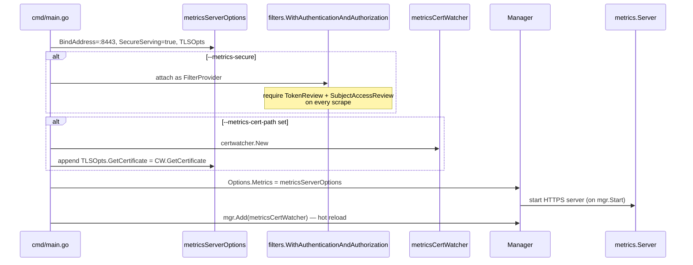
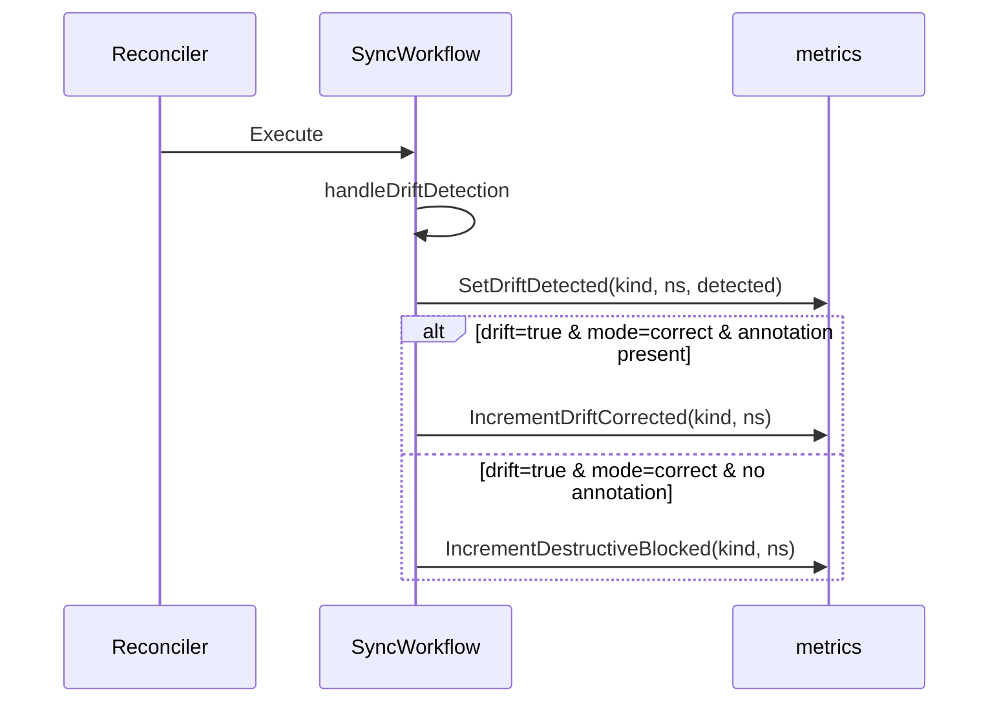
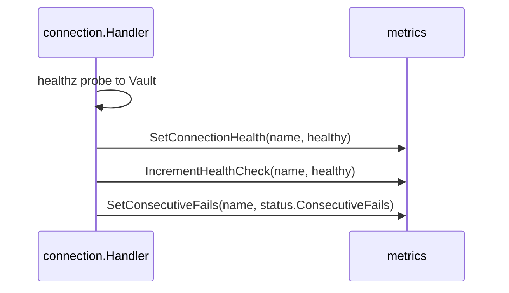
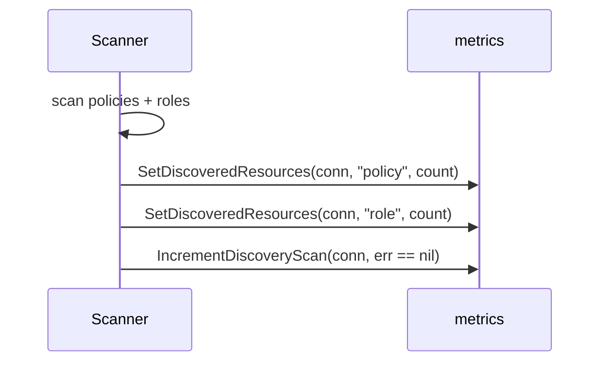

# FLOW: Metrics Emission & Scraping

## Summary

The operator exposes 14 Prometheus metrics under the `vault_access_operator_*` namespace. All are registered in [pkg/metrics/metrics.go](../../pkg/metrics/metrics.go) during package `init`. Helper functions (`SetX`, `IncrementX`) are the only sanctioned way to update them — **no caller accesses the metrics directly**, so emission sites are discoverable by grepping for the helper function names.

Findings from that grep (verified 2026-04-18):
- **8 metrics are actively emitted** from production code paths.
- **3 metrics are defined and have helper functions but are never called** outside test files: `PolicyReconcileTotal`, `RoleReconcileTotal`, `AdoptionTotal`. These are dead metrics — see [IMPROVEMENTS.md §31](IMPROVEMENTS.md#31-dead-metrics).
- **3 metrics are emitted only from code paths that aren't wired to the manager**: `OrphanedResourcesGauge` (only from `pkg/orphan`, unwired), `CleanupQueueSizeGauge` and `CleanupRetriesTotal` (only from `pkg/cleanup`, unwired). They'll always report `0` in production. See [IMPROVEMENTS.md §1](IMPROVEMENTS.md#1-unwired-controllers).

The metrics server is part of controller-runtime's manager. Exposure is gated by `--metrics-bind-address` and protected by authn/authz when `--metrics-secure=true`.

## Metrics Server Lifecycle



- **Default address**: `0` (disabled). Production Helm values set `:8443`.
- **TLS required** by default (`--metrics-secure=true`). `--metrics-secure=false` falls back to HTTP — dev only.
- **HTTP/2 disabled** by `--enable-http2=false` (default) for CVE-2023-44487 mitigation — same rationale as webhooks.
- **Auth/authz**: when secure, every scrape goes through `TokenReview` (is this a valid SA?) and `SubjectAccessReview` (is it allowed to `/metrics`?). RBAC for this is in [config/rbac/metrics_auth_role.yaml](../../config/rbac/metrics_auth_role.yaml) — grants `metrics-reader` `nonResourceURL=/metrics` via `get`.

## Full Metrics Catalogue

All metrics live under `vault_access_operator_*`. Subsystem groups segment the namespace:
- `connection_*` — Vault connection health + checks
- `policy_*` / `role_*` — reconcile counters
- `vault_*` — drift, orphaned resources
- `safety_*` — destructive-operation blocks
- `discovery_*` — scan results, adoptions
- `cleanup_*` — cleanup queue (unwired)

Legend: **✅ emitted** from production, **⚠️ unwired** (emitted only from unwired `pkg/*` controllers), **❌ dead** (no production emission site at all).

| Status | Full name | Type | Labels | Helper | Emission site(s) |
|--------|-----------|------|--------|--------|------------------|
| ✅ | `connection_healthy` | Gauge | `connection` | `SetConnectionHealth` | [handler.go:698](../../features/connection/controller/handler.go:698) |
| ✅ | `connection_health_checks_total` | Counter | `connection, result` | `IncrementHealthCheck` | [handler.go:699](../../features/connection/controller/handler.go:699) |
| ✅ | `connection_consecutive_fails` | Gauge | `connection` | `SetConsecutiveFails` | [handler.go:700](../../features/connection/controller/handler.go:700) |
| ❌ | `policy_reconcile_total` | Counter | `kind, namespace, result` | `IncrementPolicyReconcile` | **none** (defined at [metrics.go:232](../../pkg/metrics/metrics.go:232); never called outside tests) |
| ❌ | `role_reconcile_total` | Counter | `kind, namespace, result` | `IncrementRoleReconcile` | **none** (defined at [metrics.go:241](../../pkg/metrics/metrics.go:241); never called outside tests) |
| ⚠️ | `vault_orphaned_resources` | Gauge | `connection, type` | `SetOrphanedResources` | [pkg/orphan/controller.go:158, 171](../../pkg/orphan/controller.go:158) — unwired |
| ✅ | `vault_drift_detected` | Gauge | `kind, namespace, name` | `SetDriftDetected` | [workflow/sync.go:200](../../shared/controller/workflow/sync.go:200) |
| ⚠️ | `cleanup_queue_size` | Gauge | — | `SetCleanupQueueSize` | [pkg/cleanup/controller.go:132, 186](../../pkg/cleanup/controller.go:132) — unwired |
| ⚠️ | `cleanup_retries_total` | Counter | `resource_type, result` | `IncrementCleanupRetry` | [pkg/cleanup/controller.go:169, 180](../../pkg/cleanup/controller.go:169) — unwired |
| ✅ | `vault_drift_corrected_total` | Counter | `kind, namespace` | `IncrementDriftCorrected` | [workflow/sync.go:299](../../shared/controller/workflow/sync.go:299) |
| ✅ | `safety_destructive_blocked_total` | Counter | `kind, namespace` | `IncrementDestructiveBlocked` | [workflow/sync.go:258](../../shared/controller/workflow/sync.go:258) |
| ❌ | `discovery_adoptions_total` | Counter | `kind, namespace, result` | `IncrementAdoption` | **none** (defined at [metrics.go:288](../../pkg/metrics/metrics.go:288); never called) |
| ✅ | `discovery_unmanaged_resources` | Gauge | `connection, type` | `SetDiscoveredResources` | [scanner.go:323, 324](../../features/discovery/controller/scanner.go:323) |
| ✅ | `discovery_scans_total` | Counter | `connection, result` | `IncrementDiscoveryScan` | [scanner.go:325](../../features/discovery/controller/scanner.go:325) |

## Emission Flow (per reconcile)

Typical reconcile of a VaultPolicy or VaultRole fires at most 3 metrics:



Connection reconcile fires 3 metrics at the end of every successful check:



Discovery fires 3 metrics at the end of every scan:



## What's NOT Measured Today

The absence of these is explanatory: it tells you what *can't* be alerted on without additional instrumentation.

| Signal | Closest proxy | Gap |
|--------|---------------|-----|
| Reconcile **latency** | none | no histogram for `time.Since(start)` on reconcile. See [IMPROVEMENTS.md §K](IMPROVEMENTS.md#k-metrics-no-latency-histograms). |
| Vault API **latency** | none | no histogram for Vault client calls |
| Token **renewal** events | none (token events aren't published to bus or counter) | add `token_renewals_total`, `token_renewal_failures_total` |
| Bootstrap **duration** | none | add `bootstrap_duration_seconds` histogram |
| Webhook **validation** rate | none | controller-runtime exposes `controller_runtime_webhook_*` but operator doesn't surface a business-level counter (e.g., "how often are VaultPolicy creates rejected?") |
| Policy **resolution** failures | status condition `PoliciesResolved=False` only | add `policy_binding_resolution_failures_total` |
| Queue **depth** (reconciler work queue) | — | controller-runtime provides `controller_runtime_active_workers` / `workqueue_depth` globally; operator could still benefit from explicit per-feature saturation metrics |

## Labels & Cardinality

| Metric | Labels | Cardinality risk |
|--------|--------|------------------|
| `connection_*` | `connection` | low — one per VaultConnection |
| `policy_reconcile_total` / `role_reconcile_total` | `kind, namespace, result` | medium — grows with namespace count (but dead, so moot) |
| `vault_drift_detected` | `kind, namespace, name` | medium — labeled by resource name (was kind+namespace only, but multiple resources in the same namespace overwrote each other's signal). Cleanup workflow calls `DeleteDriftDetected` to prevent series leak on resource deletion. |
| `vault_drift_corrected_total` | `kind, namespace` | same |
| `safety_destructive_blocked_total` | `kind, namespace` | same |
| `vault_orphaned_resources` / `discovery_unmanaged_resources` | `connection, type` | low — type ∈ {policy, role} |
| `discovery_scans_total` / `connection_health_checks_total` | `connection, result` | low |

The "kind, namespace" choice (instead of "kind, namespace, name") is an explicit cardinality trade-off per the comment at [metrics.go:100](../../pkg/metrics/metrics.go:100). Users wanting per-resource drift insight should look at `Conditions[type=Drifted]` on each CR.

## Prometheus Scrape Configuration

### ServiceMonitor (Helm)

[charts/vault-access-operator/templates/servicemonitor.yaml](../../charts/vault-access-operator/templates/servicemonitor.yaml) exists but is gated by `metrics.enabled=true` in values. It points at the operator's `Service` (port `https-metrics`) and uses TLS + bearer token auth.

### Standalone scrape

```yaml
- job_name: vault-access-operator
  scheme: https
  tls_config:
    ca_file: /path/to/ca.crt
    insecure_skip_verify: false
  bearer_token_file: /var/run/secrets/kubernetes.io/serviceaccount/token
  static_configs:
    - targets: ['vault-access-operator-metrics-service.vault-access-operator-system.svc:8443']
  metrics_path: /metrics
```

The scraper's bearer token must belong to an SA bound to the `metrics-reader` ClusterRole; otherwise the filter chain rejects with 401/403.

## Recommended Dashboards (conceptual)

No PromQL here — just the shape of what's worth charting:

| Panel | Source metrics | Alert condition |
|-------|----------------|-----------------|
| Connections health | `connection_healthy` | alert if =0 for >5m |
| Consecutive failures | `connection_consecutive_fails` | alert if >3 for >5m |
| Reconcile error rate | (dead — would need `*_reconcile_total{result=failure}`) | — |
| Drift prevalence | `vault_drift_detected` | alert if sum >0 per cluster |
| Blocked destructive ops | `rate(safety_destructive_blocked_total[5m])` | info |
| Discovery scan failures | `rate(discovery_scans_total{result=failure}[1h])` | alert if any |
| Unmanaged-resource count | `discovery_unmanaged_resources` | cap-based alert |

## Concurrency & Consistency

- All metrics come from `prometheus.NewCounterVec` / `NewGaugeVec`. The underlying library is thread-safe; concurrent updates are fine.
- Gauges are set, not incremented. `SetDriftDetected` replaces the value — two reconciles flipping drift state in quick succession compose correctly.
- `Inc` is atomic.
- No transactional semantics: if a reconcile panics between two metric calls, the first landed but the second didn't. Usually acceptable for observability.

## Dead-Metric Risk

Registered-but-unused metrics have a non-zero ops cost:
- They show up in `/metrics` scrapes (label-less, value 0 — but the series still exists).
- Dashboards built against them quietly show flat lines instead of surfacing "this isn't instrumented".
- Future developers might assume the metric is maintained and write alerts against it.

Either wire the missing emission points (see below) or deregister. See [IMPROVEMENTS.md §31](IMPROVEMENTS.md#31-dead-metrics).

## What to wire to close the gaps

1. **`policy_reconcile_total` / `role_reconcile_total`**: call `metrics.IncrementPolicyReconcile(kind, ns, err==nil)` in `BaseReconciler.handleSync` after success/failure detection. One line each in [features/policy/controller/policy_reconciler.go](../../features/policy/controller/policy_reconciler.go) and its cluster variant.

2. **`discovery_adoptions_total`**: call `metrics.IncrementAdoption(kind, ns, success)` at the point in `PolicyOps.CheckConflict` / `RoleOps.CheckConflict` where `shouldAdopt` is honored and a previously-unmanaged Vault resource gets a managed-marker written.

3. **Orphan + cleanup metrics**: wire their controllers via `mgr.Add` ([IMPROVEMENTS.md §1](IMPROVEMENTS.md#1-unwired-controllers)). Metrics will start flowing automatically.

## Cross-References

- [ARCHITECTURE.md](ARCHITECTURE.md) — metric listing in static-view table
- [FLOW_LIFECYCLE.md](FLOW_LIFECYCLE.md) — metrics server startup
- [FLOW_CONNECTION.md](FLOW_CONNECTION.md) — connection health metrics are emitted from here
- [FLOW_DISCOVERY.md](FLOW_DISCOVERY.md) — scanner metrics
- [IMPROVEMENTS.md §K](IMPROVEMENTS.md#k-metrics-no-latency-histograms), [§1](IMPROVEMENTS.md#1-unwired-controllers), [§31](IMPROVEMENTS.md#31-dead-metrics)
