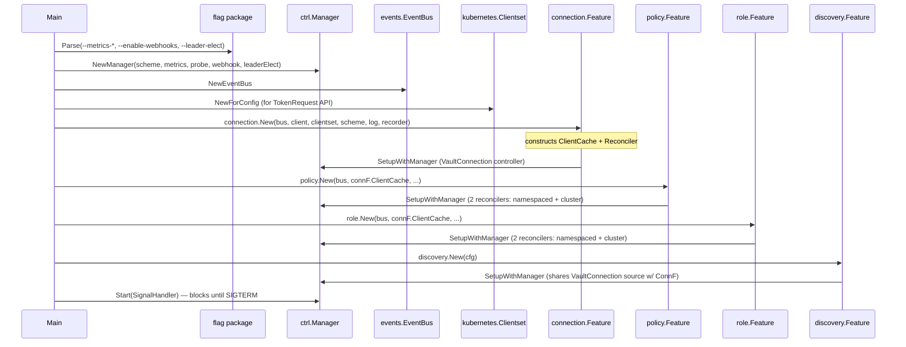
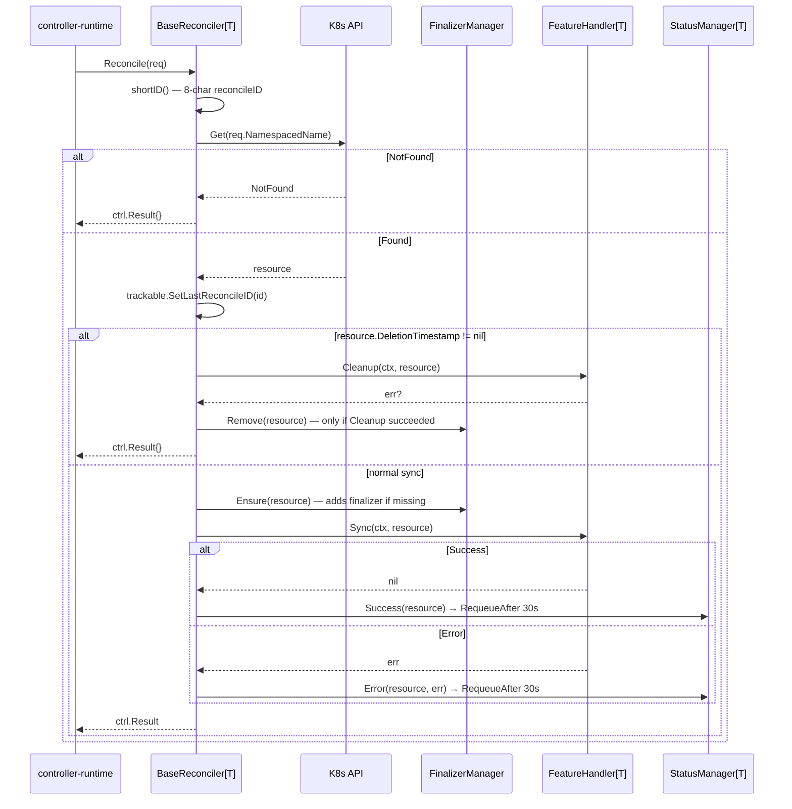
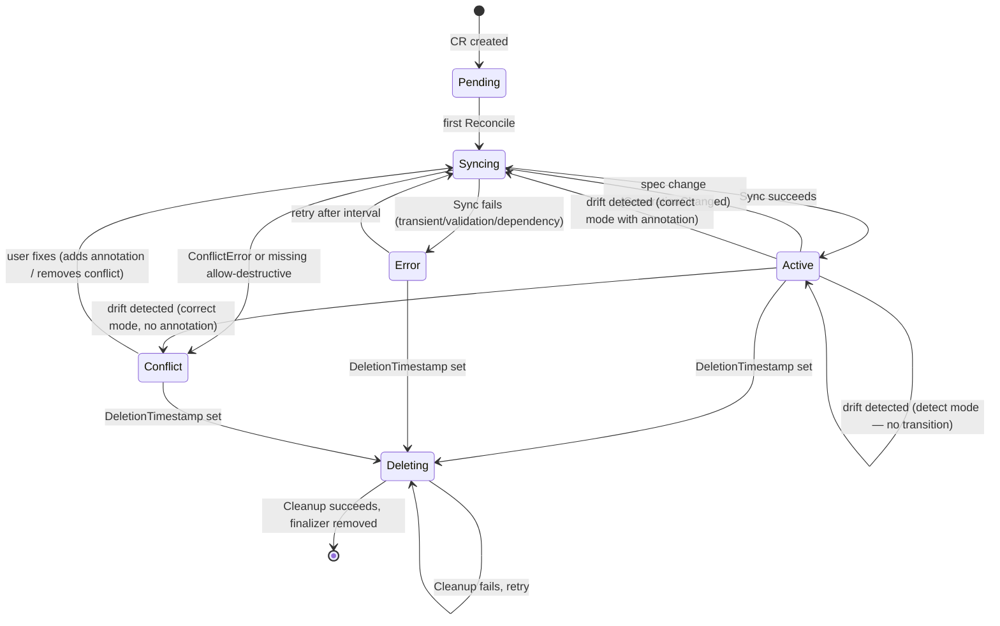

# Flow Overview — Shared Foundations

> Runtime contracts shared by all flow docs. Read this before any `FLOW_*.md`.

## Universal Pre-flight (cmd/main.go)

Every entry point runs after this setup has completed on operator start:

**Note:** The `pkg/cleanup` and `pkg/orphan` controllers have complete `Start(ctx)` methods and `NeedsLeaderElection() bool` hooks but are **never added to the manager** in `main.go`. See [IMPROVEMENTS.md §1](IMPROVEMENTS.md#1-unwired-controllers).

## Reconcile Entry (all CRDs go through `BaseReconciler[T]`)

Every `Reconcile` produces K8s events via `BaseReconciler.recordEvent`:
- Normal: `Syncing`, `Synced`, `Deleting`, `Deleted`, `DriftDetected` (warning), `DriftCorrected`
- Warning: `SyncFailed`, `DeleteFailed`, `DeletionStuck` (>5 min), `DeletionBlocked`, `PolicyNotInVault`

## Port Map (Interfaces / Abstract boundaries)

| Port | File | Methods | Implemented By | Boundary |
|------|------|---------|----------------|----------|
| `FeatureHandler[T]` | [shared/controller/base/reconciler.go:48](../../shared/controller/base/reconciler.go:48) | `Sync`, `Cleanup` | `connection.Handler`, `policyFeatureHandler`, `roleFeatureHandler` | base → feature |
| `SyncableResource` | [shared/controller/workflow/resource.go:33](../../shared/controller/workflow/resource.go:33) | 30+ status/spec accessors | `VaultPolicyAdapter`, `VaultClusterPolicyAdapter`, `VaultRoleAdapter`, `VaultClusterRoleAdapter` | workflow → feature |
| `ResourceOps` | [shared/controller/workflow/ops.go:31](../../shared/controller/workflow/ops.go:31) | `Validate`, `CheckConflict`, `PrepareContent`, `DetectDrift`, `WriteToVault`, `ReadbackVerify`, `MarkManaged`, `DeleteFromVault`, `RemoveManaged`, `ApplyActiveStatus`, `ApplyBindings`, `PublishSyncEvent`, `PublishDeleteEvent` | `PolicyOps`, `RoleOps` | workflow → feature-specific ops |
| `PolicyAdapter` | [features/policy/domain/adapter.go:27](../../features/policy/domain/adapter.go:27) | `GetRules`, `GetVaultPolicyName`, `IsEnforceNamespaceBoundary`, etc. | `VaultPolicyAdapter`, `VaultClusterPolicyAdapter` | handler → domain object |
| `RoleAdapter` | [features/role/domain/adapter.go:29](../../features/role/domain/adapter.go:29) | `GetServiceAccountBindings`, `GetPolicies`, `GetAuthPath`, `GetJWT`, etc. | `VaultRoleAdapter`, `VaultClusterRoleAdapter` | handler → domain object |
| `TokenProvider` | [pkg/vault/token/provider.go:36](../../pkg/vault/token/provider.go:36) | `GetToken(opts) (*TokenInfo, error)` | `TokenRequestProvider`, `MountedTokenProvider` | auth → K8s |
| `LifecycleController` | [pkg/vault/token/lifecycle.go](../../pkg/vault/token/lifecycle.go) | `Register`, `Unregister`, `Start` | concrete `lifecycleController` struct | scheduled token renewal |
| `TokenReviewerController` | [pkg/vault/token/rotator.go](../../pkg/vault/token/rotator.go) | `Register`, `Unregister`, `Start` | concrete reviewer rotator | K8s auth reviewer JWT rotation |
| `VaultClientResolver` | [workflow/sync.go:42](../../shared/controller/workflow/sync.go:42) | `(ctx, connRef, resourceID) → *vault.Client` | lambda wrapping `vaultclient.Resolve` | workflow → connection feature |
| `VaultClientGetter` | [workflow/cleanup.go:35](../../shared/controller/workflow/cleanup.go:35) | `(connRef) → *vault.Client` | `ClientCache.Get` | cleanup → cache (no validation) |
| `Event` | [shared/events/types.go](../../shared/events/types.go) | `EventType() EventType` | 10+ event types (ConnectionReady, PolicyCreated, RoleCreated, BootstrapCompleted, ...) | cross-feature |
| `VaultClient` (cleanup) | [pkg/cleanup/controller.go:36](../../pkg/cleanup/controller.go:36) | `DeletePolicy`, `DeleteKubernetesAuthRole` | `*vault.Client` | cleanup controller → Vault |
| `ClientCache` (cleanup) | [pkg/cleanup/controller.go:42](../../pkg/cleanup/controller.go:42) | `Get(name) (VaultClient, error)` | ⚠️ no current impl (interface mismatch — see [IMPROVEMENTS.md §3](IMPROVEMENTS.md#3-cleanup-controller-typing-mismatch)) | cleanup → connection |

## Types Crossing Boundaries

| Type | Direction | Path | Purpose |
|------|-----------|------|---------|
| `ctrl.Request` | inward | runtime → reconciler | `{Name, Namespace}` triggering reconcile |
| `client.Object` (CRD) | inward | K8s API → `BaseReconciler.Reconcile` | typed CR fetched from K8s |
| `Adapter` | inward | reconciler → handler | wraps CRD for shared logic |
| `ResourceOps` | inward | handler → workflow | per-kind operation injection |
| `syncExecutionState` | internal | workflow phases | derived state: driftMode, vaultClient, specHash, etc. |
| `*vault.Client` | outward | workflow → Vault | auth + CRUD |
| `vault.PolicyRule` | outward | policy → HCL gen | Vault-native policy shape |
| `map[string]interface{}` | outward | role → Vault API | role data (policies, bound SAs, TTLs, audiences) |
| `ManagedResource` | inward | Vault → orphan / discovery | managed-marker metadata: `{k8sResource, connectionName}` |
| `events.*Event` | lateral | publisher → subscriber | `ConnectionReady`, `PolicyCreated`, `RoleCreated`, `BootstrapCompleted`, `ConnectionDisconnected`, etc. |
| `vaultv1alpha1.Condition` | outward | `conditions.Set` → status | K8s-style condition entry |
| `VaultResourceBinding` | outward | `binding.New*` → status | foreign-key-like pointer to Vault path |
| `DiscoveredResource` | outward | scanner → connection status | `{type, name, discoveredAt, suggestedCRName, adoptionStatus}` |
| `cleanup.Item` | lateral | failed deletion → Queue ConfigMap | serialized JSON in `vault-cleanup-queue` ConfigMap |
| `token.TokenInfo` | outward | provider → auth | `{token, expiration, audiences}` |

## Error Catalog

Errors are structured in [`shared/infrastructure/errors/`](../../shared/infrastructure/errors/) and classified in [`shared/controller/syncerror/handler.go`](../../shared/controller/syncerror/handler.go).

| Error Type | Origin | Meaning | Syncerror mapping |
|-----------|--------|---------|-------------------|
| `ConflictError` | `checkConflict` (policy/role) | Vault resource exists & is owned by someone else, adoption not permitted | `Phase: Conflict`, `Reason: Conflict` |
| `ValidationError` | policy namespace-boundary check, role policy-ref kind check, JWT subject derivation | spec fails pre-sync validation | `Phase: Error`, `Reason: ValidationFailed` |
| `DependencyError` | `vaultclient.Resolve` when VaultConnection missing or not Active | connection unready or missing | `Phase: Error`, `Reason: ConnectionNotReady`, sets `DependencyReady=False` |
| `TransientError` | Vault API failures, readback mismatches | retryable | `Phase: Error`, `Reason: Failed` — requeue after interval |
| generic `error` | any other path | unknown failure | `Phase: Error`, `Reason: Failed` |

### Stuck deletion detection

In `BaseReconciler.handleDeletion` ([reconciler.go:199](../../shared/controller/base/reconciler.go:199)):
- If `Cleanup` returns error **and** `time.Since(DeletionTimestamp) > 5m`, emits `Warning / DeletionStuck` event with elapsed time.

### Auth error → cache eviction

In `connection.Handler.handleSyncError` ([handler.go:520](../../features/connection/controller/handler.go:520)):
- If error matches `permission denied | invalid token | Code: 403`, the cached Vault client is **deleted from the cache** so the next reconcile performs full re-auth with fresh credentials.

## Phase State Machine

## Conditions (standard K8s semantics)

| Type | Typical True Reason | Typical False Reason |
|------|--------------------|---------------------|
| `Ready` | `Succeeded` | `Failed`, `Conflict`, `ValidationFailed` |
| `Synced` | `Succeeded` | `Failed` |
| `ConnectionReady` | `ConnectionActive` | `ConnectionNotReady` |
| `PoliciesResolved` | `AllPoliciesExist` | `PolicyNotInVault` (warning, non-blocking) |
| `DependencyReady` | `DependencyReady` | `ConnectionNotReady` |
| `Drifted` | `DriftDetected` | `NoDrift` |
| `Deleting` | `DeletionInProgress` | `ChildrenExist` (connection only) |

Conditions are mutated via [`conditions.Set(conds, gen, type, status, reason, message)`](../../shared/controller/conditions/conditions.go). `LastTransitionTime` is only updated when `status` flips; reason/message changes preserve it.

## File-system Artifacts

The operator itself **writes no files on disk**. All persistence is via K8s or Vault.

| Artifact | Kind | Read | Written | Notes |
|----------|------|------|---------|-------|
| CRDs (`VaultConnection`, etc.) | K8s object | ✅ all reconciles | ✅ status updates | authoritative source |
| `Secret` (bootstrap token, AppRole secretID, JWT, GCP creds, TLS CA) | K8s object | ✅ connection handler | ❌ | operator-readable only |
| `ServiceAccount` token | K8s object (virtual) | ✅ `TokenRequestProvider` | ❌ | short-lived |
| `Event` | K8s object | ❌ | ✅ `BaseReconciler.recordEvent` | surfaced via `kubectl describe` |
| `ConfigMap: vault-cleanup-queue` | K8s object | queue ([cleanup/queue.go](../../pkg/cleanup/queue.go)) | queue | JSON array of `Item` — **consumer not wired** |
| Vault KV: `secret/data/vault-access-operator/managed/policies/{name}` | Vault | ✅ conflict check, orphan, discovery | ✅ `MarkPolicyManaged` | metadata: `{k8sResource, connectionName, ...}` |
| Vault KV: `secret/data/vault-access-operator/managed/roles/{name}` | Vault | ✅ conflict check, orphan, discovery | ✅ `MarkRoleManaged` | same shape |
| Vault sys: `sys/policies/acl/{name}` | Vault | ✅ drift | ✅ policy sync | HCL content |
| Vault sys: `auth/{mount}/role/{name}` | Vault | ✅ drift | ✅ role sync | role params |
| `/var/run/secrets/.../namespace` | filesystem | ✅ `getOperatorNamespace` | ❌ | fallback only |
| `tls.crt` / `tls.key` (metrics + webhook) | filesystem | ✅ `certwatcher` | ❌ | hot-reload |

Legend: ✅ = touched by this entry point, ❌ = not touched

## Cross-References

- [PROJECT_OVERVIEW.md](PROJECT_OVERVIEW.md)
- [ARCHITECTURE.md](ARCHITECTURE.md)
- [FLOW_CONNECTION.md](FLOW_CONNECTION.md) — establishes the client cache the rest of the flows depend on
- [FLOW_POLICY.md](FLOW_POLICY.md)
- [FLOW_ROLE.md](FLOW_ROLE.md)
- [FLOW_DISCOVERY.md](FLOW_DISCOVERY.md)
- [FLOW_DELETION.md](FLOW_DELETION.md)
- [FLOW_AUTH.md](FLOW_AUTH.md) — auth-backend selection (bootstrap is a special case covered in FLOW_CONNECTION)
- [IMPROVEMENTS.md](IMPROVEMENTS.md)
