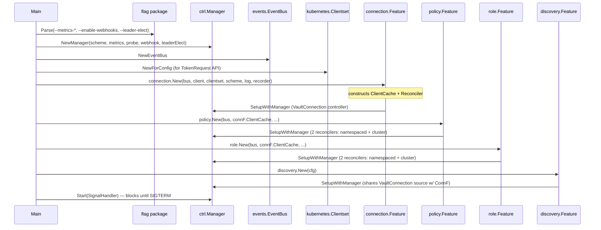
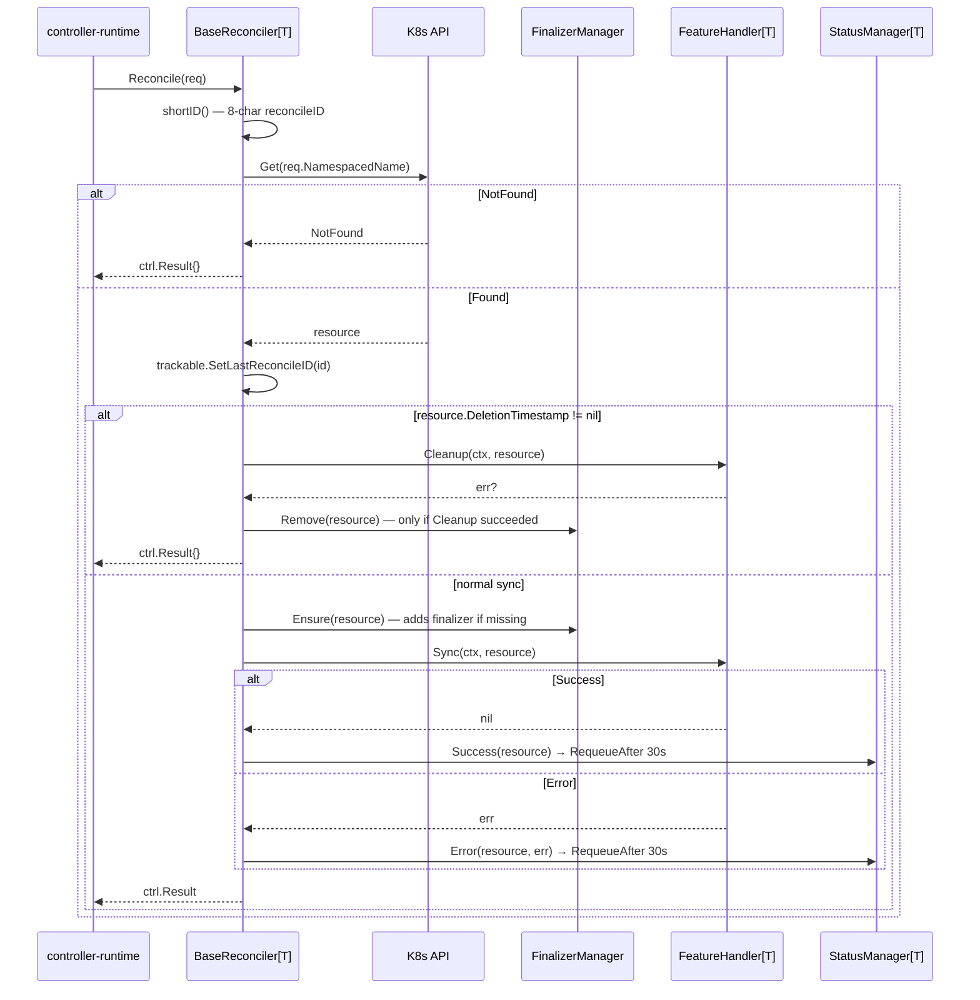
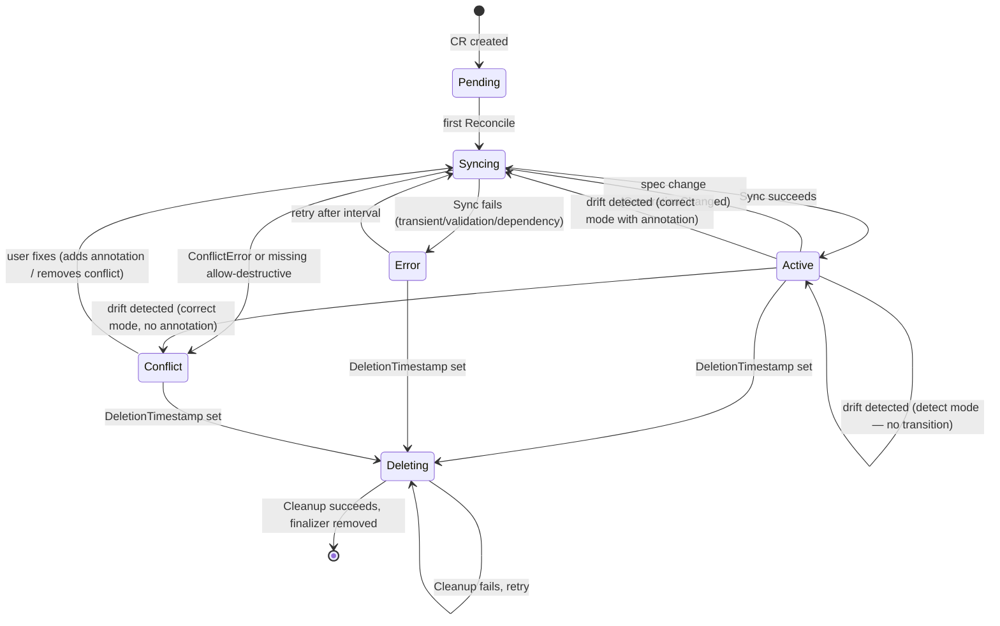

# Flow Overview — Shared Foundations

> Runtime contracts shared by all flow docs. Read this before any `FLOW_*.md`.

## Universal Pre-flight (cmd/main.go)

Every entry point runs after this setup has completed on operator start:



**Note:** The `pkg/cleanup` and `pkg/orphan` controllers have complete `Start(ctx)` methods and `NeedsLeaderElection() bool` hooks but are **never added to the manager** in `main.go`. See [IMPROVEMENTS.md §1](IMPROVEMENTS.md#1-unwired-controllers).

## Reconcile Entry (all CRDs go through `BaseReconciler[T]`)



Every `Reconcile` produces K8s events via `BaseReconciler.recordEvent`:
- Normal: `Syncing`, `Synced`, `Deleting`, `Deleted`, `DriftDetected` (warning), `DriftCorrected`
- Warning: `SyncFailed`, `DeleteFailed`, `DeletionStuck` (>5 min), `DeletionBlocked`, `PolicyNotInVault`

## Port Map (Interfaces / Abstract boundaries)

| Port | File | Methods | Implemented By | Boundary |
|------|------|---------|----------------|----------|
| `FeatureHandler[T]` | [shared/controller/base/reconciler.go:48](../../shared/controller/base/reconciler.go:48) | `Sync`, `Cleanup` | `connection.Handler`, `policyFeatureHandler`, `roleFeatureHandler` | base → feature |
| `SyncableResource` | [shared/controller/workflow/resource.go:33](../../shared/controller/workflow/resource.go:33) | 30+ status/spec accessors | `VaultPolicyAdapter`, `VaultClusterPolicyAdapter`, `VaultRoleAdapter`, `VaultClusterRoleAdapter` | workflow → feature |
| `ResourceOps` | [shared/controller/workflow/ops.go:31](../../shared/controller/workflow/ops.go:31) | `Validate`, `CheckConflict`, `PrepareContent`, `DetectDrift`, `WriteToVault`, `ReadbackVerify`, `MarkManaged`, `DeleteFromVault`, `RemoveManaged`, `ApplyActiveStatus`, `ApplyBindings`, `PublishSyncEvent`, `PublishDeleteEvent` | `PolicyOps`, `RoleOps` | workflow → feature-specific ops |
| `PolicyAdapter` | [features/policy/domain/adapter.go:27](../../features/policy/domain/adapter.go:27) | `GetRules`, `GetVaultPolicyName`, `IsEnforceNamespaceBoundary`, etc. | `VaultPolicyAdapter`, `VaultClusterPolicyAdapter` | handler → domain object |
| `RoleAdapter` | [features/role/domain/adapter.go:29](../../features/role/domain/adapter.go:29) | `GetServiceAccountBindings`, `GetPolicies`, `GetAuthPath`, `GetJWT`, etc. | `VaultRoleAdapter`, `VaultClusterRoleAdapter` | handler → domain object |
| `TokenProvider` | [pkg/vault/token/provider.go:36](../../pkg/vault/token/provider.go:36) | `GetToken(opts) (*TokenInfo, error)` | `TokenRequestProvider`, `MountedTokenProvider` | auth → K8s |
| `LifecycleController` | [pkg/vault/token/lifecycle.go](../../pkg/vault/token/lifecycle.go) | `Register`, `Unregister`, `Start` | concrete `lifecycleController` struct | scheduled token renewal |
| `TokenReviewerController` | [pkg/vault/token/rotator.go](../../pkg/vault/token/rotator.go) | `Register`, `Unregister`, `Start` | concrete reviewer rotator | K8s auth reviewer JWT rotation |
| `VaultClientResolver` | [workflow/sync.go:42](../../shared/controller/workflow/sync.go:42) | `(ctx, connRef, resourceID) → *vault.Client` | lambda wrapping `vaultclient.Resolve` | workflow → connection feature |
| `VaultClientGetter` | [workflow/cleanup.go:35](../../shared/controller/workflow/cleanup.go:35) | `(connRef) → *vault.Client` | `ClientCache.Get` | cleanup → cache (no validation) |
| `Event` | [shared/events/types.go](../../shared/events/types.go) | `EventType() EventType` | 10+ event types (ConnectionReady, PolicyCreated, RoleCreated, BootstrapCompleted, ...) | cross-feature |
| `VaultClient` (cleanup) | [pkg/cleanup/controller.go:36](../../pkg/cleanup/controller.go:36) | `DeletePolicy`, `DeleteKubernetesAuthRole` | `*vault.Client` | cleanup controller → Vault |
| `ClientCache` (cleanup) | [pkg/cleanup/controller.go:42](../../pkg/cleanup/controller.go:42) | `Get(name) (VaultClient, error)` | ⚠️ no current impl (interface mismatch — see [IMPROVEMENTS.md §3](IMPROVEMENTS.md#3-cleanup-controller-typing-mismatch)) | cleanup → connection |

## Types Crossing Boundaries

| Type | Direction | Path | Purpose |
|------|-----------|------|---------|
| `ctrl.Request` | inward | runtime → reconciler | `{Name, Namespace}` triggering reconcile |
| `client.Object` (CRD) | inward | K8s API → `BaseReconciler.Reconcile` | typed CR fetched from K8s |
| `Adapter` | inward | reconciler → handler | wraps CRD for shared logic |
| `ResourceOps` | inward | handler → workflow | per-kind operation injection |
| `syncExecutionState` | internal | workflow phases | derived state: driftMode, vaultClient, specHash, etc. |
| `*vault.Client` | outward | workflow → Vault | auth + CRUD |
| `vault.PolicyRule` | outward | policy → HCL gen | Vault-native policy shape |
| `map[string]interface{}` | outward | role → Vault API | role data (policies, bound SAs, TTLs, audiences) |
| `ManagedResource` | inward | Vault → orphan / discovery | managed-marker metadata: `{k8sResource, connectionName}` |
| `events.*Event` | lateral | publisher → subscriber | `ConnectionReady`, `PolicyCreated`, `RoleCreated`, `BootstrapCompleted`, `ConnectionDisconnected`, etc. |
| `vaultv1alpha1.Condition` | outward | `conditions.Set` → status | K8s-style condition entry |
| `VaultResourceBinding` | outward | `binding.New*` → status | foreign-key-like pointer to Vault path |
| `DiscoveredResource` | outward | scanner → connection status | `{type, name, discoveredAt, suggestedCRName, adoptionStatus}` |
| `cleanup.Item` | lateral | failed deletion → Queue ConfigMap | serialized JSON in `vault-cleanup-queue` ConfigMap |
| `token.TokenInfo` | outward | provider → auth | `{token, expiration, audiences}` |

## Error Catalog

Errors are structured in [`shared/infrastructure/errors/errors.go`](../../shared/infrastructure/errors/errors.go) and classified in [`shared/controller/syncerror/handler.go`](../../shared/controller/syncerror/handler.go).

Six structured error types are defined. The classifier currently matches four; the other two (`NotFoundError`, `ConnectionError`) fall through to the generic catch-all — see [IMPROVEMENTS.md §29](IMPROVEMENTS.md#29-structured-error-types-notfounderror--connectionerror-defined-but-unused-in-classifier).

| Error Type | Fields | Origin | Meaning | Syncerror mapping |
|-----------|--------|--------|---------|-------------------|
| `ConflictError` | ResourceType, ResourceName, Message | `checkConflict` (policy/role) | Vault resource exists & is owned by someone else, adoption not permitted | `Phase: Conflict`, `Reason: Conflict` |
| `ValidationError` | Field, Value, Message | policy namespace-boundary check, role policy-ref kind check, JWT subject derivation | spec fails pre-sync validation | `Phase: Error`, `Reason: ValidationFailed` |
| `DependencyError` | Resource, DependencyType, DependencyName, Reason | `vaultclient.Resolve` when VaultConnection missing or not Active | connection unready or missing | `Phase: Error`, `Reason: ConnectionNotReady`, sets `DependencyReady=False` |
| `TransientError` | Operation, Cause, Retryable | Vault API failures, readback mismatches | retryable | `Phase: Error`, `Reason: Failed` — requeue after interval |
| `NotFoundError` | ResourceType, ResourceName, Namespace | could signal missing Secret/ServiceAccount references | — **not currently classified** → `Phase: Error`, `Reason: Failed` |
| `ConnectionError` | ConnectionName, Address, Cause | transport-layer Vault failures (TLS, DNS, TCP) | — **not currently classified** → `Phase: Error`, `Reason: Failed` |
| generic `error` | — | any other path | unknown failure | `Phase: Error`, `Reason: Failed` |

### Stuck deletion detection

In `BaseReconciler.handleDeletion` ([reconciler.go:199](../../shared/controller/base/reconciler.go:199)):
- If `Cleanup` returns error **and** `time.Since(DeletionTimestamp) > 5m`, emits `Warning / DeletionStuck` event with elapsed time.

### Auth error → cache eviction

In `connection.Handler.handleSyncError` ([handler.go:520](../../features/connection/controller/handler.go:520)):
- If error matches `permission denied | invalid token | Code: 403`, the cached Vault client is **deleted from the cache** so the next reconcile performs full re-auth with fresh credentials.

## Phase State Machine



## Conditions (standard K8s semantics)

| Type | Typical True Reason | Typical False Reason |
|------|--------------------|---------------------|
| `Ready` | `Succeeded` | `Failed`, `Conflict`, `ValidationFailed` |
| `Synced` | `Succeeded` | `Failed` |
| `ConnectionReady` | `ConnectionActive` | `ConnectionNotReady` |
| `PoliciesResolved` | `AllPoliciesExist` | `PolicyNotInVault` (warning, non-blocking) |
| `DependencyReady` | `DependencyReady` | `ConnectionNotReady` |
| `Drifted` | `DriftDetected` | `NoDrift` |
| `Deleting` | `DeletionInProgress` | `ChildrenExist` (connection only) |

Conditions are mutated via [`conditions.Set(conds, gen, type, status, reason, message)`](../../shared/controller/conditions/conditions.go). `LastTransitionTime` is only updated when `status` flips; reason/message changes preserve it.

## Shared Helper Packages

Three small packages provide cross-feature utilities used by policy, role, and (sometimes) the connection handler. Documenting them here avoids repetition in each flow doc.

### `shared/controller/binding/` — Vault-path construction

Primary callers: `PolicyOps.ApplyBindings`, `RoleOps.ApplyBindings`, `resolvePolicyNames` in role handler.

| Function | Input | Output | Use |
|----------|-------|--------|-----|
| `VaultPolicyName(ref, roleNamespace)` | `PolicyReference`, string | `"{namespace}-{name}"` or `"{name}"` | deterministic translation from `PolicyRef` kind + name to Vault policy name |
| `NewPolicyBinding(ref, vaultName, resolved)` | `PolicyReference`, string, bool | `*PolicyBinding` | status field for `VaultRole.Status.PolicyBindings[]` |
| `NewVaultResourceBinding(kind, path, name, ...)` | — | `VaultResourceBinding` | status field for every synced CR |

The intent: one source of truth for "given a PolicyReference, what's the Vault path?". Duplicate logic in [role/controller/handler.go:307](../../features/role/controller/handler.go:307) exists today — see [IMPROVEMENTS.md §20](IMPROVEMENTS.md#20-duplicate-resolvepolicynames-logic-between-role-handler-and-binding-package).

### `shared/controller/hash/` — Spec hashing

Primary callers: `PolicyOps.PrepareContent`, `RoleOps.PrepareContent`.

| Function | Purpose |
|----------|---------|
| `FromMapDeterministic(map[string]interface{}) string` | JSON-marshal with sorted keys → SHA-256 hex. Used for role data. Determinism guaranteed by canonical key order. |
| `FromString(s string) string` | SHA-256 of arbitrary string. Used for policy HCL after whitespace normalization. |

The hash lives in `Status.LastAppliedHash`. Change detection: `newHash != oldHash → spec changed → proceed to write`. Unchanged hash + unchanged Vault state + drift clean = no-op reconcile.

### `shared/controller/drift/` — Comparator

Primary callers: `role/controller/handler.go` (drift comparison for roles), policy uses whitespace-trim comparison inline (see [IMPROVEMENTS.md §11](IMPROVEMENTS.md#11-drift-comparator-duplication-policy-hcl-vs-role-map)).

| Method | Semantics |
|--------|-----------|
| `CompareStringSlices(expected, actual []string) Diff` | Sort-insensitive; returns present/missing/extra sets |
| `CompareValues(field, expected, actual) Diff` | Simple `reflect.DeepEqual` |
| `CompareValuesIfExpected(field, expected, actual) Diff` | Only compares if `expected` is non-zero — allows optional fields in spec without causing drift when actual has them set |
| `Result.AddDiff(...)` | Accumulates diffs; produces `"fields differ: policies, bound_service_account_names"` summary |

### Managed-marker schema

Gated by `--managed-markers` (default OFF); when enabled, stored as KV v2 `custom_metadata` (never `secret/data`) at the hierarchical path `secret/metadata/vault-access-operator/managed/{cluster}/policies/{ns}/{name}` (policies) or `.../managed/{cluster}/roles/{mount}/{ns}/{name}` (roles) — `{cluster}` omitted when unset, `_cluster` sentinel for cluster-scoped CRs — via [pkg/vault/managed.go](../../pkg/vault/managed.go). See [ADR 0007](../adr/0007-hierarchical-metadata-only-managed-markers.md). The keys below are the `custom_metadata` fields:

```json
{
  "managed-by": "vault-access-operator",
  "k8s-resource": "my-namespace/my-policy",
  "managed-at": "2026-04-18T12:34:56Z",
  "last-updated": "2026-04-18T12:40:00Z"
}
```

- `managed-by` is the ownership sentinel (`vault-access-operator`); `IsOwnedBy` checks it before any read/adopt.
- `k8s-resource` is the foreign-key-like identifier: `{namespace}/{name}` for namespaced, `{name}` for cluster-scoped.
- `managed-at` is set once when the operator first claims ownership. Never re-written.
- `last-updated` is bumped every successful MarkManaged (essentially every sync).

**Two operators managing the same Vault path** — if two operator instances (different UIDs) write to the same marker, the last writer wins. There's no ownership lease. This is an unlikely-but-real multi-cluster scenario; see [IMPROVEMENTS.md §G](IMPROVEMENTS.md#g-no-backuprestore-story-for-managed-markers).

## Configuration Precedence

Settings flow from multiple sources. The precedence order, from lowest to highest:

| Source | Where | Can override | Example |
|--------|-------|--------------|---------|
| kubebuilder default | `+kubebuilder:default=` in `api/v1alpha1/*_types.go` | yes by any higher source | `authPath: "auth/kubernetes"` on VaultRole |
| env var | read in feature/base constructors | yes by CLI flag | `OPERATOR_REQUEUE_SUCCESS_INTERVAL=60s` |
| CLI flag | parsed in `cmd/main.go` | yes by spec | `--leader-elect=true` |
| Spec field | per-CR in `spec.*` | yes by annotation | `VaultConnection.spec.defaults.driftMode: correct` |
| Annotation | per-CR in `metadata.annotations` | terminal | `vault.platform.io/adopt=true` — force-overrides `ConflictPolicy: Fail` |

**Cascading resolution** is performed by `driftmode.Resolve`: resource.driftMode → connection.defaults.driftMode → `DriftModeDetect`. This three-step cascade is the prototype for future "inherit from parent connection" patterns.

## File-system Artifacts

The operator itself **writes no files on disk**. All persistence is via K8s or Vault.

| Artifact | Kind | Read | Written | Notes |
|----------|------|------|---------|-------|
| CRDs (`VaultConnection`, etc.) | K8s object | ✅ all reconciles | ✅ status updates | authoritative source |
| `Secret` (bootstrap token, AppRole secretID, JWT, GCP creds, TLS CA) | K8s object | ✅ connection handler | ❌ | operator-readable only |
| `ServiceAccount` token | K8s object (virtual) | ✅ `TokenRequestProvider` | ❌ | short-lived |
| `Event` | K8s object | ❌ | ✅ `BaseReconciler.recordEvent` | surfaced via `kubectl describe` |
| `ConfigMap: vault-cleanup-queue` | K8s object | queue ([cleanup/queue.go](../../pkg/cleanup/queue.go)) | queue | JSON array of `Item` — **consumer not wired** |
| Vault KV: `secret/metadata/vault-access-operator/managed/{cluster}/policies/{ns}/{name}` | Vault | ✅ conflict check, orphan, discovery | ✅ `MarkPolicyManaged` | `custom_metadata: {k8sResource, connectionName, ...}`; **only when `--managed-markers=true`** |
| Vault KV: `secret/metadata/vault-access-operator/managed/{cluster}/roles/{mount}/{ns}/{name}` | Vault | ✅ conflict check, orphan, discovery | ✅ `MarkRoleManaged` | same shape; **only when `--managed-markers=true`** |
| Vault sys: `sys/policies/acl/{name}` | Vault | ✅ drift | ✅ policy sync | HCL content |
| Vault sys: `auth/{mount}/role/{name}` | Vault | ✅ drift | ✅ role sync | role params |
| `/var/run/secrets/.../namespace` | filesystem | ✅ `getOperatorNamespace` | ❌ | fallback only |
| `tls.crt` / `tls.key` (metrics + webhook) | filesystem | ✅ `certwatcher` | ❌ | hot-reload |
| Leader election Lease | K8s `coordination.k8s.io/v1` | ✅ `--leader-elect=true` | ✅ every `LeaseDuration` (15s default) | lease ID `2bf9394e.platform.io` |

Legend: ✅ = touched by this entry point, ❌ = not touched

## Cross-References

- [PROJECT_OVERVIEW.md](PROJECT_OVERVIEW.md)
- [ARCHITECTURE.md](ARCHITECTURE.md)
- [FLOW_LIFECYCLE.md](FLOW_LIFECYCLE.md) — manager startup and shutdown
- [FLOW_CONNECTION.md](FLOW_CONNECTION.md) — establishes the client cache the rest of the flows depend on
- [FLOW_POLICY.md](FLOW_POLICY.md)
- [FLOW_ROLE.md](FLOW_ROLE.md)
- [FLOW_DISCOVERY.md](FLOW_DISCOVERY.md)
- [FLOW_DELETION.md](FLOW_DELETION.md)
- [FLOW_AUTH.md](FLOW_AUTH.md) — auth-backend selection (bootstrap is a special case covered in FLOW_CONNECTION)
- [FLOW_WEBHOOK.md](FLOW_WEBHOOK.md) — admission validation
- [FLOW_EVENTS.md](FLOW_EVENTS.md) — event bus
- [FLOW_METRICS.md](FLOW_METRICS.md) — Prometheus emission
- [INSTRUCTIONS.md](INSTRUCTIONS.md) — contributor procedures
- [IMPROVEMENTS.md](IMPROVEMENTS.md)
