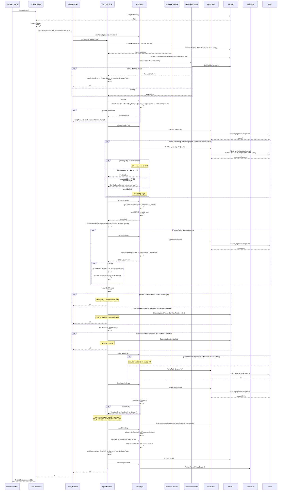
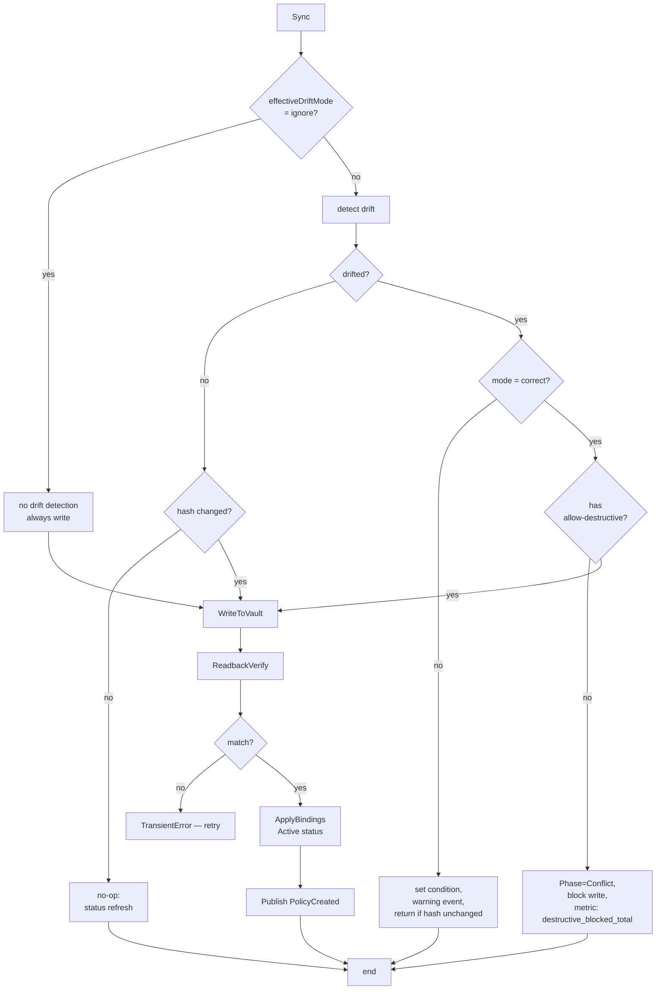

# FLOW: VaultPolicy / VaultClusterPolicy Sync

## Summary

Policies declare what Vault paths a set of capabilities (read/write/etc.) can act upon. The operator translates the declarative `rules[]` into HCL, writes it to `sys/policies/acl/{name}`, and keeps the two sides in sync by computing a spec hash. Both the namespaced `VaultPolicy` and cluster-scoped `VaultClusterPolicy` flow through the **same** `Handler` via the `PolicyAdapter` abstraction — the only differences are the Vault name (`{namespace}-{name}` vs `{name}`) and the `enforceNamespaceBoundary` validation that only applies to namespaced policies.

**All state transitions and Vault writes are driven by `workflow.SyncWorkflow`** ([shared/controller/workflow/sync.go](../../shared/controller/workflow/sync.go)), which both policy and role share.

!!! note "Ownership tracking gated by `--managed-markers` (default OFF)"
    The `CheckConflict` ownership read runs **only when `--managed-markers=true`**. With markers off (the default), the workflow writes the policy and forgets it — conflict/ownership detection is skipped. Ownership is **in-band** (ADR 0008): a structured comment header inside the policy document itself (`managed-by`, `auth-mount`, `cluster`, `k8s-resource`, `k8s-kind`), written as part of every policy write and read back via `ReadPolicy` + `ParseOwnership`. There is no marker path and no marker-specific grant. See [ADR 0008](../adr/0008-in-band-ownership-markers.md), [CONTEXT.md `Managed marker`](CONTEXT.md#managed-marker).

## Participants

| # | Component | Layer | Source | Role |
|---|-----------|-------|--------|------|
| 1 | `PolicyReconciler` / `ClusterPolicyReconciler` | transport | [policy_reconciler.go](../../features/policy/controller/policy_reconciler.go), [clusterpolicy_reconciler.go](../../features/policy/controller/clusterpolicy_reconciler.go) | watches VaultPolicy + VaultConnection phase |
| 2 | `policyFeatureHandler` | adapter | same files | wraps Handler for `FeatureHandler[*VaultPolicy]` interface |
| 3 | `policy.Handler` | feature | [handler.go:41](../../features/policy/controller/handler.go:41) | `SyncPolicy`, `CleanupPolicy` — dispatches to workflow |
| 4 | `PolicyAdapter` | domain | [features/policy/domain/adapter.go](../../features/policy/domain/adapter.go) | interface over both policy kinds |
| 5 | `PolicyOps` | feature | [ops.go:36](../../features/policy/controller/ops.go:36) | implements `workflow.ResourceOps` for policies |
| 6 | `workflow.SyncWorkflow` | shared | [workflow/sync.go](../../shared/controller/workflow/sync.go) | 9-step orchestration |
| 7 | `vaultclient.Resolve` | shared | [vaultclient/resolver.go](../../shared/controller/vaultclient/resolver.go) | connRef → `*vault.Client` via cache |
| 8 | `driftmode.Resolve` | shared | [driftmode/resolve.go](../../shared/controller/driftmode/resolve.go) | resource → connection → global default |
| 9 | `vault.Client` | pkg | [pkg/vault/client.go](../../pkg/vault/client.go) | `WritePolicy`, `ReadPolicy`, `PolicyExists`, `GetPolicyManagedBy`, `MarkPolicyManaged`, `DeletePolicy` |
| 10 | `vault.GeneratePolicyHCL` | pkg | [pkg/vault/hcl.go](../../pkg/vault/hcl.go) | rules[] → HCL string |

## Watches / Triggers

From [policy_reconciler.go:86-99](../../features/policy/controller/policy_reconciler.go:86):

```go
For(&VaultPolicy{}, GenerationChangedPredicate{})
Watches(&VaultConnection{},
    EnqueueRequestsFromMapFunc(watches.PolicyRequestsForConnection),
    ConnectionPhaseChangedPredicate{})
```

- **Spec changes** trigger reconciliation (`GenerationChangedPredicate` filters out status-only updates).
- **Connection phase changes** fan out to every policy that references that connection — so when `VaultConnection` flips to `Active`, all dependent policies requeue.

## Full Sync Interaction



## Step-by-Step Narrative

### Step 1: Resolve effective drift mode
[driftmode.Resolve](../../shared/controller/driftmode/resolve.go). Precedence: resource.driftMode → connection.defaults.driftMode → `DriftModeDetect`. Result is stored in `SyncStatus.EffectiveDriftMode`.

### Step 2: Transition to Syncing phase
Only if not already `Syncing` or `Active`. Avoids unnecessary status writes on repeat reconciles.

### Step 3: Resolve Vault client
[vaultclient.Resolve](../../shared/controller/vaultclient/resolver.go):
- fetches `VaultConnection` by `connRef`
- returns `DependencyError` if not found or `Phase != Active`
- returns `*vault.Client` from `ClientCache.Get(connRef)`

`DependencyError` maps to `DependencyReady=False` with reason `ConnectionNotReady`. The resource remains in `Phase=Error` until the connection recovers; the **phase-changed predicate** will re-requeue this policy the moment the connection flips to Active.

### Step 4: Validate (Ops.Validate)
- Namespaced VaultPolicy with `enforceNamespaceBoundary=true`: each `rules[i].path` must contain `{{namespace}}` and must NOT have `*` before `{{namespace}}` (would allow cross-namespace access).
- VaultClusterPolicy: no-op.

### Step 5: Check conflict (Ops.CheckConflict) — only when `--managed-markers=true`
With markers **off** (the default) this step is skipped entirely: the operator writes the policy and forgets it (write-and-forget). When markers are on:
- If policy doesn't exist in Vault → no conflict.
- If exists, read the policy's in-band ownership header (`GetPolicyOwnership` = `ReadPolicy` + `ParseOwnership`). Ownership requires the sentinel + the same auth-mount identity + the same owning CR (`Ownership.SameOwner`); a header naming another operator or CR is foreign → conflict, adoption blocked.
  - Same K8s owner → OK.
  - Different owner → `ConflictError` (cannot adopt under another operator).
  - No owner (not managed) → `ConflictError` unless `shouldAdopt(adapter)` (annotation or `ConflictPolicy: Adopt`).

### Step 6: Prepare content (Ops.PrepareContent)
[generatePolicyHCL](../../features/policy/controller/handler.go:184) converts each `PolicyRule` into HCL, substituting `{{namespace}}` and `{{name}}`. SHA-256 of the output is the spec hash stored in `LastAppliedHash`.

### Step 7: Detect drift (only if Phase=Active)
[Ops.DetectDrift](../../features/policy/controller/ops.go:88):
- Reads current HCL from Vault.
- Normalizes both (strip blank lines, trim whitespace).
- String compare. Returns `(drifted, "policy content differs")`.

### Step 8: Handle drift mode
- **detect + unchanged hash**: set status message "Drift detected: ...", emit warning event, return — do NOT overwrite. User is informed but not forced.
- **detect + changed hash**: proceed to Write (the user changed the spec, so this is a user-initiated update, not drift correction).
- **correct + no `allow-destructive` annotation**: `Phase=Conflict`, block write, increment `safety_destructive_blocked_total`. User must add annotation to unlock.
- **correct + annotation present**: proceed to Write (log "correcting drift with destructive annotation").
- **unchanged spec, unchanged Vault, no drift**: skip write, update status (the ownership header is part of the document — nothing to refresh).

### Step 9: Write + readback
- `discovery-pending=true` annotation → skip write (preserves adopted placeholder policies).
- Otherwise `WritePolicy`. Readback via `ReadPolicy`, compare normalized HCL.
- Readback mismatch returns `TransientError` — the next reconcile will retry.

### Step 10: Mark managed + apply bindings + active status
- The ownership header is prepended by `PrepareContent` (`vault.OwnershipHeader`) and written together with the rules in `WriteToVault` — always emitted; only the *checking* is gated by `--managed-markers`.
- `ApplyBindings` sets `Status.Binding = {vaultPath: sys/policies/acl/{name}, vaultResourceName: {name}}`.
- `ApplyActiveStatus` sets `Status.VaultName` and `Status.RulesCount`.

### Step 11: Finalize status + event
- Phase=Active, Ready=True, Synced=True, Drifted=False, message="".
- `LastAppliedHash` stored.
- Async publish `PolicyCreated` event.

## Branching Points



## Cleanup Flow

Via [workflow.CleanupWorkflow](../../shared/controller/workflow/cleanup.go):

```mermaid
sequenceDiagram
    participant Base as BaseReconciler
    participant H as Handler
    participant CW as CleanupWorkflow
    participant Ops as PolicyOps
    participant Cache as ClientCache
    participant VC as vault.Client
    participant V as Vault
    participant K8s as K8s API

    Base->>H: Cleanup(policy)
    H->>Ops: NewPolicyOps
    H->>CW: Execute
    CW->>CW: set DeletionStartedAt (first time only)
    CW->>K8s: Status.Update(Phase=Deleting, Deleting cond = True)
    CW->>Cache: Get (lightweight — no validation)
    alt client authenticated
        alt DeletionPolicy = Delete (default)
            CW->>Ops: DeleteFromVault
            Ops->>VC: DeletePolicy(name)
            VC->>V: DELETE /sys/policies/acl/{name}
            Note over CW: ownership gate — foreign header ⇒ skip delete<br/>(ForeignPolicyNotDeleted); record dies with the policy
            Ops->>VC: RemovePolicyManaged
        else DeletionPolicy = Retain
            Note over CW: keep policy in Vault
        end
    else client missing/unauthed
        Note over CW: log + proceed with finalizer removal anyway
    end
    CW->>Ops: PublishDeleteEvent
    Ops->>Bus: PublishAsync(PolicyDeleted)
    CW-->>Base: nil
    Base->>Base: remove finalizer
```

**Best-effort cleanup**: If Vault is unreachable or the cached client is gone, cleanup still completes (finalizer is removed, the CR is deleted). This prevents policies from getting stuck forever if the connection is broken at the time of deletion. However, the Vault policy is **leaked** — see [IMPROVEMENTS.md §2](IMPROVEMENTS.md#2-silent-cleanup-failures-leak-vault-policies).

## Interface Boundary Summary

| # | Crossing | Port | Method | Data |
|---|----------|------|--------|------|
| 1 | Reconciler → Handler | `FeatureHandler[*VaultPolicy]` | `Sync`, `Cleanup` | CR |
| 2 | Handler → Workflow | `ResourceOps` | `Validate`, `CheckConflict`, `PrepareContent`, `DetectDrift`, `WriteToVault`, `ReadbackVerify`, `DeleteFromVault`, `ApplyActiveStatus`, `ApplyBindings`, `PublishSyncEvent`, `PublishDeleteEvent` | — |
| 3 | Workflow → driftmode | func | `Resolve(ctx, client, resMode, connRef)` | DriftMode |
| 4 | Workflow → vaultclient | func | `Resolve(ctx, client, cache, connRef, resID)` | `*vault.Client` |
| 5 | Ops → vault.Client | concrete | `PolicyExists`, `ReadPolicy`, `WritePolicy`, `DeletePolicy`, `GetPolicyManagedBy`, `MarkPolicyManaged`, `RemovePolicyManaged` | `string`, HCL |
| 6 | Ops → EventBus | concrete | `PublishAsync` | `PolicyCreated`, `PolicyDeleted` |

## Error Scenarios

| Error | Step | Trigger | Recovery |
|-------|------|---------|----------|
| `DependencyError` (connection not Active) | resolve client | connection absent / bootstrap failing / auth failed | connection recovery → phase predicate requeues |
| `ValidationError` | Validate | missing `{{namespace}}` in enforced policy | user fixes spec |
| `ConflictError` | CheckConflict | resource exists, not adopted, different owner | user deletes Vault policy or adds adopt annotation |
| `TransientError` | WriteToVault / ReadbackVerify | Vault API error / content mismatch after write | retry after 30s |
| readback mismatch | ReadbackVerify | Vault stored a different HCL than we sent (unusual) | retry |
| status 409 | Status.Update | concurrent modification | next reconcile |
| discovery-pending annotation + user never fills in rules | WriteToVault (skipped) | operator keeps skipping writes forever | user must remove annotation after editing rules |

## Files Read / Written

| Resource | Op | Step |
|----------|-----|------|
| VaultPolicy / VaultClusterPolicy CR | R + status W | every reconcile |
| VaultConnection CR | R | dependency resolution, driftmode |
| Vault `/sys/policies/acl/{name}` | R (drift + readback + exists) + W (sync) + DELETE (cleanup) | WriteToVault, DetectDrift, ReadbackVerify, CheckConflict, DeleteFromVault |
| Vault `sys/policies/acl/{name}` in-band ownership header (checked **only when `--managed-markers=true`**) | R (GetPolicyOwnership) — written as part of the policy document itself | CheckConflict, DeleteFromVault ownership gate |
| K8s Event | W | at Syncing/Synced/SyncFailed/DriftDetected/DriftCorrected |

## Divergences from Role Flow

1. **HCL vs map[string]interface{}** — policy content is normalized HCL text; role content is a data map. Different hash normalization (policy uses whitespace-trim `normalizeHCL`; role uses `hash.FromMapDeterministic`).
2. **Namespace boundary validation** — only VaultPolicy needs it; role has no equivalent.
3. **Variable substitution** — policy rules support `{{namespace}}` and `{{name}}` via `vault.SubstituteVariables`; role data has no such templating.
4. **No policy-existence verification** — role verifies each referenced policy exists in Vault; policy has no analog (no outward references).
5. **`discovery-pending` write skip** — policy honors this annotation to avoid overwriting adopted placeholders; role does not (see [IMPROVEMENTS.md §4](IMPROVEMENTS.md#4-discovery-pending-annotation-inconsistency)).
6. **Ownership record** — the policy carries its full in-band header (owner CR, kind, identity); roles carry nothing (CR status is the memory).

## Cross-References

- [FLOW_OVERVIEW.md](FLOW_OVERVIEW.md)
- [FLOW_ROLE.md](FLOW_ROLE.md) — sibling flow sharing 80% of the workflow
- [FLOW_CONNECTION.md](FLOW_CONNECTION.md) — must be Active for this flow to succeed
- [FLOW_DELETION.md](FLOW_DELETION.md)
- [IMPROVEMENTS.md](IMPROVEMENTS.md)
