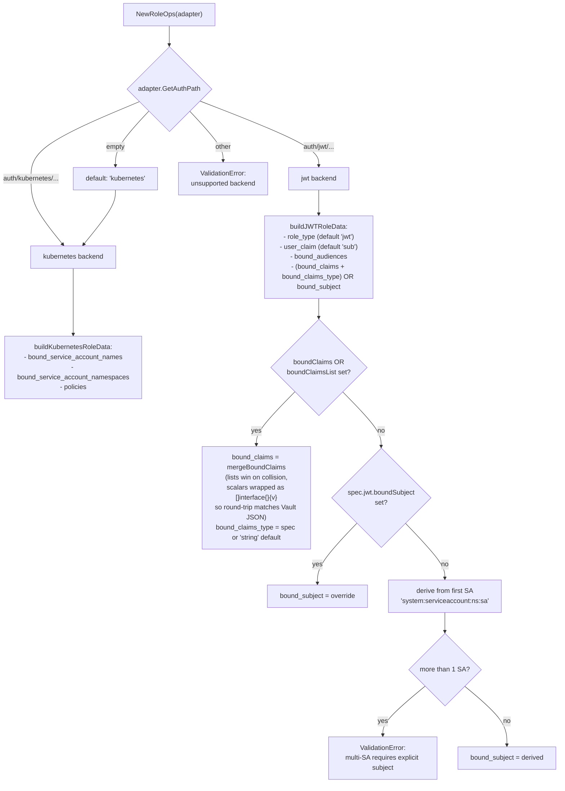
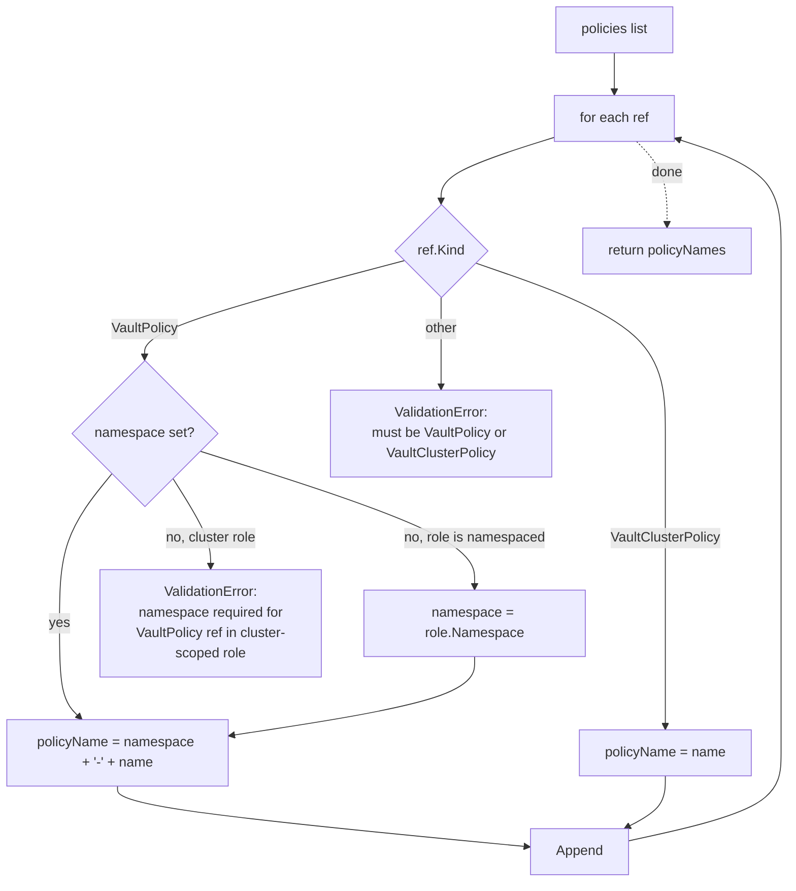
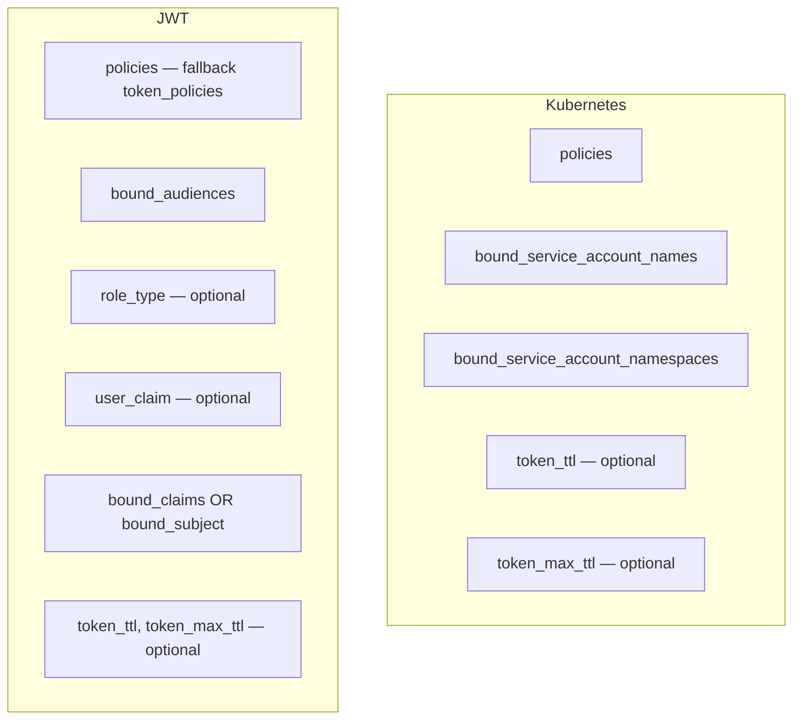

# FLOW: VaultRole / VaultClusterRole Sync

## Summary

Roles bind a set of Kubernetes service accounts (or JWT identities) to a list of Vault policies. The operator resolves `PolicyReference` objects (which point at `VaultPolicy` / `VaultClusterPolicy` CRs) into concrete Vault policy names, builds a role data payload appropriate for the **auth backend** (Kubernetes or JWT), and writes it to `auth/{mount}/role/{name}`.

Like policy, role uses the shared `workflow.SyncWorkflow`. Unlike policy, role branches on the **auth backend** at several points — backend selection is driven by `adapter.GetAuthPath()` via [`vault.AuthBackendForPath`](../../pkg/vault/client.go).

## Participants

| # | Component | Source | Role |
|---|-----------|--------|------|
| 1 | `RoleReconciler` / `ClusterRoleReconciler` | [role_reconciler.go](../../features/role/controller/role_reconciler.go), [clusterrole_reconciler.go](../../features/role/controller/clusterrole_reconciler.go) | watches VaultRole + VaultConnection |
| 2 | `roleFeatureHandler` | same | adapter to `FeatureHandler[*VaultRole]` |
| 3 | `role.Handler` | [handler.go:47](../../features/role/controller/handler.go:47) | `SyncRole`, `CleanupRole`, policy resolution, drift comparison |
| 4 | `RoleAdapter` | [features/role/domain/adapter.go](../../features/role/domain/adapter.go) | interface over both role kinds |
| 5 | `RoleOps` | [ops.go:37](../../features/role/controller/ops.go:37) | implements `workflow.ResourceOps` for roles |
| 6 | `workflow.SyncWorkflow` | shared | same 9-step orchestration as policy |
| 7 | `vault.Client` | pkg | `WriteKubernetesAuthRole`, `ReadKubernetesAuthRole`, `KubernetesAuthRoleExists`, `DeleteKubernetesAuthRole`, `MarkRoleManaged`, `GetRoleManagedBy`, `PolicyExists` |
| 8 | `drift.Comparator` | [drift/compare.go](../../shared/controller/drift/compare.go) | sort-insensitive field-by-field comparison |
| 9 | `hash.FromMapDeterministic` | [hash/hash.go](../../shared/controller/hash/hash.go) | sorted-key hashing of role data map |

## Full Sync Interaction (Kubernetes auth backend)

```mermaid
sequenceDiagram
    participant Base as BaseReconciler
    participant H as role.Handler
    participant WF as SyncWorkflow
    participant Ops as RoleOps
    participant VC as vault.Client
    participant K8s as K8s API
    participant Bus as EventBus
    participant V as Vault

    Base->>H: Sync(role)
    H->>Ops: NewRoleOps(adapter, handler) — authPath defaults to "kubernetes"
    H->>WF: Execute

    WF->>WF: resolve driftMode, resolve vault client
    WF->>Ops: Validate — no-op for roles
    WF->>Ops: CheckConflict
    Ops->>VC: KubernetesAuthRoleExists(authPath, name)
    VC->>V: GET /auth/{authPath}/role/{name}
    alt exists & different owner & !shouldAdopt
        Ops-->>WF: ConflictError
    end

    WF->>Ops: PrepareContent

    Ops->>H: resolvePolicyNames(adapter)
    Note over H: for each PolicyRef:<br/>- VaultPolicy → "{namespace}-{name}"<br/>- VaultClusterPolicy → "{name}"
    H-->>Ops: []string policyNames

    Ops->>H: verifyPoliciesExistInVault(policyNames)
    loop each policy
        H->>VC: PolicyExists(name)
        VC->>V: GET /sys/policies/acl/{name}
    end
    alt any missing
        H->>H: setCondition(PoliciesResolved=False, Reason=PolicyNotInVault)
        H->>Recorder: Event(Warning, PolicyNotInVault)
        Note over H: non-blocking — Vault allows referencing nonexistent policies
    else all present
        H->>H: setCondition(PoliciesResolved=True)
    end

    Ops->>Ops: serviceAccountBindings = adapter.GetServiceAccountBindings() — ["ns/name", ...]
    Ops->>Ops: resolveConnection — for default JWT audiences

    Ops->>H: buildRoleData
    Note over H: backend = AuthBackendForPath(authPath)
    alt backend = Kubernetes
        H->>H: buildKubernetesRoleData<br/>- split "ns/name" → names[] + namespaces[] (deduped)<br/>- sort both for deterministic hash<br/>- policies = policyNames<br/>- token_ttl, token_max_ttl (optional)
    else backend = JWT
        H->>H: buildJWTRoleData<br/>- role_type = "jwt"<br/>- user_claim default "sub"<br/>- bound_audiences (spec or conn fallback)<br/>- bound_claims = mergeBoundClaims(scalars, lists) OR bound_subject<br/>- bound_claims_type (when bound_claims is set; default "string")<br/>- policies, token_ttl, token_max_ttl
    end

    H-->>Ops: roleData map

    Ops->>H: calculateSpecHash(roleData) → hash.FromMapDeterministic
    H-->>Ops: specHash

    WF->>WF: handleDriftDetection (Active + detect/correct)
    WF->>Ops: DetectDrift(vc)
    Ops->>H: detectRoleDrift
    H->>VC: ReadKubernetesAuthRole(authPath, name)
    VC->>V: GET /auth/{authPath}/role/{name}
    V-->>VC: currentData
    H->>H: drift.Comparator
    alt backend = Kubernetes
        H->>H: compare policies, bound_service_account_names, bound_service_account_namespaces
    else backend = JWT
        H->>H: compare policies (fallback token_policies), bound_audiences, role_type, user_claim, bound_claims + bound_claims_type, or bound_subject
    end
    H->>H: compareValuesIfExpected token_ttl, token_max_ttl (normalized to int seconds)
    H-->>Ops: (drifted, summary)

    WF->>WF: handleDriftModes (same branching as policy)

    WF->>Ops: WriteToVault
    Ops->>VC: WriteKubernetesAuthRole(authPath, name, roleData)
    VC->>V: PUT /auth/{authPath}/role/{name}

    WF->>Ops: ReadbackVerify
    Ops->>H: detectRoleDrift (same compare, after write)
    alt drift still present
        Ops-->>WF: TransientError
    end

    WF->>Ops: MarkManaged
    Ops->>VC: MarkRoleManaged(name, k8sResource)
    VC->>V: PUT secret/data/vault-access-operator/managed/roles/{name}

    WF->>Ops: ApplyBindings
    Ops->>Ops: adapter.SetBinding(VaultResourceBinding{authMount, path})
    Ops->>H: buildPolicyBindings
    H-->>Ops: []PolicyBinding (tracks resolved + resolution status)
    Ops->>Ops: adapter.SetPolicyBindings

    WF->>Ops: ApplyActiveStatus
    Ops->>Ops: adapter.SetVaultRoleName, SetBoundServiceAccounts, SetResolvedPolicies

    WF->>WF: set Phase=Active, Ready/Synced/DependencyReady=True, Drifted=False
    WF->>K8s: Status.Update
    WF->>Ops: PublishSyncEvent
    Ops->>Bus: PublishAsync(RoleCreated)
```

## Auth Backend Branching



### JWT Audience Resolution

If `spec.jwt.boundAudiences` is empty, fall back to:
1. `VaultConnection.Spec.Auth.JWT.Audiences` (if present)
2. Cluster default: `https://kubernetes.default.svc.cluster.local`

See [defaultJWTAudiences](../../features/role/controller/handler.go:528) and `defaultJWTAudience` constant.

### TTL Normalization

Vault returns TTLs as integer seconds. The operator normalizes expected values before comparison:
[normalizeTTLToSeconds](../../features/role/controller/handler.go:540) — parses "30s"/"5m"/"1h" to `int(d.Seconds())`. This prevents false-positive drift where "30s" (expected string) ≠ 30 (actual int).

## Policy Resolution

From [resolvePolicyNames](../../features/role/controller/handler.go:307):



Note the **asymmetry**: VaultPolicy (namespaced) gets prefixed with its namespace to prevent collisions across namespaces (`prod-read` vs `staging-read`). VaultClusterPolicy keeps its raw name.

## Drift Comparison Fields



The comparator uses `CompareStringSlices` (order-insensitive via sort) for list fields and `CompareValuesIfExpected` for optional scalars (drift isn't flagged when the spec doesn't set the field).

## Step-by-Step Narrative

### Step 1: Resolve policy names
Kind-aware: namespaced prefix for VaultPolicy, bare name for VaultClusterPolicy. Cluster roles referencing namespaced policies **must** specify `namespace` explicitly.

### Step 2: Verify policies exist (warning, non-blocking)
Loop `PolicyExists` for each resolved name. Missing policies emit a warning condition (`PoliciesResolved=False`) and a K8s event but **do not block** the sync — Vault permits binding non-existent policies. This supports workflows where you create the role CR first and the policy CRs catch up.

### Step 3: Service account bindings
`RoleAdapter.GetServiceAccountBindings()` returns `[]string` of `"namespace/name"`:
- VaultRole (namespaced): adapter prepends the role's own namespace to each SA name.
- VaultClusterRole: adapter uses the explicit `ServiceAccountRef.Namespace`.

### Step 4: Resolve connection (best-effort)
`RoleOps.resolveConnection` — used only for JWT audience fallback. Return `nil` on any error.

### Step 5: Build role data (backend-aware)
- **Kubernetes**: split bindings into names + namespaces (deduped), sort both (stable hashing), add optional TTLs.
- **JWT**: compute role_type, user_claim, bound_audiences, then either `bound_claims` map or derived `bound_subject`. Multi-SA JWT roles require explicit `boundSubject` or `boundClaims` (error otherwise).

### Step 6: Spec hash
`hash.FromMapDeterministic(roleData)` — sorted keys, JSON marshal, SHA-256. Any change in bindings, policies, or TTLs produces a new hash.

### Step 7 onwards
Same as policy: drift detection, write, readback, mark managed, apply bindings, status, event.

## Status Fields Set on Success

| Field | Source |
|-------|--------|
| `VaultRoleName` | `adapter.GetVaultRoleName()` |
| `BoundServiceAccounts` | resolved `"ns/name"` list |
| `ResolvedPolicies` | resolved Vault policy names |
| `Binding` | `{vaultPath: auth/{mount}/role/{name}, authMount, ...}` |
| `PolicyBindings[]` | per-ref: `{VaultPolicyRef, vaultPolicyName, resolved:bool}` |
| `LastAppliedHash` | spec hash |
| `LastSyncedAt` | now |
| `EffectiveDriftMode` | resolved mode |

## Error Scenarios

| Error | Step | Trigger |
|-------|------|---------|
| `ValidationError "invalid policy kind"` | resolvePolicyNames | user set `kind: Role` or empty |
| `ValidationError "namespace required"` | resolvePolicyNames | cluster role references VaultPolicy without namespace |
| `ValidationError "unsupported auth backend"` | buildRoleData | authPath not kubernetes/jwt |
| `ValidationError "at least one service account"` | resolveJWTBoundSubject | JWT role has no SAs & no `boundSubject` override |
| `ValidationError "multi-SA JWT VaultRole must set boundSubject"` | resolveJWTBoundSubject | JWT role with >1 SA |
| `ConflictError` | CheckConflict | existing role owned by another resource |
| `DependencyError` | vaultclient.Resolve | connection not Active |
| `TransientError "readback verification"` | ReadbackVerify | role content differs after write (rare) |
| Warning `PolicyNotInVault` | verifyPoliciesExistInVault | referenced policy missing — non-fatal |

## Cross-References

- [FLOW_POLICY.md](FLOW_POLICY.md) — sibling flow sharing the workflow
- [FLOW_CONNECTION.md](FLOW_CONNECTION.md) — required dependency
- [FLOW_AUTH.md](FLOW_AUTH.md) — more on kubernetes vs jwt auth backend handling
- [FLOW_DELETION.md](FLOW_DELETION.md)
- [IMPROVEMENTS.md](IMPROVEMENTS.md) — drift comparator divergence, backend coverage gaps
