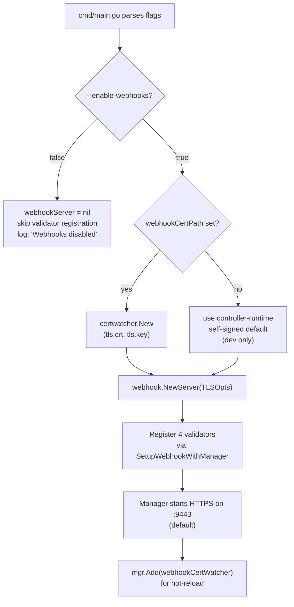
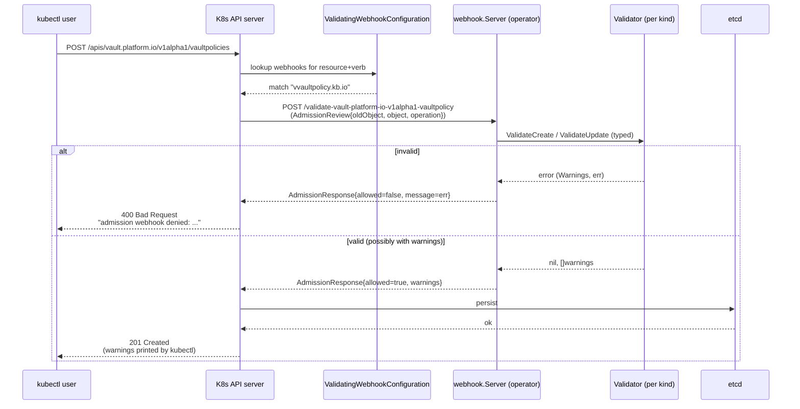

# FLOW: Admission Webhooks

## Summary

Validating admission webhooks run inside the K8s API server request path: every `CREATE`/`UPDATE` against one of the four webhook-covered CRDs is forwarded to the operator's webhook server *before* the object is persisted to etcd. Rejection aborts the request with the operator's error message surfaced directly to `kubectl apply`, so users get apply-time feedback instead of discovering misconfigurations hours later in the CR status. Webhooks are **opt-in** via `--enable-webhooks=true`; without the flag the operator runs a reconcile-only mode and misconfigurations surface as `Phase=Error` / `Reason=ValidationFailed`.

Four validators are wired today: `VaultPolicy`, `VaultClusterPolicy`, `VaultRole`, `VaultClusterRole`. Notably missing: **`VaultConnection`** — see [IMPROVEMENTS.md §8](IMPROVEMENTS.md#8-connection-webhook-missing). There are **no mutating webhooks**; defaults are applied via kubebuilder `+kubebuilder:default=` markers instead.

## Participants

| # | Component | Layer | Source | Role |
|---|-----------|-------|--------|------|
| 1 | API server | external | — | routes admission requests |
| 2 | `webhook.Server` | controller-runtime | [cmd/main.go:144](../../cmd/main.go:144) | HTTPS server; hosted by manager |
| 3 | `certwatcher.CertWatcher` | controller-runtime | [cmd/main.go:130](../../cmd/main.go:130) | hot-reloads `tls.crt`/`tls.key` |
| 4 | `VaultPolicyValidator` | webhook | [internal/webhook/vaultpolicy_webhook.go:57](../../internal/webhook/vaultpolicy_webhook.go:57) | validates `VaultPolicy` |
| 5 | `VaultClusterPolicyValidator` | webhook | [vaultpolicy_webhook.go:62](../../internal/webhook/vaultpolicy_webhook.go:62) | validates `VaultClusterPolicy` |
| 6 | `VaultRoleValidator` | webhook | [internal/webhook/vaultrole_webhook.go:44](../../internal/webhook/vaultrole_webhook.go:44) | validates `VaultRole` |
| 7 | `VaultClusterRoleValidator` | webhook | [vaultrole_webhook.go:49](../../internal/webhook/vaultrole_webhook.go:49) | validates `VaultClusterRole` |
| 8 | ValidatingWebhookConfiguration | K8s resource | [charts/vault-access-operator/templates/validatingwebhookconfiguration.yaml](../../charts/vault-access-operator/templates/validatingwebhookconfiguration.yaml) | wires API server → operator endpoints |

## Opt-in Gate & Construction



Key lines:
- Flag definition: [cmd/main.go:91](../../cmd/main.go:91)
- Server construction: [cmd/main.go:144](../../cmd/main.go:144)
- Registration block: [cmd/main.go:297-314](../../cmd/main.go:297)
- Cert watcher add: [cmd/main.go:325-331](../../cmd/main.go:325)

## Request Flow



`failurePolicy: fail` (set in every `+kubebuilder:webhook:` marker) means an unreachable webhook **rejects the request** rather than admitting it. This is the safe default: a down operator blocks writes until it recovers, instead of silently letting malformed configs through.

## Validator Registration Details

Each validator is registered via `ctrl.NewWebhookManagedBy` with a kubebuilder `+kubebuilder:webhook:` marker. The markers flow through `make manifests` into [config/webhook/manifests.yaml](../../config/webhook/manifests.yaml) and from there into the Helm template [validatingwebhookconfiguration.yaml](../../charts/vault-access-operator/templates/validatingwebhookconfiguration.yaml).

| Resource | Verbs | Path | Failure Policy | Side Effects | Source |
|----------|-------|------|----------------|--------------|--------|
| `VaultPolicy` | create, update | `/validate-vault-platform-io-v1alpha1-vaultpolicy` | fail | None | [vaultpolicy_webhook.go:70](../../internal/webhook/vaultpolicy_webhook.go:70) |
| `VaultClusterPolicy` | create, update | `/validate-vault-platform-io-v1alpha1-vaultclusterpolicy` | fail | None | [vaultpolicy_webhook.go:136](../../internal/webhook/vaultpolicy_webhook.go:136) |
| `VaultRole` | create, update | (generated) | fail | None | [vaultrole_webhook.go:58](../../internal/webhook/vaultrole_webhook.go:58) |
| `VaultClusterRole` | create, update | (generated) | fail | None | [vaultrole_webhook.go:66](../../internal/webhook/vaultrole_webhook.go:66) |

`ValidateDelete` is implemented but always returns `nil, nil` for all four kinds — deletions are unvalidated.

## VaultPolicy / VaultClusterPolicy Validation Rules

### Structural rules (rule-by-rule)

For every entry in `spec.rules[]` ([validatePolicyRule](../../internal/webhook/vaultpolicy_webhook.go:201)):

| Check | Condition | Result |
|-------|-----------|--------|
| Non-empty path | `strings.TrimSpace(rule.Path) == ""` | **error** — "path cannot be empty" |
| Path charset | `pathPattern = ^[a-zA-Z0-9/_*.{}\-+]+$` mismatch | **error** — "contains invalid characters" |
| Namespace var present | `EnforceNamespaceBoundary=true` && `!Contains(path, "{{namespace}}")` | **error** — "must contain `{{namespace}}` when namespace boundary enforcement is enabled" |
| No wildcard before namespace | `EnforceNamespaceBoundary=true` && `"*"` appears before `{{namespace}}` | **error** — "contains wildcard before `{{namespace}}` which is a security risk" |
| Non-empty capabilities | `len(rule.Capabilities) == 0` | **error** |
| Known capability | `Capability` not in `{create, read, update, delete, list, sudo, deny}` | **error** |
| Deny + other | Both `deny` and any other cap in same rule | **warning** — "`deny` takes precedence; other capabilities ignored" |
| Description length | `len(Description) > 256` | **error** |
| Description control chars | any `unicode.IsControl(r)` in description | **error** — defense in depth |

### Global rules

| Check | When | Source |
|-------|------|--------|
| Namespace-variant naming collision | `VaultPolicy` "ns/name" would map to Vault name "ns-name"; reject if a `VaultClusterPolicy` with that exact name already exists | [checkPolicyNameCollision](../../internal/webhook/vaultpolicy_webhook.go:348) |
| Cluster-variant naming collision | `VaultClusterPolicy` "name" could collide with any `VaultPolicy` whose "{namespace}-{name}" equals "name" | [checkClusterPolicyNameCollision](../../internal/webhook/vaultpolicy_webhook.go:374) |
| `connectionRef` change (update only) | Allowed only if old+new connections both resolve AND have identical `spec.address` | [checkConnectionRefSameAddress](../../internal/webhook/vaultpolicy_webhook.go:319) |

The `connectionRef` mutability rule is subtler than outright immutability: users migrating between two `VaultConnection` CRDs that target the **same** Vault server (e.g., rotating auth methods) are allowed, but moving a policy to a *different* Vault instance would silently orphan the original write and is rejected.

## VaultRole / VaultClusterRole Validation Rules

### Service accounts

| Check | `VaultRole` | `VaultClusterRole` | Source |
|-------|-------------|---------------------|--------|
| non-empty list | ✔ | ✔ | [validate](../../internal/webhook/vaultrole_webhook.go:115) |
| no `/` in name (ns implicit) | ✔ | n/a (ns explicit) | [vaultrole_webhook.go:130](../../internal/webhook/vaultrole_webhook.go:130) |
| non-empty `Name` | n/a | ✔ | [vaultrole_webhook.go:268](../../internal/webhook/vaultrole_webhook.go:268) |
| non-empty `Namespace` | n/a | ✔ | [vaultrole_webhook.go:272](../../internal/webhook/vaultrole_webhook.go:272) |

### Policy references

| Check | Source |
|-------|--------|
| Non-empty policies list | [validate](../../internal/webhook/vaultrole_webhook.go:136) |
| Kind ∈ {`VaultPolicy`, `VaultClusterPolicy`} | [validatePolicyReference](../../internal/webhook/vaultrole_webhook.go:408) |
| Non-empty Name | same |
| Namespace required for `VaultPolicy` in `VaultClusterRole` (no default) | same |
| Namespace forbidden for `VaultClusterPolicy` refs | same |
| Referenced policy exists in K8s | [checkPolicyDependencies](../../internal/webhook/vaultrole_webhook.go:173) — **warning only**, not error |

The missing-policy check is a warning (not an error) because Vault allows binding non-existent policies, and users can legitimately create a role first and its policies shortly after. The warning surfaces via `kubectl apply`'s output.

### JWT constraints ([validateJWTSpec](../../internal/webhook/vaultrole_webhook.go:311))

```mermaid
flowchart TD
    Start["spec.jwt on role"] --> IsJWT{authPath = auth/jwt*?}
    IsJWT -->|no, jwt set| Err1["error: spec.jwt only allowed with JWT auth path"]
    IsJWT -->|no, jwt unset| Ok1[pass]
    IsJWT -->|yes| MultiClaim{bound_subject AND bound_claims set?}
    MultiClaim -->|yes| Err2["error: mutually exclusive"]
    MultiClaim -->|no| MultiSA{len(serviceAccounts) > 1?}
    MultiSA -->|no| Ok2[pass]
    MultiSA -->|yes| Override{bound_subject OR bound_claims set?}
    Override -->|yes| Ok3[pass]
    Override -->|no| Err3["error: multi-SA JWT requires explicit<br/>boundSubject or boundClaims<br/>(single bound_subject cannot be derived)"]
```

### Immutability (update only)

| Kind | Field | Rule | Source |
|------|-------|------|--------|
| `VaultRole`, `VaultClusterRole` | `spec.connectionRef` | strictly immutable (not same-address-relaxed) | [vaultrole_webhook.go:92-95](../../internal/webhook/vaultrole_webhook.go:92) |
| `VaultRole`, `VaultClusterRole` | `spec.authPath` | strictly immutable | [vaultrole_webhook.go:98-101](../../internal/webhook/vaultrole_webhook.go:98) |

Policy's same-address relaxation does **not** apply to roles — `authPath` change would target a different Vault auth mount, and the operator doesn't move role data across mounts.

### Global rules

| Check | Direction | Source |
|-------|-----------|--------|
| `VaultRole` name collides with any `VaultClusterRole` | "ns-name" vs "name" | [checkRoleNameCollision](../../internal/webhook/vaultrole_webhook.go:443) |
| `VaultClusterRole` name collides with any `VaultRole` | "name" vs every "ns-name" | [checkClusterRoleNameCollision](../../internal/webhook/vaultrole_webhook.go:469) |

## TLS & Cert Rotation

- **Dev**: if `--webhook-cert-path` is unset, controller-runtime generates a self-signed cert at startup. Not valid across restarts.
- **Prod**: `--webhook-cert-path=/tmp/k8s-webhook-server/serving-certs` (default in [charts/vault-access-operator/templates/deployment.yaml](../../charts/vault-access-operator/templates/deployment.yaml) when `webhooks.enabled=true`).
- **Cert source**: cert-manager issues a `Certificate` resource → Secret mounted into the pod. Helm values: `webhooks.certManager.enabled=true`.
- **Hot reload**: `certwatcher.CertWatcher` polls the cert file every 10s (controller-runtime default). Rotations don't require pod restart.
- **TLSOpts**: HTTP/2 disabled by default (`--enable-http2=false`), matching the metrics server for the same CVE reasons.

## Helm Wiring

[charts/vault-access-operator/templates/validatingwebhookconfiguration.yaml](../../charts/vault-access-operator/templates/validatingwebhookconfiguration.yaml) generates the `ValidatingWebhookConfiguration` only when `webhooks.enabled=true`. Key fields:
- `clientConfig.service.namespace/name` = operator service
- `clientConfig.caBundle` = cert-manager-injected or manually set
- `admissionReviewVersions: [v1]`
- `sideEffects: None` — signals to API server that retry is safe

## Error Surfacing

| Where | What user sees |
|-------|----------------|
| `kubectl apply` | Webhook errors come back as `Error from server (admission webhook "..." denied the request: validation failed: rule[0]: path "...")` |
| Webhook warnings | Printed as `Warning:` lines before the create/update completes |
| Operator logs | `vaultpolicy-webhook` / `vaultrole-webhook` loggers emit `Info` for every validate call |

## Files Read / Written

| Operation | File | When |
|-----------|------|------|
| Read `VaultPolicy`/`VaultClusterPolicy` | K8s cache | `checkPolicyNameCollision` / `checkClusterPolicyNameCollision` |
| Read `VaultConnection` | K8s cache | `checkConnectionRefSameAddress` |
| Read `VaultPolicy`/`VaultClusterPolicy` | K8s cache | `checkPolicyDependencies` on roles |
| Read TLS cert/key | filesystem | `certwatcher` (every 10s) |

All reads go through the controller-runtime client cache, so they're fast and don't round-trip to the API server. The cache is populated by the manager; the webhook server shares the manager's client.

## Error Scenarios

| Error | Origin | Visibility |
|-------|--------|------------|
| Path with invalid char | `validatePolicyRule` | `kubectl apply` immediate rejection |
| Multi-SA JWT without override | `validateJWTSpec` | same |
| Naming collision | `checkPolicyNameCollision` / role analog | same |
| Connection address mismatch on update | `checkConnectionRefSameAddress` | same |
| K8s API list failure during collision check | `checkClusterPolicyNameCollision` | *fail closed* — webhook rejects with "failed to list VaultPolicies" |
| Webhook server down | — | `failurePolicy=fail` → API server rejects create/update |
| Cert expired without rotation | file not updated | TLS handshake fails; API server retries per admission review, then rejects |

## Missing Validators / Gaps

- **No `VaultConnection` webhook** — see [IMPROVEMENTS.md §8](IMPROVEMENTS.md#8-connection-webhook-missing).
- **No mutating webhook** — defaults come from kubebuilder `+kubebuilder:default=`. For dynamic defaults (e.g., auto-filling `authPath` from connection's `defaults.authPath`), a mutating webhook would be needed.
- **No apply-time `connectionRef` existence check** — a policy or role can be applied with a `connectionRef` pointing at a nonexistent VaultConnection; the webhook doesn't block it. The reconciler reports `DependencyError` after the fact. See [IMPROVEMENTS.md §36](IMPROVEMENTS.md#36-no-connectionref-existence-webhook-check).
- **No `VaultConnection` address format validation** (HTTPS prefix, port format) — relies on kubebuilder `+kubebuilder:validation:Pattern`; an explicit webhook message would be more user-friendly for common mistakes like `http://vault:8200`.

## Cross-References

- [FLOW_OVERVIEW.md](FLOW_OVERVIEW.md) — pre-flight and reconcile cycle
- [FLOW_POLICY.md](FLOW_POLICY.md) — what happens after webhook passes
- [FLOW_ROLE.md](FLOW_ROLE.md)
- [ARCHITECTURE.md](ARCHITECTURE.md) — webhook wiring in manager lifecycle
- [IMPROVEMENTS.md §8](IMPROVEMENTS.md#8-connection-webhook-missing), [§36](IMPROVEMENTS.md#36-no-connectionref-existence-webhook-check)
